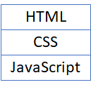
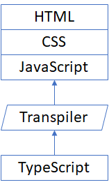

24 March 2018

tl;dr: We're just starting on the biggest revolution in smart client *and* web client development technology in many, many, many years. Now is an extremely exciting time to be a smart client developer, or to rediscover smart client development if you (like me) have been hiding in server-side code over the past decade or so. WebAssembly is the technology that may reshape the way we build client-side software, and it is really cool!

I've been a smart client developer since 1991 when I first started exploring how to build apps on my Amiga and on Windows 3.1. Prior to that point I was purely focused on building minicomputer apps that used VT100 terminals to interact with the user. And I must confess that (after a long and painful learning curve) I completely fell in love with the idea of making full use of the powerful computing devices sitting on my users' desks, and later laps, and these days that they hold in their hands.

But it certainly hasn't been a smooth ride from 1991 to 2018! Our industry tends to engage in wide pendulum-like swings in terms of technology. So I went from terminals to PCs to browsers-as-terminals to mobile to browsers-as-smart-clients to a major resurgence in command line windows (bash and PowerShell) - which brings us to now.

I've noticed over all this time though, that *end users* prefer a smart, interactive, and responsive experience. They never liked terminals, and I think we all agree that the "classic web" was even worse than using a 3270 or VT terminal for the most part. Yuck!

So while there've been these pendulum swings, the overall gravity of the changes have focused on how to build smart clients that make users happy, while trying to achieve the zero-friction deployment models that make terminals and browsers so popular.

For a brief, shining moment in 2007-2009 we had a vision of what "could be" via Silverlight. Zero friction web deployment to give the user a full-blown smart client experience based on mature and modern developer tooling, including unit testing and all the other goodies we rely on to make quality software.

Sadly Apple and Microsoft managed to derail that technology, leading to us spending a decade on a different approach: single page apps (SPAs). A valiant attempt to use web client technologies (html, css, JavaScript) to build comparable smart client productivity and capabilities to what was created by Visual Basic and PowerBuilder in the 1990's, and then carried through the 00's via .NET with Windows Forms and WPF.

I'm sure there are a lot of lessons to be learned by looking at what's transpired over the past decade in this regard. One conclusion I take from it, is that without some organization devoted strongly to creating all the tooling necessary to build a smart client app development environment, this stuff is nearly impossible.

To be clear, what I'm saying is that Visual Basic went from a toy in 1991 to the dominant way of building apps by 1997. Beyond that, by 1997 it was *pure joy* to build Windows apps, because the tooling was highly productive, very stable, and we then got to enjoy a stable platform from 1997-2002. Think about that - learn your tools and just be productive *for FIVE YEARS*!!

Today the typical web development experience using Angular and TypeScript (the dominant players in the space) generally seems to revolve around getting four DAYS of productivity, and then spending a day troubleshooting why the dev pipeline broke because of some npm package that got changed somewhere in the world.

My personal guess as to why web client development remains so fragile is that it is "owned" by hundreds of individuals and companies, all of whom do whatever the f-ck they want, when they want - and we just sit on top of that quivering mass of software and try to build multi-million dollar enterprise apps. *Knowing* that even if we get them built and deployed, that they'll never be stable without *continual* work to accommodate the random changes constantly occurring to the underlying muck on which we've built that software.

If you are a consultant who charges by the hour there's no better world in which to live. The money will never stop flowing, and you'll never have to worry about finding work, because at the *very least* you'll always have a job dealing with these random changes to the dozens or hundreds of JavaScript library dependencies used to build every app.

If you are a business decision maker or leader in IT, you are probably just starting to realize what a nightmare you've stepped into, and will quickly be trying to figure out how to escape the world of web client development. Hopefully with a little dignity, if not your job.

Yeah, I know. At this point some of you are probably thinking that this is how it has always been. You have no memory of building apps with VB6, and then Windows Forms, and then WPF. All platforms that *evolve*, but don't break on a weekly basis. Believe me though - there *really was a time* when software could be built, tested, deployed, and then it would actually work for months or even years with little to no maintenance beyond enhancements and other things that provided *real business value*.

Perhaps I'm just impatient. Maybe the web client world will eventually stabilize and become productive at the level of the technologies we had through the 90's and 00's. Maybe it just takes 20 years instead of 10?

Or maybe we need another vector for innovation.

I think that vector is just now arriving on the scene and I'm very excited!

WebAssembly is now available (or about to be available) in all major browsers. It is now in Firefox, Chrome, and Edge. Safari is lagging, but Apple will get with the modern world very soon.

You know how browsers (used to) run html, css, and JavaScript?

Now they also run web assembly code.

At a very basic level all this means is that JavaScript is no longer the only programming language for the web. And thanks to the Canvas and OpenGL support provided by HTML5, it is true that html/css aren't even the only ways to create the visual elements for end users.

For many years now people have been trying to figure out ways to "escape" JavaScript. Mostly by creating other languages that transpile or even compile into JavaScript. One of the most popular of these is [TypeScript](https://www.typescriptlang.org/), which is a true superset of JavaScript, with a bunch of extremely nice features that transpile into JavaScript before the code is run on the browser. But in all these cases the new language is limited by how it can be converted into JavaScript.

[WebAssembly (wasm)](https://en.wikipedia.org/wiki/WebAssembly) offers an alternative. The wasm engine is nestled in the browser right alongside the JavaScript engine, really filling the same niche: running code in the browser. Ultimately this means developers can choose to develop in JavaScript or something that compiles into JavaScript, *or* they can develop in any other language that can compile to wasm.

Today C, C++, Go, Rust, and probably other languages have wasm compilers. Other languages with compilers and runtimes built using, let's say C, have subsequently been built for WebAssembly too - Python being a good example. The Xamarin team at Microsoft took the open source mono implementation of .NET and built *that* for WebAssembly, so now .NET (C# and F#) is available in the browser.

> My personal background is very Microsoft-focused. But WebAssembly isn't a Microsoft thing. It is a standards-based initiative led by the Mozilla Foundation: https://developer.mozilla.org/en-US/docs/WebAssembly.

No longer are smart client developers stuck only with JavaScript. We can now escape the JavaScript hegemony and use nearly any other language!

You might still choose to use html/css, but with C or Go or C# instead of JavaScript as your programming language. One example of this is the [Blazor project](https://github.com/aspnet/Blazor). In many cases you'll probably see performance benefits, because those languages have better compiler optimizations, and because wasm runs faster than JavaScript in most cases. Beyond which, many of these other languages have more robust tooling for development, testing, DevOps, and more.

What is interesting is that *other UI technologies* now compete with html/css in the browser. Again, the HTML5 Canvas and OpenGL support means that pretty much anything can be rendered in the browser window. As an example, the [Ooui project](https://github.com/praeclarum/Ooui) has Xamarin Forms (XAML) running in the browser on top of the mono .NET implementation.

It is this last bit that has some folks on twitter comparing WebAssembly to Microsoft Silverlight from 2007. But that's a very incomplete and misleading comparison.

WebAssembly represents something *much bigger* and more powerful than Silverlight: the use of many different programming languages and UI frameworks in the browser as alternatives to the previous html/css/JavaScript monoculture. We can now think of the browser as a true client-side target for smart client development on a par with Windows, macOS, Android, and iOS.

The fact that Microsoft and the open source community have been able to get .NET, ASP.NET Razor, and Xamarin Forms running in WebAssembly are merely illustrations of just how powerful wasm is today, and I think are just a teaser for the innovation and exciting stuff we'll see in the future!

And yes, I do think this will directly allow us to recapture the smart client development productivity and stability we enjoyed for a couple decades when building software using VB and .NET.
