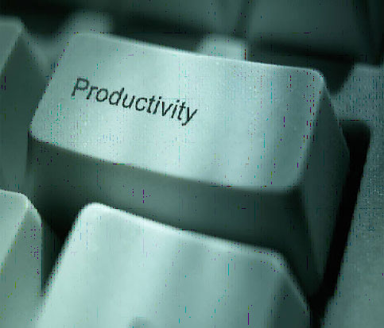

20 February 2017

According to [this article](http://www.businessinsider.com/smartphone-vs-amazon-echo-virtual-reality-and-augmented-reality-2017-2?utm_source=feedly&amp;utm_medium=referral), the smartphone boom is over, and the "next big thing" isn't really here yet. I would argue that's good. We need a breather to catch up with all the changes from the past several years.

In a sense, there have been two periods in my career that were *really fun* from the perspective of solving business problems (as opposed to other points that were equally fun from the perspective of learning new tech).

One was a couple years before and after 1990, when the minicomputer ecosystem was generally stable (HP 3000, Unix, VAX were common options). The other period was the six years when VB6 was dominant, while .NET was still nascent, VB had matured, and Windows was the defacto target for all client software.

In both those cases there was a 5-6 year window when the platforms were slow-changing, the dev tools were mature, and disruption was around the fringes, not in the mainstream. From a "learn new tech" perspective those were probably pretty boring periods of time. But from a "solve big business problems" perspective they were *amazing* periods of time, because everyone felt pretty comfortable using the platforms/tools at hand to actually do something useful for end users.

The iPad turned the world on its ear, and we're just now back to a point where it is clear that the platform is .NET/Java on the server and Angular on the client (regardless of the client OS). The server tooling has been fine for years, but I think we can see real stability for client development in the near future - whew!

So if the chaos we've been suffering through for the past several years (decade?) is coming to an end, and there's no clear "next big thing", then with any luck we'll find ourselves in a nice period of *actual productivity* for a little while. And I think that'd be refreshing.
