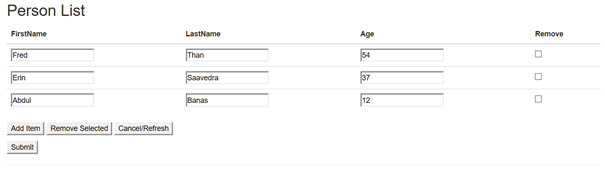

07 June 2016

A very common scenario for line of business apps is to edit a collection of items. Often this isn’t a bit collection, just a variable number of rows with a few columns to edit per row.

The MVC scaffolding supports this scenario by making it easy to create a set of pages – display the list, create a new item, edit an existing item, confirm removal of an item. And this scaffolding is quite useful, especially for scenarios where each row of data has a lot of properties to edit.

Where it isn’t so useful is in another common case, where each row of data has a small number of properties to edit (and where there are a relatively small number of rows). In this case most users would prefer to just edit all the values on a single screen, not having to navigate to the create/edit/delete pages for each row, as that is quite awkward.

What I’ve found is that there are some (ok, lots) of blog posts and code snippets showing ways to solve this problem. Much of this content dates back many years, often to MVC 2, and shows what (in my view) are some pretty hacky solutions involving client-side JavaScript that manually creates html strings that replicate (often outdated) html comparable to that generated by MVC in Razor. Other solutions use WebGrid, a seemingly little-used feature of MVC that also needs some (less hacky) JavaScript to support editing.

For my purposes, I wanted something simpler, more direct. I don’t mind some postbacks – you’d get those with the standard MVC scaffolding – I just want the user to feel like they are just editing the list of items without a lot of page navigation. Something like this:

I also don’t mind using Session in this case, because I’m building something that will, at most, be used by 0.3% of our employee base, which is currently around 600 people. If we grow enough that scaling is an issue we’ll obviously have

To that end I created a new ASP.NET MVC 5 project in Visual Studio 2015 and added the [files in this gist](https://gist.github.com/rockfordlhotka/0474af9cf53cec9f2d359fa413d61e73) that contain the implementation.

The ProjectListController serves up the initial page, and accepts POST operations from the browser.

The Index method displays the page with the collection data. If Session is empty the data is loaded from the database, otherwise the cached Session data is used to populate the page. Typically this means that the first time the user arrives at the page they’ll get fresh data from the database, and on postback operations the data will come from Session. Basically I’m using Session as an in-memory scratch location for the data until all edits are complete and the user clicks the button to save the data.

The POST method works differently depending on the button clicked by the user, handling add, remove, cancel, and submit operations. The operation is indicated by the value of the button, which flows into the controller through a method parameter. In every case the POST method has the full contents of the collection from the UI that flows from the browser into the method.

The add operation adds a new/empty item to the collection, updates the state in Session and allows the page to be redisplayed. This means the newly added item appears to the user, but hasn’t been saved to the database.

The remove operation removes the selected item or items from the collection, updates the state in Session and allows the page to be redisplayed. This means the removed items are no longer displayed, but haven’t been removed from the database.

The cancel/refresh operation clears Session and redisplays the page, causing the page to display fresh data from the database.

The submit operation saves the data into the database, then clears Session to ensure that when the page is redisplayed that the user gets fresh data from the database (including the newly saved changes).

The Index.cshtml view implements the page, relying on the Person.cshtml view to display each row of data from the collection. The Index view has all the buttons the user can click to trigger the postback operations to the controller as I just described.

The Person.cshtml view creates the edit controls for the properties the user should view/edit for each row.

The Person.cs file implements the model – really the *viewmodel*. Notice that it has a Removed property which is very UI specific, so this clearly isn’t the *actual* model you’d ever get/save in a database.

The controller has TODO comments indicating where code should go to invoke the data access layer to retrieve and update the database based on the in-memory collection of Person objects.
