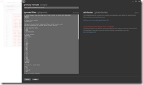

25 February 2013

A short time ago I decided to move the CSLA .NET project off my self-hosted Subversion server to GitHub.

I’ve used svn for years now, and really liked it a lot. But my server was getting old in the tooth, and everyone seems totally nutso about git. Apparently it not only does source control, but makes a mean gourmet meal and will eventually solve world hunger.

I want to thank [Nick Schonning](https://github.com/nschonni) for helping get a lot of the GitHub stuff up and running. He just jumped in and was a great help, thank you!

My original run at moving was to just export the latest trunk from svn and add it to a blank new git repo. Sure I lost a decade’s worth of history, but my wife often tells me I just need to let go and stop being a pack rat 

That worked really quite well, or so I thought. The ultimate problem hadn’t really surfaced yet, and wouldn’t for a while longer. You see I was the only person using the repo, and only from a Windows dev workstation, so the (really bad) default settings for GitHub repos in terms of line termination characters didn’t cause me issues.

> Here’s some technical detail on the [background of the line termination issue](http://timclem.wordpress.com/2012/03/01/mind-the-end-of-your-line/) if you are curious about stuff that shouldn’t exist in modern computing…

Then Nick kindly ran an svn2git tool and provided me with that decade’s worth of history I’d lost. Awesome! I added that to the repo and merged in the changes I’d been making. I think this is where things started to go awry, because Nick ran that tool on a Linux box, resulting in some files using LF and some using CR/LF line termination characters.

What happens to you at this point is that you change one line in a code file and GitHub thinks you’ve changed every line in that file. And often random other files too. So I’d change one file and end up with a few dozen files in my next commit. Total chaos!

Nick added a .gitattributes file, but the merge of his fork failed. People keep telling me git has flawless merges, but in my brief experience this is far from true… So I added the .gitattributes file directly. And I followed the instructions on the [GitHub page dealing with line endings](https://help.github.com/articles/dealing-with-line-endings).

> WARNING: DO NOT FOLLOW THEIR INSTRUCTIONS – THEY LEAD TO A BAD PLACE!

I was then referred to a [stackoverflow post on the topic](http://stackoverflow.com/questions/170961/whats-the-best-crlf-handling-strategy-with-git). Ultimately it appears that this thread (in and amongst the arrogance and anti-Microsoft sentiment) was what fed into the GitHub help page.

> AGAIN, WARNING: DO NOT FOLLOW THEIR INSTRUCTIONS – THEY LEAD TO A BAD PLACE!

See the thing is this: I followed the instructions from these two sources. Several times. Carefully, because I kept thinking I’d overlooked some minor detail. At no point was the problem solved. In fact, it turns out that manually adding a .gitattributes file and following these instructions *blocked the resolution of the problem*.

Scott Hanselman discusses the issue in his blog post on [the pink wall (of doom)](http://www.hanselman.com/blog/YoureJustAnotherCarriageReturnLineFeedInTheWall.aspx). Although this post has good info, it still left me confused – and that’s the reason I’m writing THIS blog post.

What I learned out of all this is that Scott is right: the GitHub for Windows GUI tool does fix the problem. *But only if you haven’t already tried to follow the manual instructions!!!!* (also Git for Windows is not the same as GitHub for Windows, and you need *GitHub for Windows*.

The correct overall solution is this:

Create your GitHub repo

Clone your repo to your Windows dev workstation

At this point you will *not* have a .gitattributes file in your repo (and this is important!!!)

Add the client-side repo to the GitHub for Windows GUI tool (if necessary)

Then open the repo

And click the Tools | Settings menu option

This is where I hit the problem. Because I’d already done the manual (and not successful) steps to address the problem, I already had a .gitattributes file. As a result my screen didn’t match what I’m showing you here in this blog post. You *really* need to see the screen I’m showing here!!

The value of this screen is that the GUI tool will perform magic of some sort. It adds a .gitattributes file as shown, and when you click the Update button it will trigger an update to all the files in your repo.

Commit those updates to fix all the line endings for all your files

Then push the commit to GitHub

From what I can determine this has solved the issue. So after wasting several hours farting around with cryptic command line tools, the solution was to let a tool do magic for a couple minutes. If only I’d known to delete the .gitattributes file earlier (or to have never manually created it) I’d have been infinitely happier.

In summary, git does seem pretty cool. But it clearly is no more of a silver bullet or super-solution than anything else in our industry. It is a decent tool, but I suggest taking all the hype about git with a shaker of salt.
