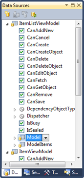
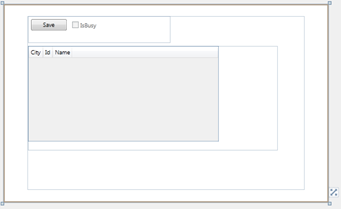
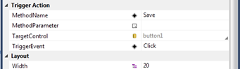

16 February 2010

Visual Studio 2010 includes a new XAML designer, with capabilities roughly comparable to the Windows Forms designer we’ve enjoyed all these many years.

This means you can use drag-and-drop design concepts to get controls from the Toolbox onto the design surface, drag them around, see snaplines and use the Properties window to set properties (including data binding). And the Data Sources window works, so you can drag entire objects or specific properties from a data source (like a CSLA .NET business object) onto the design surface to create a UI control with the data binding all set up.

I’m very excited about this designer, as I think the lack of a good designer has been the single biggest roadblock to WPF (and now Silverlight) adoption. While some people are OK with manually typing XAML, I think a lot more people have been (im)patiently waiting for tooling so they don’t have to work at that level. I’m in the latter camp, but I’ve been forcing myself to type XAML for a few years now because the results are so much better than Windows Forms that it has been worth the pain.

However, with the designer being out now (stable and fast in the RC) I’ve been spending some quality time with it. And what I’m finding is that I have to unlearn a lot of techniques. Things that work great when you manually type XAML don’t always translate exactly into the designer metaphor and/or workflow.

### CollectionViewSource Indirection

For example, when you drag something from the Data Sources window to the design surface the designer creates a CollectionViewSource resource to manage the data object. Suppose the data source is your business object – the CVS now contains your business object. Suppose the data source is your viewmodel object – the CVS now contains your viewmodel object.

It is this last point that is tricky. I have been building my viewmodel objects so *they are the resource*. Now they are *contained inside the resource*. There’s a new level of indirection involved.

Oh, and the CVS only contains a list of objects, never a single object. So when I drag my single viewmodel onto the designer it ends up in a list of 1 item in the CVS. And that’s OK, it just means your binding expressions need to take this into account. Instead of setting the DataContext directly to the resource, you must set it to the *current item* in the resource:

DataContext=”{Binding Source={StaticResource viewModelViewSource}, Path=/}”

 It is the *Path=/* part that is new and different. Of course you don’t really type that binding expression – the designer has a dialog where you set up or edit the DataContext and other binding details.

In the screen shot to the left you can see some regions on the form. The top, where the button and checkbox are visible, is bound to the / path. The bottom, where the datagrid is visible, is bound to the Model property – which means the datagrid is bound directly to the business object, and that’s a fine thing since CSLA 4 BusinessListBase objects derive from ObservableCollection&lt;T&gt; and are fully bindable in XAML.

### Executing ViewModel Verbs

The other area of challenge I’ve encountered is with triggering viewmodel verbs/commands/actions/methods when a UI event occurs. Remember that Silverlight doesn’t have commanding, and even in WPF commanding is not a complete solution to this problem.

Blend 3 introduced the concept of trigger actions and behaviors, and CSLA .NET 3.8 has an Execute trigger action that executes a method on the viewmodel when an event occurs on a UI control. Prior to that, in version 3.6, there was the InvokeMethod attached property that did the same basic thing.

The problem with both InvokeMethod and the Blend 3 trigger action concept is that there’s no access to these concepts from the VS10 designer. You can use them, but you have to manually type the XAML. My personal goal and hope with the designer is to never type (or even see) XAML.

 So this evening I took the ideas from InvokeMethod and Execute and created a new control I’m calling TriggerAction ([see code here](http://www.lhotka.net/cslacvs/viewvc.cgi/core/branches/V4-0-0-RC/Source/Csla.Xaml/TriggerAction.cs?view=markup)). The TriggerAction control is a real control – it shows up in the Toolbox and you can drag it onto the design surface. It is invisible (collapsed), as it really has no UI aspect. But it does have some important properties:

- TargetControl – use element binding to connect it to the UI control that’ll raise the event
- TriggerEvent – the name of the event raised by the UI control
- MethodName – the name of the method/verb/action on the viewmodel (DataContext) object to invoke in response to the trigger event
- MethodParameter – a bindable parameter value that can optionally be passed to the viewmodel method

In short, TriggerAction does exactly what InvokeMethod and Execute do, but in a way that is friendly to the XAML designer. This means not requiring any manual editing of XAML.

I’m not done yet, but I’m becoming increasingly convinced that the VS10 designer really will allow creation of XAML interfaces using patterns like MVVM and requiring zero code-behind the XAML – without the developer ever having to see (much less edit) XAML directly. Happiness!!
