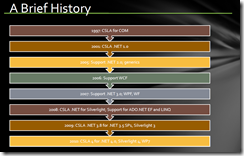
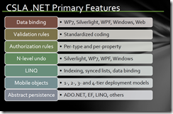

08 October 2010

Every now and then someone asks me for some content they can use in a high level or executive presentation about CSLA .NET. Here’s a PDF with the [slides I’ve been using](http://www.lhotka.net/files/csla40/CSLA.pdf) for CSLA 4.

The first slide lays out the high level goals I keep in mind when building the framework.

The second slide provides a brief history of the framework. I use this to establish that CSLA has been around for a very long time, much longer than the vast majority of open source tools and frameworks for .NET (or most other platforms).

The third slide is more tactical, showing a high level list of features provided by the framework. What’s interesting about this list, is that the primary reason most people use the framework is that it provides such rich data binding support, but my *original motivation* was the concept of mobile objects. But as servers have become so powerful over the past 14 years that feature has actually become less important to a lot of people.

The final slide is a high level illustration of the types of organizations and applications that use CSLA .NET. You can get similar information on my web site (http://www.lhotka.net/cslanet/usage.aspx). I think the important thing to realize is that this framework is used all over the world, by organizations both big and small. For my part, I am honestly humbled by this reality – that amazingly talented people use CSLA to create some software that impacts people in many ways great and small.

Feel free to use this information if you find it valuable.
