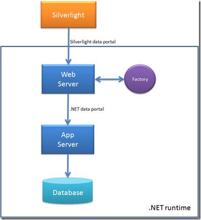
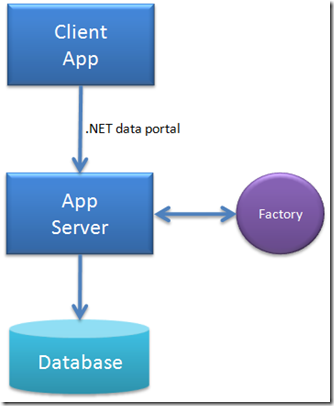

14 July 2008

While most people use CSLA .NET because it provides support for data binding, validation, business rules and authorization, I personally think the coolest part of the framework is its support for *mobile objects*. This support is provided by the data portal, which provides both an abstract persistence model for business objects, as well as an implementation of mobile objects with location and network transparency.

CSLA Light will also include a data portal that works in a manner similar to the one in CSLA .NET. In fact, the two are complimentary - the CSLA Light data portal talks to the CSLA .NET data portal, because the client is running Silverlight and the server is running .NET. This occurs when the CSLA Light data portal is running in "remote" mode - meaning it is talking to a remote data portal server.

The CSLA Light data portal can also run in "local" mode, which means that the "data access" code runs on the Silverlight client. In reality, this probably means that your client-side code is directly calling some external service - an asmx web service, a WCF service, ADO.NET data services, etc. So the fact is that the data access is still on some server somewhere, but you aren't using the data portal to get from the client to that server.

As in .NET, when using the data portal in local mode things are pretty simple. A call to the data portal to fetch an object simply results in a call to a DataPortal\_Fetch() method in your object, and the object is running on the client in Silverlight. What you do in that DataPortal\_Fetch() method is entirely up to you, as long as the object is populated with data by the time the call completes.

When you use the remote data portal there are more options. Things are somewhat different from the existing .NET data portal. The following figure will help explain.

The CSLA Light data portal interacts with a server (probably a web server, though it could be a Windows Server 2008 running WAS) through WCF. That server is running CSLA .NET 3.6, which includes data portal support to listen for CSLA Light data portal requests. Objects are serialized to/from CSLA Light using the MobileFormatter, which is a serializer included in both CSLA Light and CSLA .NET that provides a subset of the functionality provided by the BinaryFormatter (or NetDataContractSerializer), targeted at the CSLA scenario.

On the web server, CSLA .NET 3.6 receives the inbound client request. Any objects sent from the client to the server are deserialized (including any criteria objects or business objects). At this point there are two ways the process will work.

The default option is that the call from the client is "echoed" into the standard CSLA .NET data portal. In other words, if the client calls Fetch() on the data portal, that call is relayed into the standard data portal as a Fetch() request. This means that the .NET data portal applies its normal process and runs in local or remote mode and ultimately creates an instance of your business object and calls its DataPortal\_Fetch() method. Remember that this is all happening in .NET on the server(s). The resulting business object is then returned through the .NET data portal to the web server, and from there through the Silverlight data portal to the client.

So by default, the .NET data portal running on the web server (in the diagram) is a pass-through from Silverlight into .NET. The end result is that the Silverlight data portal works just like the .NET data portal does today.

While the default is good and easy, it may not always be ideal. You may not trust the code running in Silverlight on the client. You may be concerned that the code has been compromised, that somehow a malicious user cracked into the Silverlight runtime, mucked around with your code and bypassed your logic. Thus far no one has established that this can be done, but I can understand the concern.

In that case, another option is that the business class (on the .NET side) can have a MobileFactory attribute attached:

> [MobileFactory("MyLibrary.CustomerFactory,MyLibrary", "Create", "Fetch", "Update", "Delete")]
> public class Customer : BusinessBase&lt;Customer&gt;

If this attribute is applied, the .NET data portal will create an instance of the type specified in the attribute, and will call methods on that factory object *instead of on the business object*. In other words, a call that *would have gone* to DataPortal\_Fetch() will now go to a method matching the third parameter of the attribute - in this example a method called Fetch().

The factory object is responsible for creating, initializing and returning the object from create/fetch/update operations. Delete returns nothing. How the factory object does this is up to the factory author - you. I suspect a very common implementation will be for the factory method to do extra business checks (validation/authorization) to decide if the client call is valid, and if it is valid then the factory will just echo the call into the .NET data portal. So you might write something like this in a factory:

> public object Fetch(SingleCriteria&lt;Customer, int&gt; criteria)
> {
>   // do extra validation/authorization checks here
>   if (allChecksPassed)
>     return DataPortal.Fetch(criteria);
>   else
>     throw new Exception("Bad client request");
> }

A colleague of mine at Magenic, Nermin Dibek, suggested an interesting enhancement to this MobileFactory model, which I'll include in the implementation. As a configuration option, you can specify a "factory of factories" object. The default behavior is to take the type name in the first parameter and use it to create an instance of the factory object. But if you'd like, you can create your own "factory creator" object that takes that first parameter and uses it however you'd like to create an instance of the factory. This would allow you to substitute MyTestLibrary for MyLibrary when you wanted to use a set of test factories instead of the production versions, and that sort of thing.

It is my intent to extend this MobileFactory concept into the .NET data portal itself (in CSLA .NET 3.6), so in a pure-.NET scenario you'd have comparable options, like this figure:

The data portal would default to its existing behavior, which would be unchanged. However, you'd be able to apply an ObjectFactory attribute to your business classes to indicate that the data portal should route its calls to your factory object rather than to the DataPortal\_XYZ methods.

The only catch here, is that your factory objects then assume responsibility for managing the status values (IsNew, IsDirty, etc) of the object (and its child objects, etc). The data portal essentially steps out of the picture entirely - leaving you to do all the work of creating and manipulating the business object as necessary. However, this does open up some interesting alternatives for persisting objects even though the solution is less automated than the current implementation.

The CSLA Light part of what I've discussed here is in the current 3.6 code in Subversion (svn://svn.lhotka.net/csla/branches/cslacs36 and svn://svn.lhotka.net/csla/trunk/cslalightcs). The ObjectFactory support for CSLA .NET itself will probably happen in a few weeks.
