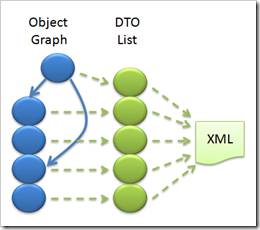
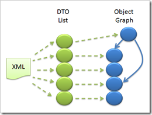

10 June 2008

I've been prototyping various aspects of CSLA Light (CSLA for Silverlight) for some time now. Enough to be confident that a decent subset of CSLA functionality will work just fine in Silverlight - which is very exciting!

The primary area of my focus is serialization of object graphs, and I've blogged about this before. This one issue is directly on the critical path, because a resolution is required for the data portal, object cloning and n-level undo.

And I've come to a final decision regarding object serialization: I'm not going to try and use reflection. Silverlight turns out to have some reasonable support for reflection - enough for Microsoft to create a subset of the WCF DataContractSerializer. Unfortunately it isn't enough to create something like the BinaryFormatter or NetDataContractSerializer, primarily due to the limitations around reflecting against non-public fields.

One option I considered is to say that only business objects with public read-write properties are allowed. But that's a major constraint on OO design, and still doesn't resolve issues around calling a property setter to load values into the object - because object setters typically invoke authorization and validation logic.

Another option I considered is to actually use reflection. I discussed this in a previous blog post - because you *can* make it work as long as you insert about a dozen lines of code *into every class you write*. But I've decided this is too onerous and bug-prone. So while reflection could be made to work, I think the cost is too high.

Another option is to require that the business developer create a DTO (data transfer object) for each business object type. And all field values would be stored in this DTO rather than in normal fields. While this is a workable solution, it imposes a coding burden not unlike that of using the struct concepts from my CSLA Classic days in the 1990's. I'm not eager to repeat that model...

Yet another option is to rely on the concept of *managed backing fields*that I introduced in CSLA .NET 3.5. In CSLA .NET 3.5 I introduced the idea that you could choose not to declare backing fields for your properties, and that you could allow CSLA to manage the values for you in something called the FieldManager. Conceptually this is similar to the concept of a DependencyProperty introduced by Microsoft for WF and WPF.

The reason I introduced managed backing fields is that I didn't expect Silverlight to have reflection against private fields *at all*. I was excited when it turned out to have a level of reflection, but now that I've done all this research and prototyping, I've decided it isn't useful in the end. So I'm returning to my original plan - using managed backing fields to avoid the use of reflection when serializing business objects.

The idea is relatively simple. The FieldManager stores the property values in a dictionary (it is actually a bit more complex than that for performance reasons, but conceptually it is a dictionary). Because of this, it is entirely possible to write code to loop through the values in the field manager and to copy them into a well-defined data contract (DTO). In fact, it is possible to define one DTO that can handle any BusinessBase-derived object, and other for any BusinessListBase-derived object and so forth. Basically one DTO per CSLA base class.

The MobileFormatter (the serializer I'm creating) can simply call Serialize() and Deserialize() methods on the CSLA base classes (defined by an IMobileObject interface that is implemented by BusinessBase, etc.) and the base class can get/set its data into/out of the DTO supplied by the MobileFormatter.

In the end, the MobileFormatter will have one DTO for each business object in the object graph, all in a single list of DTOs. The DataContractSerializer can then be used to convert that list of DTOs into an XML byte stream, as shown here:

The XML byte stream can later be deserialized into a list of DTOs, and then into a clone of the original object graph, as shown here:

Notice that the object graph shape is preserved (something the DataContractSerializer in Silverlight can't do at all), and that the object graph is truly cloned.

This decision does impose an important constraint on business objects created for CSLA Light, in that they *must use managed backing fields*. Private backing fields will not be supported. I prefer not to impose constraints, but this one seems reasonable because the alternatives are all worse than this particular constraint.

My goal is to allow you to write your properties, validation rules, business rules and authorization rules exactly one time, and to have that code run on both the Silverlight client and on your web/app server. To have that code compile into the Silverlight runtime and the .NET runtime. To have CSLA .NET and CSLA Light provide the same set of public and protected members so you get the same CSLA services in both environments.

By restricting CSLA Light to only support managed backing fields, I can accomplish that goal without imposing requirements for extra coding behind every business object, or the insertion of arcane reflection code into every business class.
