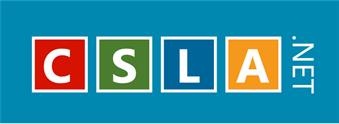
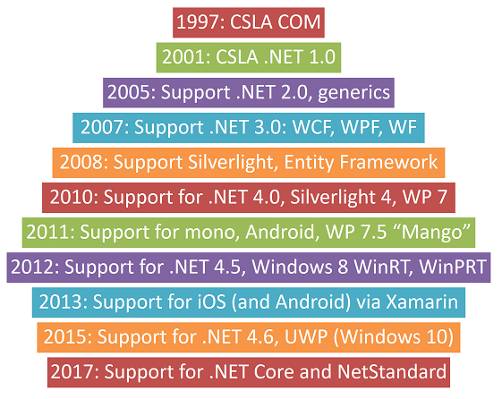
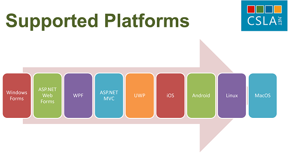

10 October 2017

The [CSLA framework](http://cslanet.com) is now officially 20 years old. Seriously, some version of CSLA has been out in the world for people to freely use since 1997 when my *Professional VB5 Business Objects* book came out with the code on a disc attached inside the back cover.

Although I didn't technically call it "open source" back then, because the more common terms were "freeware" and "shareware", and I considered CSLA to be "freeware". Those terms eventually became subsumed by what we now know as Open Source Software (OSS), and of course that's the term I use today.

I'm proud of the fact that I've been contributing to the OSS world for 20 years. Not too many open source projects last this long.

And more importantly, I'm humbled and amazed by the emails and feedback I've received over the years - both in terms of people using CSLA, and also people who've benefited from reading my books. And of course by the amazing contributions by colleagues and community members, several of whom I'll call out later in this article.

The following is a pretty long post, but I thought that it would be good to record the highlights of the past 20 years.

### Why Open Source?

Lots of people have opinions and views and motivations about why they use and/or contribute to open source.

Personally, my motivation to *contribute* flows from being an early user of the concept. I very much believe that my career wouldn't have gone where it did, except for me having access to freeware, shareware, and open source software.

Back in 1989 (give or take) I was making my living being a DEC VAX programmer. And 1-2 times each year we'd get a couple big magnetic tapes (like in those very old movies) that contained tons and tons of freeware, shareware, and early open source (GNU and copyleft) stuff. I'd typically come in on a Saturday, download the index from the tapes and then selectively download and play with various tools.

Things like awk (really gawk) that I used to transform how our company processed reporting data. Or like uupc, which was a UseNet protocol implementation for the VAX that allowed us to get store-and-forward email service to the world over our 1200 baud modems.

I looked like a frickin' rockstar thanks to those tools!

Similarly, at the time, I was an Amiga fanatic. And the [Fred Fish](https://en.wikipedia.org/wiki/Fred_Fish) collection of software was like a lifeline to all that was cool and fun in the world of ... everything!

Yes, like everyone I've needed to make a living, support my family, save for the kids college and my retirement. But, and I know this sounds sappy, having built my career on the shoulders of some impressive people's contributions, I was on the lookout for a way to try and do the same for others.

### CSLA COM or "Classic"

CSLA started out as the "Component-based, Scalable, Logical Architecture" in the world of COM. And I didn't originally *intend* for it to be a standalone framework. My original thought was that this code was an example of what people *could* do, and it fit into the bigger narrative of my book.

By the time I wrote the *Professional VB6 Business Objects* and *Professional VB6 Distributed Objects* books though, it was already becoming clear that I was mistaken. I phrase it that way on purpose, because by that time I was receiving emails with bug reports, feature suggestions, and other comments - where people were *clearly* taking the code and using it as a framework, not as an example.

Want to see that old code (and a picture of me from 20 years ago)? I put the old [VB6 CSLA code](https://github.com/MarimerLLC/csla-vb6) in a GitHub repo for safe keeping.

[Kevin Ford](https://github.com/Bowman74) and I worked together on a project in 1996-97, and the two of us argued extensively about how things should work. Without his input, CSLA would not have been what it was, and Kevin has been providing input and contributions from then through today.

### CSLA .NET 1.0

Toward the end of the 1990's I was seriously considering switching to the shiny new Java world. Primarily because I'd become increasingly frustrated with COM and DCOM, and yearned for the more object-oriented aspects of Java. Fortunately for me, I became aware of things like a new "COOL" language, and "COM+3". Technologies that ultimately became what we know as the .NET framework, VB.NET, and C#. So I stuck with the Microsoft world through that time.

Working with the earliest pre-releases of .NET I tried directly porting the COM code to .NET. That sort of worked, but clearly wasn't what I wanted, because it didn't leverage the new OO features available to me. I believe I wrote and rewrote the core of CSLA three different times into .NET, each time learning more and more about how .NET worked and what I could do with it.

The end result was CSLA .NET 1.0. Still very much a bare bones "framework" that I still personally considered as much an example of what to do as a framework someone could use out of the box. But by that point I *had* reconciled myself to the reality that people would be using it as-is, so I use XML comments and a short-lived, but very good, OSS tool called ndoc to create a help file for the framework.

And of course CSLA .NET came out concurrent with my *Professional VB.NET Business Objects* book. That was republished not long after under the title *Expert One-On-One Visual Basic .NET Business Objects* because my books were purchased from Wrox Press by APress. Not that this affected CSLA .NET, but it obviously affected me and my books - in a positive way, as APress was great to work with!

### CSLA .NET 1.1 and C#

In fact, I wrote the *Expert C# Business Objects* book with APress. The port of CSLA .NET from VB.NET to C# was almost entirely done by a colleague of mine: Brant Estes. And I think he did it in just a few days - amazing work by an amazing developer!

Thus started the era of maintaining the "same codebase" twice in two different languages. You can see it in the [v1-5-x branch](https://github.com/MarimerLLC/csla/tree/V1-5-x) - two versions of everything.

This is also about the time that the term "CSLA" stopped being an acronym and became just an unpronounceable word. The acronym no longer applied really, because .NET is object-oriented, not component-based. What I *should* have done is given it a cool name instead of some letters. Saying "see es el ay" is tedious. People were saying "the Lhotka framework", or "the coleslaw framework", or the "cuz law framework". But I didn't have that foresight, and after 20 years I doubt I'll change the branding now.

So now we're in 2002-2003, give or take, and the Internet as we know it today was really coming together, including the idea that OSS projects should have public source repos. So I set up a Subversion (svn) server and a web site with downloadable zip archives containing the code and samples. I still figured people should leverage the code, not the framework as a "product".

### CSLA .NET 2.0

That changed in 2005 with CSLA .NET 2.0, which primarily supported .NET 2.0 and generics. And of course the new *Expert C# 2005 Business Objects* and *Expert VB 2005 Business Objects* books. But somewhere around this time is when I started releasing not just the code, but also pre-compiled binaries for people to leverage.

### CSLA .NET 3.0

In 2007 Microsoft released .NET 3.0, including WPF, WCF, and WF. Supporting WCF meant decoupling the data portal from .NET Remoting, so people could use Remoting, asmx, or WCF as a transport protocol. Supporting WPF meant lots of alterations to data binding code, because WPF interacts with the data binding interfaces differently from Windows Forms. Very messy and hard to accommodate, so this was the point in the evolution of CSLA where I realized the *primary* benefit was how it mitigates all the differences in data binding, not the data portal.

Around this time was my first foray into self-publishing content via the web, with my *CSLA .NET 2.1 Handbook* and *Using CSLA .NET 3.0* ebooks. Both published in VB and C# editions.

### CSLA .NET 3.7 and Silverlight

2008 brought Silverlight 2, the first time .NET fragmented into two totally different platforms. Getting CSLA decoupled from full .NET, such that it could also support the Silverlight flavor of .NET, was a major undertaking. Thankfully CSLA had [Magenic](https://magenic.com) as a patron, and Magenic committed several full time developers for a period of months to work through all the issues necessary for CSLA to run on both full .NET and Silverlight.

2008 is also the year I published my last paper books: *Expert C# 2008 Business Objects* and *Expert VB 2008 Business Objects*. By this time I'd switched entirely to C# myself, and a colleague named Joe Fallon was responsible for getting the VB code and book out there.

Subsequent to 2008 the VB source code for the framework itself was dropped, and only the C# framework code continued forward. Obviously the framework supports all .NET languages, so it can be *used* by VB or C#, but the framework code itself is C# only from 2008 forward.

[Justin Chase](https://github.com/justinmchase) was instrumental in the port to Silverlight. In fact, there were no good ways to run unit tests in Silverlight, especially if you wanted the same tests to run in .NET. So Justin created [UnitDriven](http://unitdriven.codeplex.com/) to solve that problem.

### Marimer LLC

In 2009 I created Marimer LLC as an official company to own CSLA .NET and all related code, content, and business operations. Prior to that point I'd been operating as what's called a Sole Proprietor, and having an LLC provides a level of legal protection. Not that I've ever needed that, thankfully.

The trigger for this was a very large company who wanted to use CSLA .NET, but even though it was open source they didn't want to use a product that didn't have a company behind it. Other people were covering the legal costs to create the LLC and ultimately it was to my benefit, so I saw no downside.

### CSLA .NET 4.0

A couple years later, in 2010, came some of the biggest changes to CSLA .NET since the addition of generics.

This is also the point where I switched completely to self-published books and videos via the web with the *Using CSLA 4* ebook.

The http://store.lhotka.net has been online with that content for seven years now. Wow!

The massive work to decouple from .NET and support Silverlight was far more *work* than what we did in .NET 4, but it was largely transparent to users of CSLA .NET (which is kind of the point after all). But the changes we made to CSLA .NET 4 were breaking changes for users of the framework.

I say we, because by this point in time CSLA had accumulated quite a number of contributors. A list of contributors since we switched to GitHub is on the [CSLA .NET contributors](https://github.com/MarimerLLC/csla/graphs/contributors) page. I'm truly sorry I have no way to list all the people who contributed to the svn codebase, though the [CSLA .NET Open Hub](https://www.openhub.net/p/cslanet) page has captured quite a lot of historical data and says 61 people have contributed.

But back to CSLA .NET 4 and the big changes. What did did in this version was add the basis for a robust rules engine. This was based on lots of community feedback from our early attempts with a rules engine starting in version 3.8 and the influence of David West through his *Object Thinking* book.

Building on this rules engine, [Jonny Bekkum](https://github.com/jonnybee) has evolved the engine substantially over the past several years, and today it is able to handle extremely complex scenarios. Best of all, the engine retains its relative simplicity for less complex scenarios and rules.

Beyond that, Jonny has been a major contributor to other parts of the framework, one of my most trusted advisors, and a stalwart member of the broader community over many, many years.

I also want to call out [Tiago Freitas Leal](https://github.com/tfreitasleal), who's run a parallel OSS project called [CslaCodeGenFork](https://github.com/CslaGenFork/CslaGenFork), has worked closely with Jonny to manage the community-based [CslaContrib](https://github.com/MarimerLLC/cslacontrib) project, and has been an active contributor to the CSLA framework and the community. Tiago has been involved for almost as many years as Jonny.

This is also about the time that [Jaans](https://github.com/Jaans) helped create the initial NuGet definitions necessary to get CSLA into NuGet. Most of his nuspec files remain intact, though perhaps evolved slightly over time.

### Enter mono, mono for Android, and Windows Phone

In 2011 the open source mono port of .NET became much more relevant to me than it had been prior to that point. Primarily because the mono project embraced Android and iOS as well as Linux.

Jonny Bekkum leveraged the decoupling of CSLA .NET from full .NET to get a version running on mono, and based on that I tried to get it working on Android and iOS. Android was successful, but technical limitations of mono on iOS blocked our progress at that time.

We also leveraged the decoupling from full .NET in order to get a version of CSLA running on the nascent Windows Phone platform.

Turns out that all that work back in 2007 to support Silverlight was *incredibly* valuable going forward, even though Silverlight itself ultimately had no future. Because CSLA .NET had been largely decoupled from full .NET though, we've been able to get CSLA .NET running on over 11 different flavors/versions of .NET *simultaneously* - all from a single codebase!

### CSLA .NET 4.5

In 2012 Micrsoft came out with the ill-fated Windows 8, and what I personally describe as the evolution of Silverlight: WinRT. Porting CSLA .NET to WinRT took some effort, mostly because Microsoft messed around with the way the .NET reflection API worked. Why they changed one of the fundamental building blocks of .NET itself is beyond me, and it caused a great deal of pain. But we worked through it.

The other big impact was that the XAML supported by WinRT was comparable to that from Silverlight 2. Which is to say it was pretty limited compared to WPF or Silverlight 5. Fortunately I was able to dust off a lot of old Silverlight 2 XAML code and use it to support WinRT. This goes to show the value of having good source control history over a period of years!

I think this is also about the time that we switched the source code repository from svn to git, and the server from my personal lhotka.net server to GitHub. Bringing all the svn history forward was not trivial. At all. It was my colleague [Nermin Dibek](https://github.com/ndibek) who convinced me to switch to git, and [Nick Schonning](https://github.com/nschonni) suffered through the pains necessary to convert the svn history into git so it was (mostly) preserved.

### Enter Xamarin

By 2013 that mono for Android and iOS initiative had been canceled by its patron/owner Novell. Fortunately the project remained alive via a new company named Xamarin. Better still, Xamarin overcame some of the earlier iOS limitations, and so CSLA .NET was able to provide full support for Android and iOS via Xamarin.

From a historical perspective, it is also worth noting that this is about the time that, thanks to the confusion around the iPad and Windows 8, enterprises generally decided to stop building smart client apps *at all*, favoring to focus on HTML5 web apps and the newly coined "single page app" concept.

So supporting Xamarin was important from my viewpoint, because it felt like people might never again write a .NET client-side app otherwise. Today I'm not so pessimistic, primarily because *today* Xamarin is owned by Microsoft and supports cross-platform development across Windows 7, 8, 10, iOS, Android, Linux, MacOS, and more. Damned impressive!

### Windows 10

In 2015 Microsoft released Windows 10 to replace Windows 8. Now Windows 8 was largely a commercial failure, but I believe it did one very important thing: it broke everyone's conception about what Windows looked like and how it worked.

Windows 10 brought back many of the best-loved features of Windows 7, while keeping and refining the bits of Windows 8 that were actually good. Personally I really enjoy Windows 10, more than I did Windows 7 (which I thought at the time was the best Windows ever).

Windows 10 brought with it an evolution of WinRT called UWP, or the Universal Windows Platform. UWP had an interesting quirk, in that it ran on a super-early implementation of yet another flavor of .NET: .NET Core. Getting CSLA .NET to run on this new UWP flavor of .NET wasn't too hard, primarily because it really is just an evolution of WinRT, which we already supported.

Support for UWP means that CSLA .NET supports native Windows 10 development, and also works for Xbox and Hololens development. I think that's pretty cool!

### .NET Analyzers

[Jason Bock](https://github.com/JasonBock) has been a colleague and friend for many years, and his passion for compilers and low-level implementation details around .NET is hard to match. In 2015 Microsoft introduced this idea of .NET analyzers, which allow us to write components that runs within the .NET compilers and analyzes our code as we write and compile it.

Jason wrote a bunch of analyzers for CSLA .NET that help enforce the guidelines people *should* follow when using the framework. Prior to this point those guidelines were documented in my books and code samples, but there was nothing to help remind people what to do as they were coding. Jason's analyzers changed that entirely, providing real-time feedback *and code refactorings* directly within Visual Studio. Awesome!

### MIT License

From the inception of CSLA until 2016 I'd been using a custom license based largely off the Apache license. And that never really caused any issue, but it did occasionally result in me having an email exchange with an organization's lawyer as they approved the license.

Switching to the MIT license is something, in retrospect, that I should have done much earlier. Now I don't get any such email exchanges, because everyone knows and understands the MIT license.

That's perhaps one of the lessons to learn here. I started doing all this back before "open source" was as formal or defined as it is today. And "little" things like licensing rarely get updated over time, because the focus is always on the code and other fun stuff. It is probably a good idea to review things like licensing more frequently over the lifetime of a project, just to make sure those elements remain up to date and relevant as times change.

### .NET Core and NetStandard

The most recent changes to the .NET world have largely centered around the new .NET Core implementation of .NET, a version of .NET than is truly cross-platform. And something called netstandard, which is an API definition against which we can write code, and have that same compiled code work on multiple flavors of .NET.

CSLA .NET 4.7 supports netstandard 2.0, and that means a single Csla.dll works on all the platforms that conform to netstandard 2.0, including:

- Full .NET 4.6.1+
- Xamarin Android, iOS, and more
- UWP starting in October 2017
- .NET Core 2.0

Basically all the modern versions/flavors of .NET now support netstandard 2.0. And so does CSLA .NET 4.7.

So where we've been compiling the CSLA source code 11+ times - once for each flavor of .NET that's running out there, the future looks bright, in that hopefully, eventually, we'll be able to build it just *one* time.

Of course it'll be a while before that happens. Today CSLA still supports people as far back as .NET 4.0. But the future is bright, and today's messy reality of various versions/flavors of .NET and PCLs and everything else is clearly going to be replaced by netstandard.

### Thank you

It has been a pretty incredible 20 years. I've met people (virtually and IRL) from all corners of the globe, and I've become good friends with many folks.

I've been able to continually improve and maintain the CSLA framework through the revenue generated by my books, training videos, and by having Magenic as a patron. Even with all that though, none of this would have been possible without the fantastic support from many thousands of people who've read my books and used CSLA, and the hundreds of people who've participated in the CSLA forums over the years, and the scores of people who've directly contributed to the CSLA framework and related projects.

As I wrote this article, I called out the names of a few people who've helped shape and create CSLA and the community. But there are other people in our small community that were and are also part of the narrative. Please know that I value each and every one of you as a colleague and friend.

Closer to home, the steadfast support from my wife and kids and close friends - really I don't have the words to express my gratitude and love for all of you. Much of my early work on CSLA and the books was done with my sons bouncing on my knees, sleeping in my lap as I typed, or making sure I got outside occasionally for some sunshine. And believe it or not, my wife and I are almost going to celebrate our 30th anniversary. So even with me disappearing to write for extended periods of time, we're still together and enjoying life.

### CSLA .NET Futures

Where to from here?

I'm more optimistic about the future of .NET than I have been for many years.

.NET on the server is gaining new life and enthusiasm thanks to .NET Core and the ability to run your code on Windows, Linux, MacOS, in Docker containers, and I'm sure more to come.

.NET on the client might be on the rebound. I think as more people discover just how horrific Electron is as a development platform for desktops, and they are already backing off from Cordova on mobile, this will open the door for Xamarin and .NET to be viewed as a desirable alternative. You know, a technology that doesn't suck down memory and CPU for no good reason, and a technology that truly allows developers to leverage each device and platform when needed.

And then there's the *great hope*, which is web assembly (wasm). If this project continues to progress, and I think it will, browsers will no longer be a homogeneous runtime for JavaScript. They'll be much closer to a true operating system or runtime, supporting many languages, include C# and .NET. Just imagine going to a "web page" and having it run .NET code instead of JavaScript!

And where .NET goes, CSLA .NET goes too.
