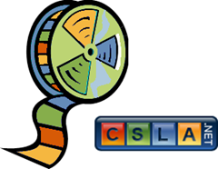

29 December 2009

 For those who have purchased the CSLA .NET Core 3.8 video series, you'll be happy to know that segment 6 (Authentication and authorization) is online, along with associated sample code.

<u><a href="http://download.lhotka.net/Default.aspx?t=Core38">http://download.lhotka.net/Default.aspx?t=Core38</a></u>

This completes the core video series. As we move into 2010 I plan to produce separate UI-specific videos covering WPF, ASP.NET MVC, etc, so watch for those.

If you haven't purchased the CSLA .NET Core 3.8 video series, there are only two days left of the special pre-release pricing. And only two days left for the holiday discount on the CSLA .NET for Silverlight video series.

So if you want to save 15% to 33% off regular pricing, [buy the video series before the end of 2009!](http://store.lhotka.net)
