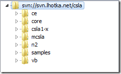
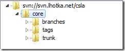
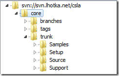
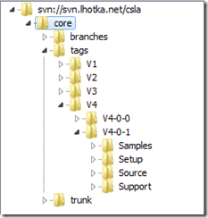
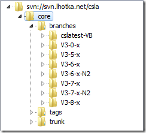

15 October 2010

Over the past 14 years of building and maintaining the CSLA framework I’ve tried several source control technologies and strategies. My current technology is Subversion and I have a branching and tagging strategy with which I’ve been very happy. So I thought I’d share how this works.

My CSLA .NET development team is distributed, with contributors to CSLA in various regions of the US and as far away as Norway. And my user base is truly global, with people using the code (and presumably looking at the repository) from countries in every corner of the planet.

I use Subversion primarily because it is “free as in beer”. In many ways I’d rather use TFS, but since I expose my repository to the world via svn clients and the web (and since CSLA is a free, open-source framework) TFS is completely out of reach financially.

The thing is though, if I used TFS I’d almost certainly use it the same way I’m using svn today. The lessons I’ve learned over the years about maintaining numerous releases, building major new versions and reducing administrative and developer complexity should generally apply to any source control technology.

### Top level folders

My top level folder structure organizes each project.

No branching or tagging at this level. I tried that years ago, and it was a mess, because the branches and tags often don’t operate at the project level (because projects often have multiple components), so there’s a mismatch – the top level folders contain projects, but the branches/tags often contain components – and that’s confusing.

I know I could have a different repository for each project. And for more narrowly focused authorization access to the projects that would be nice. But in my case I want to expose all these projects externally via svn and web clients, so having the projects within a single repository makes my administration burden quite manageable. And I think it makes the repository easier to consume as an end-user, because there’s this one URI that provides access to the entire history of CSLA .NET.

You can see some “legacy projects” in this structure. Things like *csla1-x* or *samples*are really just places where I’ve dumped very old code, or code from some of the ways I no longer use svn. I don’t want to lose that history, but at the same time it wasn’t realistic to try and fit that older code into the way I currently organize the code.

Normally you’d look at *core*(the current code) or other comparatively live projects like *n2*, *vb* or *ce*.

### Project folder structure

Within each project folder I have trunk, branches and tags.

This keeps each project isolated and reduces confusion within the repository.

Within the trunk I have the folders of my project. In the current trunk I’ve organized the CSLA 4 content into some high level areas.

At one point in the past I had the Samples as a separate project, rather than a folder within a project. That was a problem though, because the samples need to version along with the actual project source. They are dependent on the source. The same is true of the support files and setup project (and hopefully soon the NuPack project).

Basically what I’m doing is keeping all related content together within a project to avoid version mismatch issues (such as having samples versioning independent from the framework they demonstrate).

### Tagging

I use tagging for releases. When I release a version of the framework, I create a tag that includes everything from trunk at the point of release.

The way svn prefers to think about tags is as a read-only snapshot of a point in time. That is perfect for a release, since it really is a snapshot in time. This is incredibly valuable because it means the code for any given release can always be easily discovered.

I wasn’t always so disciplined about this, and the results were bad. People would report issues with a version of the code and I wasn’t always able to see or even find that version. Nor was it possible to do change comparisons between versions. Having an easily discoverable and accessible snapshot of each version is invaluable.

### Branching

I have used branching for different reasons:

- Long-term maintenance of a point release (like 3.8)
- Fixing bugs in an old release (where old is more than 1 release prior to current)
- Creating major new versions of the code
- Supporting experimental or research efforts that may or may not ever merge into the trunk
- Creating alternate versions of the framework (like the N2 or VB versions)

Not all those reasons turn out to be good ones… Specifically, I no longer use branching to create alternate versions of the framework. Efforts like N2 or the VB version of the framework are now top level projects. While I might use “branching” to create those top level projects, I don’t maintain that code here in the branches folder of the core. The reason is that those projects take on a life of their own, and need their own branching and tagging – because they version and release independently.

However, I find that the long term maintenance of a point release is a perfect use for a branch. So you can see the branch for V3-8-x for example, which was created when I started working on CSLA 4 in the trunk.

In fact that’s an important point. In the past, when I started a major new version, I’d start that work in a branch and then merge back into trunk. While that technically works, the merge process is really painful. So I now keep trunk as being the future-looking code – including major new versions. In other words, whenever I start working on CSLA 4.5 (or whatever) that work will occur in the trunk, and before I start that work I’ll create a V4-0-x branch where I’ll be able to keep working on the then-current version.

I do cross-merging while working on major releases, especially early in the process when the code is still very similar. For example, while I was building CSLA 4 people would report issues with 3.8. So I’d fix the issue in 3.8 and then merge that fix from the 3.8 branch into trunk. That was easy, because trunk started out exactly the same. Over time however, that becomes increasingly difficult because the trunk diverges more from any given branch, and eventually such cross-merging becomes (in my experience) too difficult and it is easier to manually do the bug fix in both places (if appropriate).

Today almost all work is done in trunk, because the primary focus is on CSLA 4. At the same time, there are occasional bug fixes or changes made to 3.8, which of course occur in the V3-8-x branch. And when I do a release of 3.8.x that still results in a new tag for that release – with that tag created off the branch.

In some *extremely rare* cases, I might end up doing a bug fix for an older release (like 3.6 or something). While this is really unlikely, it can happen, and in such a case I’d create a branch off the tag (the snapshot of the release) to make that fix. And when that update is released, I’d create a tag off that branch for the release.

In summary, for branching I always end up with a branch to maintain the current code every time the trunk becomes focused on a major future release. I sometimes create a branch to fix a bug in an old release. And I sometimes create a branch to do some experimental or research work – to see “what if I did something crazy” without affecting any mainstream efforts.

I no longer use branching to create alternate versions of the framework, or to create major new versions. The drawbacks to using branching in those cases, specifically in terms of complexity and/or merging issues, is just too high.

This particular approach to folder structures, tagging and branching may not apply to all scenarios, but it has absolutely made maintenance of CSLA .NET easier and better over the past several years.
