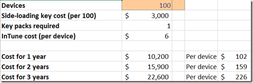

18 January 2013

*Note that this is one post in a series. Make sure to read them all. [This post](http://www.lhotka.net/weblog/Windows8WinRTSideloadingUpdate.aspx) provides an index to the set.*

I’ve been doing a lot of research around the possibility of building business apps for Windows 8 (WinRT) – focusing a lot on deployment.

The short story with deployment is summarized in this table:

|   | On Domain | Not on domain |
| --- | --- | --- |
| Windows RT | n/a | w/ key |
| Windows 8 | n/a | n/a |
| Windows 8 Pro | w/ key | w/ key |
| Windows 8 Ent | yes | w/ key |

The “yes” designation means you can deploy to these devices at no additional cost for licensing. You will still need to figure out how to actually push the apps to the Windows 8 Enterprise computers. The options are the same as what follows where I discuss the “w/ key” designation.

The “w/ key” designation means you need to buy a $30 side-loading product activation key that is per device, and which is non-transferable. So to side-load apps on your Surface RT (for example) you need to buy a $30 key. These keys come in packs of 100, so the minimum price is $3000.

Also, you need a way to actually deploy your app. Your options include:

- Sneaker-net with a USB key
- Run a PowerShell script from a network share
- Deploy via System Center (assuming you have this level of IT infrastructure)
- Deploy via InTune, Microsoft’s cloud service, where they even provide you with a ‘corporate marketplace’

Of the four, I suspect most organizations will laugh at sneaker-net and having their users run ps1 scripts, leaving the last two options. <strike>I also suspect a lot of orgs can’t use System Center, at least when deploying to BYOD and home user devices. Beyond which, if you use System Center and want a corporate marketplace you’ll have to write that yourself. At normal consulting costs I suspect that’ll cost between $50,000 and $100,000 to build and get deployed in your organization.</strike>

> **Update: **There is an InTune add-in for System Center. That add-in allows the use of the corporate marketplace WinRT app, and it costs $4 per device per month (plus the cost of SCCM of course).

So this leaves InTune as a primary option. InTune costs $6 per device per month.

> **Update: **There is a more comprehensive $11 per device per month InTune subscription as well.

Let’s assume that your organization has 100 Windows RT or Windows 8 Pro devices, so you buy $3000 worth of side-loading keys. And let’s assume you use InTune. Finally let’s assume your devices have a 3 year life – which is pretty typical for corporate devices where you buy a service agreement from Lenovo or Dell or another vendor.

These 100 devices will cost $3000 for keys, plus $6 per device per month. This means that your org with 100 devices will pay around $23,000 extra to deploy a WinRT app just for this licensing.

Money you won’t pay if you use WPF or web technologies to build the app. As a result, you have to ask yourself if there’s an additional $23k of value provided by WinRT that you can’t get via WPF or a browser-based solution, otherwise targeting WinRT makes no sense.

Does anyone have other insight into the costing? Any holes in my logic that makes this sound more sane?

I’ve put the [calculator spreadsheet](https://skydrive.live.com/redir?resid=B9397700A0A08439!318) on my SkyDrive for those who care to play around with it.
