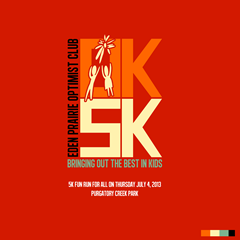

23 May 2013

Outside of my professional life in computing, one of the many things I’m involved with is the [Eden Prairie Optimists](http://www.facebook.com/EPOptimists).

(I know this blog has a global reach, but I also know a lot of people in and around the Twin Cities read it, and this post is mostly for you)

The Optimist organization is focused on helping our youth grow up to be good citizens and successful people. To that end the many chapters around the world help organize and/or fund many different youth oriented programs.

Our particular chapter funds local anti-drug and alcohol programs in the schools, organizes an annual fishing derby for kids, helps fund children’s cancer research, teaches firearms safety classes, holds oratorical and essay contests for youth, and several other programs each year.

We just wrapped up the spring firearms training class, and plan to hold another in late summer.

In June we’ll send all the crossing guards (kids) from Eden Prairie schools to an amusement park to thank them for their service to the community.

June will also see our annual fishing contest, where we get kids and their parents (and sometimes grandparents and others) outside in a nice city park to see who can catch the biggest fish. You haven’t lived until you’ve seen the excitement on the face of 5 or 6 year old who just caught their first fish ever!

July 4 is the date for our annual [OK 5K run/walk](http://www.active.com/running/eden-prairie-mn/optimist-club-ok-5k-2013). This is one of our primary fundraising events, raising the money that allows us to provide these services and programs to the community. Even better, this is a great family event that is open to all ages. We’ve had little kids walk the route, and a WWII veteran run it. This year we’re honored that the City of Eden Prairie asked us to include our event as part of their overall series of events for the July 4 week, and I expect the event to be bigger and better than ever!

Later in the year we’ll sponsor the Halloween on the Mall event so kids have a safe, fun, and warm place to trick or treat. My kids always went around the neighborhood in the dark, their costumes hidden beneath coats to keep them warm. These days kids can show off their costumes in the warmth of the mall, without the risk of cars racing down the streets.

And we’ll fund next year’s drug and alcohol awareness programs, student achievement awards, and organize our annual essay and oratorical contests.

Although a lot of people look at all these things and wonder how someone like me, who has kids *now*, has time to be involved. My answer is simple: I include my kids. What’s the point of a youth focused organization that does youth focused events if you don’t include your own kids? Both of my boys have been involved in a lot of the Optimist activities – either as participants or as contributors. Personally I hope that this grounding in civic activities stays with them through their lives so they become involved in something similar as adults. I know *my* interest in civic involvement flows from my father and the ways he got me involved when I was a youth.
