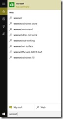

30 July 2015

It seems to be a common problem with the Windows 10 store to have issues downloading or updating apps. Any message you see is probably something like “Windows Store - Error Code: 0x80070005” or “Error Code: 0x803f7000”.

The problem seems to be that some metadata related to the store gets corrupted, because more often than not the solution is to run **wsreset**, a utility that resets the store app.

The **wsreset** utility is installed with Windows 10, so all you need to do is press the Windows key and type ‘wsreset’.

Click or tap the wsreset app to run it.

Some people find that it works best to immediately reboot the computer, then open the store and your downloads should work. I find that the reboot is not typically required, so your mileage may vary.
