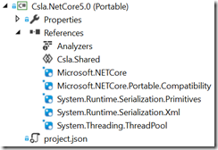

06 November 2015

.NET Core is somewhat confusing to a lot of people. In short, .NET Core is an open source reimplementation of .NET that Microsoft has been, and continues to, work on completing. The Universal Windows Platform (UWP) runs on .NET Core, as does the upcoming ASP.NET 5 technology. What is a little confusing is that ASP.NET 5 also runs on full .NET 4.6 – it can run on either NET implementation.

One of the biggest things to understand about .NET Core is that Microsoft is working hard to keep it very modular. Unlike full .NET, where a lot of things are in a few assemblies, in .NET Core there are a lot of assemblies with a few things in each. And those assemblies are generally available via NuGet, not included by default as part of the “.NET Core install”. The advantage to this is that your app can be more lean, because generally we’ll bring in only the framework assemblies we need, where in full .NET a lot of unneeded stuff tends to just come along for the ride.

### Getting to UWP

Some time ago I added Windows 10 UWP support to CSLA .NET, which means that I already did some work to get CSLA running on .NET Core. However, the UWP project template in Visual Studio is somewhat forgiving, in that it brings in several .NET framework components that aren’t automatically brought in if you create a bare-bones .NET Core class project. This makes sense, because there are a set of assemblies necessary to support UWP and I think we’d all expect those to be automatically available to any UWP project.

The CSLA UWP project targets Windows 10.

Or in `project.json` terms:

`{        "dependencies": {           "Microsoft.NETCore.UniversalWindowsPlatform": "5.0.0"         },         "frameworks": {           "uap10.0": {}         },         "runtimes": {           "win10-arm": {},           "win10-arm-aot": {},           "win10-x86": {},           "win10-x86-aot": {},           "win10-x64": {},           "win10-x64-aot": {}         }       }`

Back in the Windows 8 timeframe we did a bunch of work to support the Wiindows Runtime (WinRT). WinRT is quite a lot like Silverlight, in that apps run in a sandbox and have access to a subset of .NET. So getting CSLA running for WinRT wasn’t *too hard* because we already supported Silverlight before Windows 8 came along. However, WinRT changed reflection in some pretty radical ways, and we had to do quite a lot of work to replicate the old-style reflection API and behaviors in the WinRT world.

UWP now runs on .NET Core, which is a reengineered subset of full .NET, and UWP apps use the WinRT API from a UI perspective. So really UWP apps are very comparable to WinRT apps. That said, Microsoft did take this opportunity to *yet again* tweak reflection, so I used the WINDOWS\_UWP compiler symbol to provide UWP-friendly implementations of the reflection fixes we’d created for WinRT. Whew!

(to be honest, some of the code in the TypeExtensions class are basically placeholders that need more work to be complete; for example: [TypeExtensions.GetConstructor is not implemented properly](https://github.com/MarimerLLC/csla/issues/476 "TypeExtensions.GetConstructor is not implemented properly"))

The final thing to understand about the existing UWP support is that .NET Core code can be compiled to native – in fact it *will be compiled to native* by the Windows Store to provide the end user with the best performance. Compiling .NET code to native is a fairly complex process and one part of that process is that the end result only contains the code that is known to be invoked – all other code is literally left out of the end result. If you don’t use reflection this is not a problem, but if you do use reflection (and CSLA does) then it is important to tell the native compilation process not to “optimize” away code you might actually be calling.

To do this you edit a file in your UWP application’s Properties folder called *myapp.rd.xml*. In this file you indicate the assemblies that shouldn’t be optimized. For example:

`<Directives xmlns="http://schemas.microsoft.com/netfx/2013/01/metadata">         <Library Name="Csla.Uwp">           <Assembly Name="Csla" Activate="Required All" Browse="Required All" Serialize="Required All" Dynamic="Required All" />         </Library>       </Directives>`

This says that Csla.dll shouldn’t be optimized away – which is probably fine because it isn’t very big to start with. And you *absolutely must* ensure that your business assemblies aren’t optimized because CSLA reflects against your business assemblies to do its work. Again, probably not a big deal because your *business assembly* should be containing business code and not UI assets or other large artifacts – in other words it shouldn’t be terribly large either.

This is done in your UWP app project – the one that gets built and deployed to the user – and the one that typically references your business assemblies and CSLA.

### Getting to .NET Core

Given everything I just discussed regarding UWP, it seems like getting a “pure” .NET Core assembly for CSLA wouldn’t be too hard. But there were some unexpected hurdles I’ll discuss.

The first step to creating a class library project for .NET Core is to create a portable class library (PCL) project that targets .NET 4.6 and ASP.NET Core 5.0.

This creates a project with the correct functional cross-section to target .NET Core.

Some time ago I refactored the CSLA codebase so all the actual code files are in a shared project named Csla.Shared. We then have a concrete project for each target platform we support (Xamarin Android and iOS, iOS Classic, .NET 4, 4.5, 4.6, WinRT, UWP, etc.).

This new PCL project is named Csla.NetCore5.0 and it just references that pre-existing shared project to get the same code as every other version of CSLA.

As I mentioned earlier, this bare-bones class library project doesn’t bring in any more of .NET than absolutely necessary. As a result I had to add some NuGet packages required by CSLA.

Or via project.json:

`{        "supports": {           "net46.app": {},           "dnxcore50.app": {}         },         "dependencies": {           "Microsoft.NETCore": "5.0.0",           "Microsoft.NETCore.Portable.Compatibility": "1.0.0",           "System.Runtime.Serialization.Primitives": "4.0.10",           "System.Runtime.Serialization.Xml": "4.0.10",           "System.Threading.ThreadPool" : "4.0.10-beta-23409"         },         "frameworks": {           "dotnet": {             "imports": "portable-net452"           }         }       }`

This brings in the BCL functionality required by CSLA.

The one exception is that I didn’t bring in WCF. Instead what I’ve done at the moment is to use a NETCORE compiler directive symbol to exclude the data portal WCF channel from building as part of CSLA for .NET Core. The reason for this is that I had a conversation with one of the Microsoft engineers responsible for this, and it turns out that referencing WCF has a cascade effect where a very large percentage of .NET gets brought into scope (to support WCF).

If your app doesn’t use the WCF data portal channel you shouldn’t have to include all that extraneous code/assemblies in your app. So rather than including the WCF data portal support into core CSLA my plan is to follow the lead of .NET Core itself and break the WCF data portal channel into its own separate assembly ([Create .NET Core WCF data portal channel assembly](https://github.com/MarimerLLC/csla/issues/490 "Create .NET Core WCF data portal channel assembly")).

There’s one other issue I had to deal with, and that is that in my UWP implementation I used some WinRT APIs – and those aren’t available in “pure” .NET Core. The most notable of these is code in CSLA that captures and restores the current culture and UI culture values on the current thread. Some of this is extremely old code that used to pull the information off the current thread, and then along came WinRT that required a different approach. It turns out that in .NET 4 Microsoft introduced a new API to consolidate the old and new styles of interacting with the culture values. For example, you can now do this:

`request.ClientCulture = System.Globalization.CultureInfo.CurrentCulture.Name;      request.ClientUICulture = System.Globalization.CultureInfo.CurrentUICulture.Name;`

The code here works on all platforms, no need to use the current thread in .NET and some WinRT API elsewhere. Very nice!

The one catch is that *setting* the culture isn’t universally supported in a single model because older versions of .NET (like 4) still require the use of the Thread object. So setting the culture requires a compiler directive.

`#if NETFX_CORE              _clientCulture = System.Globalization.CultureInfo.CurrentUICulture.Name;               _clientUICulture = System.Globalization.CultureInfo.CurrentUICulture.Name;       #else               _clientCulture = System.Threading.Thread.CurrentThread.CurrentCulture.Name;               _clientUICulture = System.Threading.Thread.CurrentThread.CurrentUICulture.Name;       #endif `

And that’s it – pretty easy really – thanks to having added Silverlight support years ago, followed by WinRT support, then UWP support. All the groundwork was laid for pure .NET Core support.

(and it helped that I was doing this work in Redmond so I had direct access to Microsoft engineers that are creating .NET Core  )

Just at the moment this work is available in a branch of my fork: https://github.com/rockfordlhotka/csla/tree/337-NetCoreSupport

Once I’ve done some more testing I’ll merge this into the actual CSLA master branch at: https://github.com/MarimerLLC/csla/tree/master
