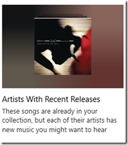

22 July 2016

I am thrilled with the “Your Groove” functionality in the Groove music app.

Years ago I begged and pleaded to get Pandora-like functionality in the (then) Zune app. Microsoft responded with SmartDJ, which later became Radio – and that has been excellent all these years – and I still use that functionality *a lot*.

However, this new “My Groove” feature adds a new dimension to the overall experience that I really like a lot. For example:

The Radio feature sometimes provides new music, but dynamic channels like this one provide a lot of new music. And they auto-update weekly, so they never get stale.

I’m at the point where I think I’ll cancel my SiriusXM subscription in my car, because I can just sync these playlists to my phone and play them via BlueTooth – who needs SXM Octane to find new music when Groove does a better job for a lot less money!
