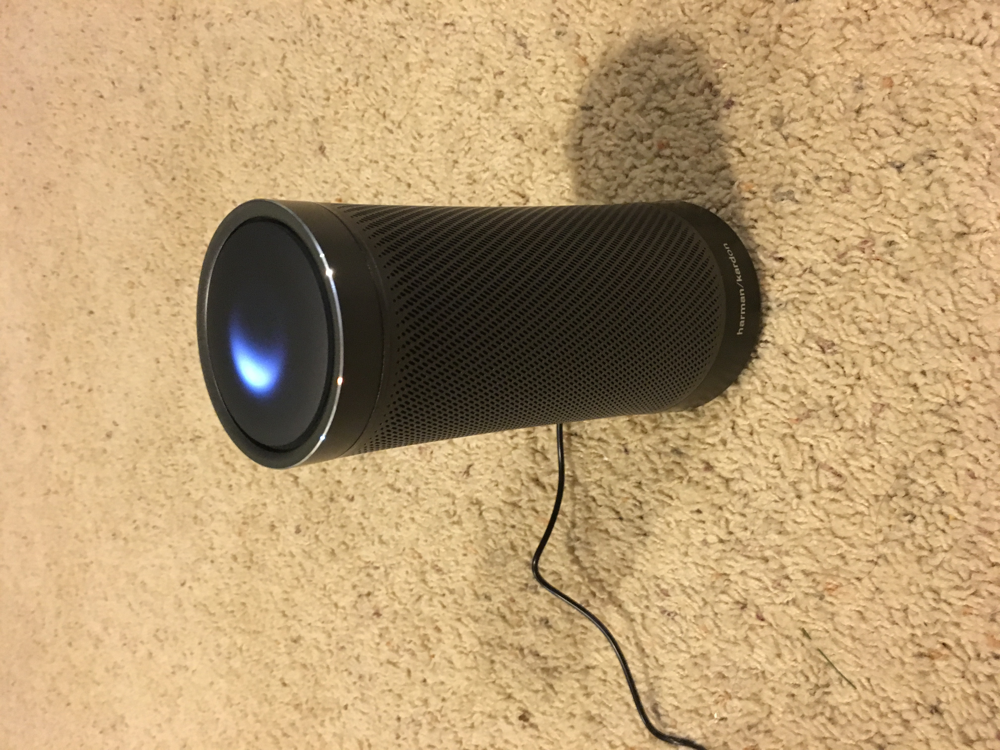

29 November 2017

A while ago I got an Amazon Echo - the little hockey puck one. But I haven't been real pleased, for three primary reasons.

1. It usually requires me to ask it the same thing twice
2. It frequently gets disconnected from my network
3. I'm a heavy Cortana user, and very few of the third party services supported by Cortana are also supported by Echo (no OpenTable, Wunderlist, cross-platform reminders, etc.)

So I took advantage of the recent holiday sales and ordered a Harmon Kardon Invoke, which is a Cortana based device.

As with most consumer devices post-Kindle, the Invoke comes in nice, friendly packaging.

(the pictures are rotated by MarkdownMonster - I don't know how or why, or how to fix it - sorry...)

The device itself feels solid, has some weight, and is attractive.

The swirling light on the top is pretty cool, and the physical ring at the top of the device turns to act as volume. The top of the device itself is touch sensitive, so you can tap it or tap-and-hold to interact. But really, most interaction is by voice.

Setting up the device was easy. When I plugged it in the blue light started swirling, and I used the Cortana app on my iPhone (which I already use all the time anyway) to initialize the Invoke. The whole process was pretty much automated, including connecting to my wifi network. The Invoke updated itself from the Internet once connected

Using Cortana with the Invoke is the same as with my Xbox or Surface. "Hey Cortana" and away you go! All the stuff I can do with Cortana on my iPhone or Surface seems to work the same on the Invoke.

What the Invoke does that seems special (as compared to Cortana via iPhone, Surface, or Xbox) include:

1. Playing music via Spotify (one step during configuration is to identify your streaming music provider)
2. Making voice calls to cell phones and land lines (the Invoke includes a year of free calling via Skype)
3. Interacting with SmartThings based devices (and others too, but I have a ST hub, so that's what I'm using)

Unlike the Echo, Cortana has yet to need me to repeat anything, so that's a bonus right there!

Of course the Invoke *sounds* way better than the Echo Dot, but that's not a fair comparison. A friend of mine who has a full-sized Echo says that the Invoke sounds better than the Echo. That makes sense, given HK's reputation for audio.

The most important thing for me is that the Invoke, using Cortana, was instantly aware of, and integrated with, my existing reminders, to-do lists, calendars, package tracking, flight tracking, and everything else for which I already use Cortana.

Where really embracing the Amazon Echo would require me to use a whole other ecosystem, the Invoke just gave me access to the ecosystem I'm already using.

There's no question that the Echo has access to a lot more apps than Cortana. But it doesn't give me access to the apps I'm already using, and I guess that's the really thing for me - I don't want to migrate to a whole new to-do list app, stop using Foursquare and Yelp and OpenTable. I like those apps and services, and I'm used to them, and with Cortana I get to keep using them.
