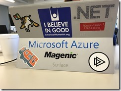
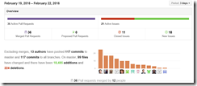
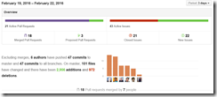
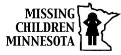

22 February 2016

Wow, what a great [Humanitarian Toolbox](http://www.htbox.org/) codeathon experience we had this weekend!

We had close to 20 analysts, designers, and developers working on the [MobileKidsIdApp](https://github.com/HTBox/MobileKidsIdApp) and [allReady](https://github.com/HTBox/allReady) projects at the Magenic office in the Twin Cities. The allReady project was also the focus of a concurrent codeathon in Calgary. And some folks were remote for both projects as well.

So in total we had nearly 30 people working on two projects, across at least two continents and four countries. Talk about distributed agile development!

(special thanks to [@mheggeseth](https://twitter.com/mheggeseth) for driving from Chicago to the Twin Cities!)

Here’s the summary of work for the MobileKidsIdApp project (being done in conjunction with [Missing Children Minnesota](http://missingchildrenmn.net/)):

And here the summary of work for the allReady project:

Here are some [pictures from the Twin Cities codeathon](https://www.flickr.com/photos/9274835@N08/sets/72157664747270982).

The MobileKidsIdApp project generated a lot of interest from the Twin Cities news media:

- http://www.msn.com/en-us/news/crime/interview-missing-children-minnesota-and-magenic/vp-BBpBVTE
- http://www.fox9.com/news/94476584-story

Many of the people who participated in the codeathon are eager to continue the work, and we’ll most likely have another codeathon in about a month to keep up the momentum, especially around the MobikeKidsIdApp.

Humanitarian Toolbox (and these two project teams) are always looking for volunteers. You can contact [HTBox via twitter](https://twitter.com/htbox) and via their [signup page](http://www.htbox.org/sign-up).

          
