04 April 2016

I’ve never posted one of these “opening the box” type blog posts before, but I took a bunch of photos as I opened my new [Hololens](https://www.microsoft.com/microsoft-hololens/en-us) on Saturday and thought I’d share.

At Build 2016 Microsoft’s Alex Kipman announced that the device was officially shipping. Within 15-20 minutes my phone chirped to give me the tracking number of the package. Seriously, they must have had people waiting on the loading dock to ship as soon as the keynote announcement occurred! As a result, two devices were waiting for me as soon as I got home from San Francisco 

> Well, really they are for my team at [Magenic](http://www.magenic.com) – but I got to spend the weekend with the device 

The device came nicely packed in a shipping box that contains the product box:

[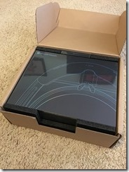](binary/Open-Live-Writer/Hololens_13DBE/20160402_223518090_iOS_2.jpg)

Not only did the shipping box include the Hololens, but also a clicker (single button remote):

[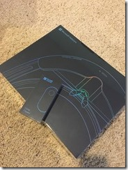](binary/Open-Live-Writer/Hololens_13DBE/20160402_223611221_iOS_2.jpg)

It *is* clearly labeled as a developer device:

[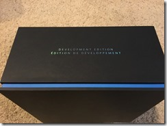](binary/Open-Live-Writer/Hololens_13DBE/20160402_223701886_iOS_2.jpg)

Inside the Hololens box itself is a nice carrying case for the device, and inside that is the device:

[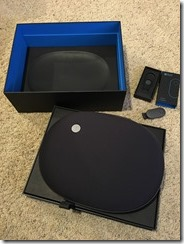](binary/Open-Live-Writer/Hololens_13DBE/20160402_223837348_iOS_2.jpg)   [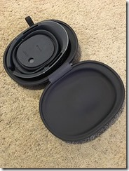](binary/Open-Live-Writer/Hololens_13DBE/20160402_223955345_iOS_2.jpg)   [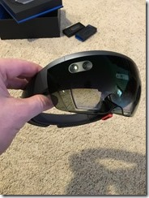](binary/Open-Live-Writer/Hololens_13DBE/20160402_224030877_iOS_2.jpg)

The center of the carrying case includes some more items:

[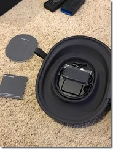](binary/Open-Live-Writer/Hololens_13DBE/20160402_224640751_iOS_2.jpg)     [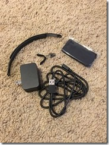](binary/Open-Live-Writer/Hololens_13DBE/20160402_224816821_iOS_2.jpg)     [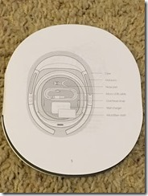](binary/Open-Live-Writer/Hololens_13DBE/20160402_225029392_iOS_2.jpg)

Specifically:

1. A second node pad in case the default doesn’t fit well
2. A micro-USB cable for charging and connecting to your Windows 10 development PC
3. An optional overhead strap if you need that to make the device fit/feel better
4. A wall charger (AC power to USB)
5. A microfiber cloth to clean the lenses of the device

Here are some shots of the device itself:

[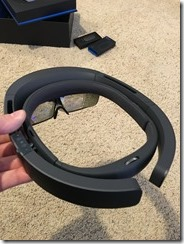](binary/Open-Live-Writer/Hololens_13DBE/20160402_224049143_iOS_2.jpg)  [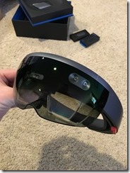](binary/Open-Live-Writer/Hololens_13DBE/20160402_224156940_iOS_2.jpg)  [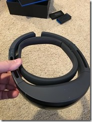](binary/Open-Live-Writer/Hololens_13DBE/20160402_224224939_iOS_2.jpg)  [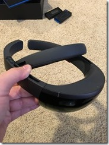](binary/Open-Live-Writer/Hololens_13DBE/20160402_224251471_iOS_2.jpg)  [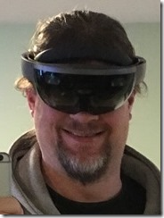](binary/Open-Live-Writer/Hololens_13DBE/20160402_224531303_iOS_2.jpg)

On twitter and other places people have asked a few common questions.

*How long does the battery last?*

So far my experience seems to indicate that Microsoft’s stated 2.5 hour estimate is about right. I haven’t run it dead yet, but it seems like 2.5 hours is about right.

*How is the field of view (FOV)?*

Microsoft actually describes this as the ‘holographic frame’, and I’d say it is about the same as if you held an iPhone 6s about 15 cm (6”) in front of your face. Which is to say that it doesn’t appear in your peripheral vision, but does dominate your forward vision area pretty well.

*Is it comfortable to wear?*

It takes some getting used to, that is for sure. It isn’t *uncomfortable*, but it does take a while to get used to the feel of the device, as well as how it impacts your vision. After wearing it a few minutes I personally am finding that it becomes like a “new normal”.

*Can you wear glasses and use the device?*

Yes. However, I do think that people like me who have progressive lenses in their prescription glasses are at a bit of a disadvantage, because the lower part of my vision isn’t in focus and so I’m forced to tilt my head to look at the lower parts of holograms or 2d displays. Fortunately for me I am far sighted, so I can use the device without my glasses (because the projections are always far enough away that they are beyond where I need glasses to see clearly), but I suspect this may be a problem for other people, especially those who are near-sighted and still have progressives.

*It is as cool as it seems?*

That’s obviously subjective, but I’m going to go with yes. Even in a simple scenario where I pin multiple 2d apps to the walls around my office, it is pretty darned neat to look around at an office covered in live displays of various sorts (images, youtube videos, web sites, etc.).

While at Build 2016 last week I was able to participate in the Hololens Academy. This experience probably best describes why I think Hololens is as cool as it seems.

[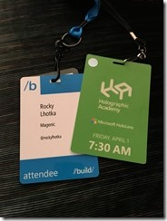](binary/Open-Live-Writer/Hololens_13DBE/20160402_223321649_iOS_2.jpg)

At the end of that event our holographic demo resulted in an “explosion” that “blew a hole in the floor”. Even though the 3D models and textures were intentionally unrealistic, the illusion was so real that our brains literally didn’t want to have us lean over the hole too far for fear of falling in. Sure, we rationally knew this was an illusion, but some part of my brain was screaming that the hole was deep enough that I didn’t want to fall.

Yeah, really!

There’s no doubt in my mind that Hololens will make a big difference in many scenarios where we want computing power, and we want our hands free, and we want to augment reality. I’m sure this will include gaming, but also medicine, probably inventory, manufacturing, insurance estimation, home improvements, many sales scenarios, and a whole lot of other areas I’m not listing here.

If you or your users interact with the real world while carrying around a phone/tablet/PC so you can simultaneously interact with a computer system, it seems reasonably likely that Hololens has the potential to make that process smoother and easier.
