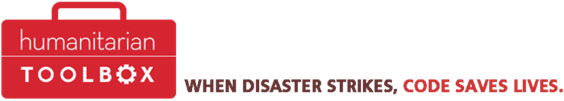

19 January 2016

I am excited to announce that there will be a codeathon for the [Humanitarian Toolbox project](http://www.htbox.org/) in the Twin Cities the weekend of Feb 20.

We plan to work on the [allReady](http://www.htbox.org/projects/allready) project and a new project for [Missing Children Minnesota](http://www.missingchildrenmn.net/), and possibly also the [crisischeckin app](https://github.com/HTBox/crisischeckin/blob/master/README.md) if we get enough volunteers.

Of course that’s the primary reason for this blog post: we need volunteers for the codeathon!

I attended an HTBox codeathon in Redmond, WA a couple months ago and it was an amazing experience! I got to spend a couple days with some amazing developers and technologists, building software that literally makes the world a better place. The “make the world a better place” part is hard to quantify, but I think is very important. Beyond that yet, I learned *a lot* about building software in an agile manner where each sprint is (more or less) about 4 hours long, and where a lot of people are issuing concurrent pull requests into GitHub that need resolving. It was an intense and exciting microcosm of project work in a mobile, web, and .NET world.

In summary, what do you gain by volunteering?

- Help build software that literally makes the world a better place
- Work with a bunch of really smart, motivated people on some cool technology
- Almost certainly learn a lot about agile, GitHub, mobile, web, and modern .NET
- Free food 

Sounds wonderful doesn’t it?!?

What skills do we need?

- JavaScript/TypeScript
- Cordova
- ASP .NET
- Azure
- UX and design
- QA and testing

Do you need to be an expert? No, absolutely not, though we do expect you to have working knowledge in one or more of these areas.

What are the logistics you ask?

- When: weekend of Feb 20 – specific times TBD, but it is likely we’ll start Friday evening, code Saturday, and part of Sunday
- Where: Magenic office – 1600 Utica Av S, #800, St. Louis Park, MN 55416

If you want to volunteer (or have questions) please contact DaveSa@magenic.com
