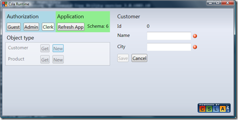

01 July 2009

I’ve updated my prototype MCsla project to work on the “Olso” May CTP. The update took some effort, because there are several subtle changes in the syntax of “Oslo” grammars and instance data. What complicated this a little, is that I am using a custom DSL compiler because the standard mgx.exe utility can’t handle my grammar.

Still, I spent less than 8 hours getting my grammar, schemas, compiler and runtime fixed up and working with the CTP (thanks to some help from the “Oslo” team).

I chose at this point, to put the MCsla project into my public code repository. You can use the [web view](http://www.lhotka.net/cslacvs/viewvc.cgi/mcsla/) to see the various code elements if you are interested.

The prototype has limited scope – it supports only the CSLA .NET editable root stereotype, which means it can be used to create simple CRUD screens over single records of data. But even that is pretty cool I think, because it illustrates the end-to-end flow of the whole “Oslo” platform concept.

A business developer writes DSL code like this:

> Object Product in Test
> {
>   Public ReadOnly int Id;
>   Public string Name;
>   Public double ListPrice;
> } Identity Id;

(this is the simplest form – the DSL grammar also allows per-type and per-property authorization rules, along with per-property business and validation rules)

Then they run a batch file to compile this code and insert the resulting metadata into the “Oslo” repository.

The user runs the MCslaRuntime WPF application, which reads the metadata from the repository and dynamically creates a XAML UI, CSLA .NET business object and related data access object that talks to a SQL Server database.

The basic functionality you get automatically from CSLA .NET is all used by the runtime. This includes application of authorization, business and validation rules, automatic enable/disable for the Save/Cancel buttons based on the business object’s rules and so forth.

If the business developer “recompiles” their DSL code, the new metadata goes into the repository. The user can click a *Refresh App* button to reload the metadata, immediately enjoying the new or changed functionality provided by the business developer.

The point is that the business developer writes that tiny bit of DSL code instead of pages of XAML and C#. If you calculate the difference in terms of lines of code, the business developer writes perhaps 5% of the code they’d have written by hand. That 95% savings in effort is what makes me so interested in the overall “Oslo” platform story!
