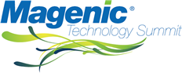

13 May 2008

Magenic is holding a full-day, two-track mini-conference on June 20. We have put together a great lineup of speakers and topics, including 2 keynotes and 8 sessions. This will be a full day of hard-core technical content and fun!

The event is being held in Downers Grove near Chicago, IL. It starts at 8:30 AM and runs through to a reception at the end of the day at around 5 PM.

The event is by invitation only - specifically invitation by one of Magenic's sales people. If you are already a Magenic customer and you'd like an invitation, please contact your Magenic AE and let them know. If you are not a Magenic customer please email info@magenic.com and let us know you'd like an invitation.

The event is free, and includes both lunch and a reception at the end of the day. You are responsible for any travel expenses involved in getting to the event. Magenic is arranging a block of rooms at a nearby hotel with special pricing and ground transportation between the conference and hotel.

The following link has more information about the event
http://www.magenic.com/Default.aspx?tabid=1225
