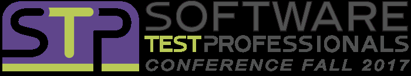

07 September 2017

One of [Magenic](https://magenic.com/)'s largest business areas is QAT, and we have a serious focus on automated testing (including our open source [MAQS testing framework](https://github.com/Magenic/MAQS)).

The [Software Test Professionals Conference (STPCon)](http://www.stpcon.com/) is the leading event where test leadership, management and strategy converge.

I'm extremely pleased that this year's [STPCon keynote](http://www.stpcon.com/sessions/keynote-with-great-judgement-comes-great-responsibility/) speaker is [Paul Grizzaffi](https://twitter.com/pgrizzaffi)) from Magenic.

> Join us as Paul Grizzaffi explains responsible ways to approach automation, some of the knowledge we’ll need in order to be responsible, and shares insights about automation responsibility from his own career. Let’s allow history to remember our automation initiatives fondly instead of as Pyrrhic forays into irresponsibility.

Paul is also hosting a [round table discussion on automation challenges](http://www.stpcon.com/sessions/automation-challenges-a-round-table-discussion/).

> Please join us in a round table discussion of attendee-provided automation challenges where we can share our thoughts and potential solutions to these challenges.

[Troy Walsh](https://www.linkedin.com/in/troy-walsh-378a8142/), Magenic's practice lead for QAT, is also presenting at the conference. He'll talk about [WinAppDriver vs Winium](http://www.stpcon.com/sessions/winappdriver-or-winium-picking-the-right-tool-for-thick-client-windows-testing/).

> In this session, we will go hands on with WinAppDriver and Winum. We will dig into code and see how each tool works. We will also compare and contrast the tool features, usages and shortcomings.

Finally, Paul and Troy will team up to provide a [demo of the open source MAQS framework](http://www.stpcon.com/sessions/demo-start-automating-today-with-the-framework-built-for-tomorrow/).

> We will demonstrate the Magenic Automation Quick Start framework, and its integration with CI/CD/CT workflows. MAQS is an open source package designed so that you can be running automated tests in minutes.

We are proud to be involved in STPCon, and hope you'll join us at the event!
