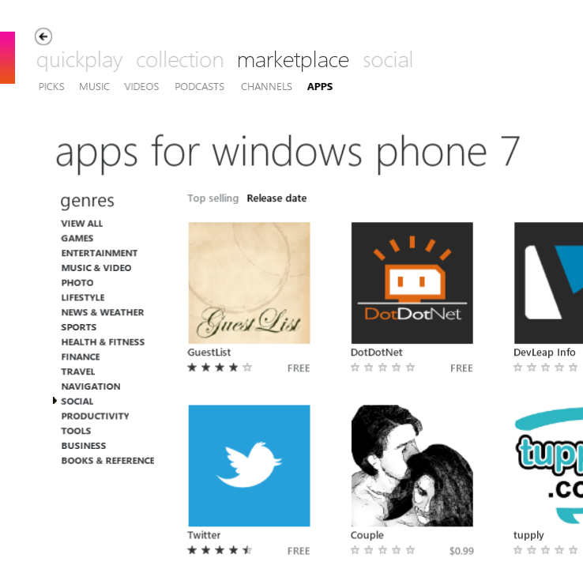

27 October 2010

The first WP7 app built by Magenic is now in the WP7 app marketplace: GuestList.

This app allows you to easily check in attendees at an event, using [EventBrite](http://www.eventbrite.com/) as the backend service. You create your event in EventBrite, users register through their web site, and as they arrive at your event you get the attendee list on your phone, and easily check them in right there.

Chris Williams (Microsoft MVP and author of an upcoming WP7 developer book) did the development on this project, with assistance from Donn Felker (author of a similar app for Droid). Anthony Handley (from our Magenic Studios group) created the user experience flow and look and feel.

Very exciting stuff!
