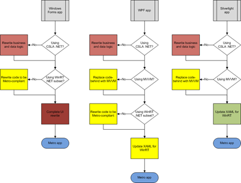

28 September 2011

I have been giving quite a lot of thought to the WinRT migration path. What is the outlook for taking a Windows Forms, WPF, or Silverlight app into WinRT/Metro in Windows 8?

The amount of effort required for any given application may vary radically, depending on the architecture used when building the application, and how well that architecture was implemented in the actual code. And it is obviously important to understand how much client-side application code uses .NET features that aren’t in WinRT, or that are substantially different in WinRT.

And of course I tend to look at this from a CSLA .NET perspective   If you use CSLA 4 today, and you adhere to the architecture and coding structures recommended when using CSLA, most or all of your business layer code will probably move to WinRT without change.

So, rather simplified, and CSLA-centric, here’s a set of process flows:

Although the first decision point is “Using CSLA?”, you could replace that with “using a architecture/framework that abstracts all business, validation, authorization, data access and other application logic away from the UI, exposing a model that supports data binding and async server interactions”. Although I’m obviously biased, there are absolutely other architectures that offer the same layered abstraction to keep *all business and data logic* out of the presentation layer. And that’s really what’s required.

In the final analysis, if you have any business or data logic in your code-behind, or you aren’t using data binding to connect your existing UI views to some sort of business objects, you have some work ahead of you to get to that point.

Essentially all non-CSLA **Windows Forms apps **I’ve ever seen will require a complete rewrite. Most use DataSet objects, and therefore require total rework. And most use a lot of code-behind, and therefore require total rework. And a lot of them use numerous windows and modal dialogs, so the user workflow will require a complete rethink.

A surprising number of **WPF apps **are written much like Windows Forms apps, with code-behind, etc. Those apps will require much the same effort to migrate as Windows Forms. But if you’ve written your WPF app using MVVM, even without something like CSLA, and have strictly avoided code-behind, the migration probably won’t be too bad.

The big thing is that a lot of WPF apps aren’t written to assume async server interactions, and updating code to handle that can be a lot of work. WPF apps written using CSLA may already be using the async features in CSLA, and so can avoid this issue entirely. Worst case, if you are already using CSLA synchronously, the changes to move to async aren’t overwhelming.

If you have a **Silverlight app**, you are in the best position of anyone, because you are already using async server interaction, and can’t have made the mistake of using the DataSet. And if you are using MVVM without any code-behind your migration will probably be quite smooth.

If you are also using CSLA, then your existing business layer will probably translate to WinRT without change.

As I mentioned in a previous [WinRT post](http://www.lhotka.net/weblog/WinRTAndNET.aspx), Windows 8 is years away for most organizations. At the same time, I do think that [WinRT/Metro will be used for business app development](http://www.lhotka.net/weblog/WinRTAndBusinessApps.aspx).

Quite a number of people are mistakenly saying that “Silverlight is dead”, when in reality Silverlight has never been more important.

What are you going to use to build business apps in the years between now and when Win8 is available in your organization?

You might consider using the technology that appears to offer the easiest migration to WinRT… And that is Silverlight (plus MVVM and CSLA 4  ).
