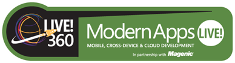

08 February 2014

The Modern Apps Live! conference is coming up soon. Not only am I speaking at this event, but I’m the conference chair so I had the privilege of laying out all the content for the show.

This is the third Modern Apps Live! event and I think it offers something you won’t find in many (any?) other conferences. It is a single track, a single room. The content builds on itself through the entire conference. If you stick with us for the whole show we’ll walk you through the entire process of architecting, designing, and implementing a modern app.

What is a modern app? We define it as an app that has a compelling user experience that is available across all modern devices (Windows, iPad, Android, HTML 5) and that provides the user with a great touch/keyboard/mouse experience as appropriate for each device. A modern app’s data is ubiquitous, so it follows you from device to device, providing a consistent experience and access; as you can imagine, this implies a cloud-based back end system.

The great thing is that Modern Apps Live! is part of the Live 360! event, so if you want to branch out you’ll have full access to all the Visual Studio Live!, SQL Live!, and SharePoint Live! sessions as well.

There’s still time to register for [Modern Apps Live!](http://modernappslive.com/Events/Las-Vegas-2014/Home.aspx) in Las Vegas, and I hope to see you there!
