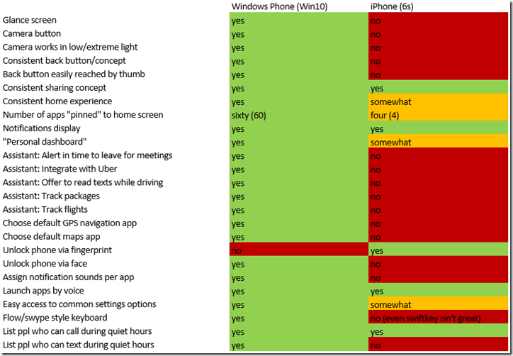
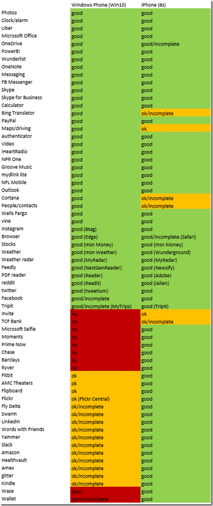

31 January 2016

On Sunday I tweeted a couple comparison tables with my personal observations between Windows Phone (Windows 10, Lumia 950) and iPhone (6s). I got some great feedback, primarily around some apps and features I didn’t know about when I put together the comparisons. If you saw all the twitter activity you’ll probably enjoy these updated charts that reflect everyone’s feedback.

I know, this sort of thing is often flame-bait. That’s not my intention. I’m trying to decide if I should keep my iPhone or not – and it isn’t an easy decision. Your decision criteria and weighting might be different from mine – I’m just sharing my observations in case others find them interesting or useful.

I compared the two operating systems/devices, and then the apps I use on each platform. I compare the OSes separate from the apps because in my view each OS sets the stage on which the apps run. I find that the two OSes are quite different, and some of the things I like/dislike about each OS flow through to *every* app. Given the base foundation of each OS/device, then I compare *the apps I use, within the context I use them*.

Starting with the OS comparison. I come at this as a longtime Windows Phone user (WP), who’s been running the Windows 10 mobile preview releases for a few months now. About three weeks ago I got an iPhone 6s, primarily because I’ve been complaining about the crappy apps on WP, and because iPhone users keep telling me their experience is magical – not just because of the apps, but because of the iPhone itself (which to me means the OS and device).

This isn’t in the table, but there are a lot of things I find entirely equal about both devices. They are light, fast, elegant, fun to hold, the buttons and screens feel and look good. There is no *bad device* here – I think this is a comparison between two wonderful pieces of engineering. But at the OS level, and a little bit at the device level, there are very real differences. Mostly what I’ve listed (and this shouldn’t be a surprise) are the things I’m really missing having switched to the iPhone (which I can’t say I find to be magical).

Now I’m happy to admit that perhaps an iPhone user switching to a Lumia 950 would have a comparable list of things they find missing every time they go to use their phone. I’m not sure what that list would look like – the only must-have feature of the iPhone I have yet found is unlocking the device with a fingerprint – that’s awesome! Otherwise things are quite equal except all the stuff in this list that I really wish existed on the iPhone.

There are a couple iOS features I really *dislike*. The Back button/concept in the OS seems like a poorly designed late arrival – hard to reach with my right thumb (yes, I know I can double-tap the start button, then reach not-quite-as-far to the back buttons that may or may not be visible – but you *can’t* tell me that’s as nice as a single tap of the fixed-location back button on WP). And I expected a *lot*more from Siri – I always thought Cortana was playing catchup to Siri, but in reality Siri isn’t on the same playing field as Cortana in terms of being capable, helpful, or proactive.

I was also shocked to find that only WP lets me tell the OS to use different default maps and driving apps. I suppose this is a hold-over from Microsoft being forced to be more open about these things in the 1990’s, and Apple having somehow avoided being sued because they are too closed and propietary. I wouldn’t wish Microsoft’s legal experiences on Apple – but I really wish Apple would *choose* to open up for the benefit of their customers.

In terms of apps: I’m a power user of some apps, a casual user of others, and so my ratings on the apps might not match yours. You might care more about certain apps or features than me, and of course I didn’t rate apps I don’t use, because I don’t use or care about them. I put this comparison together for my purposes, and I’m just sharing it with all of you.

I was actually surprised at how well WP fared when I put this table together. My gut feel was that all the WP apps sucked and all the iPhone apps were great. Turns out that nearly all the iPhone apps are great (other than suffering from some OS-created usability issues like poor and inconsistent Back button concepts). However, there are a lot more WP apps that are comparable to their iPhone counterparts than I expected.

Of course there are a bunch of apps that just aren’t on WP at all, and several that technically exist, but are incomplete compared to their iPhone equivalents. Shame on the companies who own/build those apps for not caring about their customers (or their software development craft) enough to create something decent. Seriously, some of those apps are so bad the companies really should be embarassed! And the ones that are totally missing: obviously those companies don’t really care about their customers at all.

I have about a week to decide if I want to keep my iPhone. And I’m torn, because although I like Windows 10 much more than iOS, I also really like several of the iPhone apps that have yellow or red counterparts on WP.

Apparently I can’t have my cake and eat it too…

*If you want to provide constructive feedback, like cool apps I’ve overlooked or ways to overcome what I percieve as limitations of the iPhone then please respond to [@rockylhotka](https://twitter.com/RockyLhotka) on twitter or on my public*[*Facebook*](https://www.facebook.com/RockfordLhotka)*page.*
