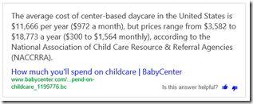

13 November 2015

Yesterday I got involved in a twitter discussion about the need for more women speakers (and attendees for that matter) at tech conferences. Of course twitter isn’t a good venue for discussing complex issues, and so I thought I’d put some of my thoughts into a blog post.

I identify as an ally for women in tech. I’m a technologist, but not a woman, so I can only express my views from being adjacent to the actual problem space. As such it is quite possible that my views are naïve in some ways, and if so I’ll beg forgiveness in advance (and welcome constructive feedback!).

I’m also a long-time co-chair for [Visual Studio Live!](http://vslive.com) and am the chair for [Modern Apps Live!](http://modernappslive.com), and have spoken at hundreds of events around the world over the past couple decades. As a result I do have some perspective on how conferences work, the economics behind them, and the work involved in soliciting and selecting content for conferences.

To start with, I absolutely think that we need more women in technology, and (from my personal perspective) in software development. Nearly half the brainpower, creativity, and talent in the US is effectively untapped and that’s simply unconscionable.

One way to help get (and retain) more women involved in technology is to have women be visible as leaders in our industry. Not just business leaders like Marissa Mayer, but actual technologists who are visible within our communities.

> As an aside, business leadership is great, but doesn’t translate to credibility in the minds of most technologists. I think one of our challenges in this space is that a lot of women feel pushed out of technology and into tangential careers such as project management, business analysis, sales, or pure business. That might be good for them as individuals (if they love that other career more than technology), but it doesn’t help the lack of women in technology.

For technologists some of the most visible people in the industry are public speakers at conferences and similar events. Many regular speakers are (as my wife puts it) “famous in geek-land”, and as such are a type of role model for others in the industry. So it is a logical thought progression to think that one way to encourage more women to get involved in software development is to get more women to be regular, recognized speakers at conferences.

In the twitter discussion I referenced at the start of this post the premise of the original post was addressing some of the primary barriers to women attending or speaking at industry events.

Some of this is (imo) gender-neutral. As a professional (or at least semi-professional) speaker I expect events to cover my travel costs and provide a stipend or speaker fee. I provide a valuable professional service, and as such I expect reasonable compensation. That should be true regardless of anyone’s gender.

The childcare point might at first seem a bit odd to people who haven’t been paying attention to these issues. But it is a *primary* challenge when talking about getting women to attend or speak at events. For better or worse, in the US it is still assumed to be the mother’s responsibility to manage childcare for any kids – whether we’re talking single mothers or a married couple.

> To be clear, this isn’t a universal truth – there are women who have a spouse/partner willing to assume childcare responsibilities while they are at an industry event – but like it or not there are a *lot* of women who don’t have that support, or who are single mothers without that option.

On the surface it seems obvious to lump “childcare” into the “travel cost” category – put the burden of such cost entirely on the speaker-who-is-a-parent. I do think though, that this cost *tends* to fall mostly on women, and that it absolutely contributes to the lack of women in technology and at conferences. There’s value to conferences in having more diversity – more talented people available as speakers. And there’s value to our industry as a whole to tapping into all the underutilized brainpower of women would otherwise be engaged in the field. As a result, perhaps there’s some way to translate the value to the industry and conferences into schemes that help absorb some of the costs or complexities involved in childcare for the kids of speakers.

No matter how you look at it, at the end of the day this is ultimately a matter of economics for the event organizer and the speaker: it costs X to go speak at an event, so as a professional I should expect Y from the conference organizer.

Before going further I think it is important to consider a couple things about events in our industry, and also the broader motivations of many (most?) of the regular speakers that I’ve interacted with over the past couple decades.

At least in the Microsoft software development event space there are some broad categories of events, each with their own economic model.

1. Local/regional community events – user groups, code camps – which are generally free to attendees and which generally provide no direct compensation to speakers because they have no budget
2. Local/regional commercial events – Heartland Developer Conference, That Conference, etc. – which are organized by a someone as part of a commercial or marketing venture (even if their *intent* is to support the community, their venture itself involves charging attendees and paying expenses, or indirectly making money by marketing the event under their company name)
3. Large independent industry events – VS Live, Dev Intersections – which are organized by someone as a commercial venture where attendees pay to attend
4. Microsoft direct industry events – Ignite, Build – where Microsoft organizes events and charge attendees to attend, and where Microsoft also largely controls the content with the intent of delivering the “official” marketing message around their products and services

There are outliers that don’t fit these categories and grey areas between them, but these are very common models.

Next I think it is important to consider the value a speaker gains from speaking. Different speakers put different weight toward these items, but they all should be considered part of the package.

1. Travel expenses covered – should it *cost money* for the speaker to get themselves there to speak?
2. Speaker stipend or fee – should the speaker be compensated for their work?
3. Travel to cool places – sometimes events are in interesting/fun places around the world and the speaker might perceive value in such travel
4. Speaker community – regular speakers on a circuit often become good friends, and only see each other at events, and some speakers perceive value in the opportunity to see their friends in person from time to time
5. “Do good” – some speakers get a great deal of personal satisfaction by helping their colleagues be better technologists – altruism is a real thing
6. Publicity/fame – translates to marketing value for the speaker and/or their employer – I’m talking about *passive marketing* here – speakers generate publicity by speaking, that’s just reality, and that publicity often helps them sell books, drive traffic to their blogs, get leads for subsequent training/consulting work, etc. This only happens (as a general rule) if the speaker provides great high-quality content without any overt marketing or product message – conference organizers and attendees love this stuff!!
7. Direct marketing opportunity – usually this occurs because the speaker (or their employer) spent a metric ton of money to be a high-level sponsor of the event and thus basically bought a speaking slot – and in this scenario one would assume the speaker (or their employer) is making it worth the speaker’s time/effort to deliver their content. In many cases this is frowned upon by attendees, but sometimes this is the point of speaking – and in the case of first-party events like Ignite/Build the content is often quite good even as it is structured to fit within the overall marketing message of the event

Now here’s where it gets interesting because individual speakers weigh these benefits differently, and conference organizers do as well. I don’t know that it is possible to generalize the intersection between value to the speaker and what’s offered by various events. Instead I’ll relate some of my personal decisions from my experiences.

I generally won’t speak without some compensation. [John Scalzi says it quite well.](http://whatever.scalzi.com/2012/12/09/a-note-to-you-should-you-be-thinking-of-asking-me-to-write-for-you-for-free/) Mostly I expect that compensation to be in the form of a speaker fee, over and above travel expenses. To be honest, it is a rare thing that my speaker fees amounted to “real money”, at least by comparison to my salary or a typical consulting fee. Anyone who thinks they are doing to speak at tech conferences *as a money-making career* are generally delusional.

> I do know a couple people who *do* make their living speaking, but they get paid by some company like Microsoft to do high-end presentations to decision makers (AKA CxO level people with big budgets), and if they speak at a more normal tech event it is as the highly paid keynote speaker. Yes, there’s a *big* difference in compensation between keynote speakers and regular session speakers at commercial events. And it is important to recognize that these are highly experienced speakers, not people just getting started in their careers as technologists or presenters.

I have spoken at some events because it was in the interest of Magenic to do so – so my compensation was from my employer rather than from the conference organizer. And I’ve spoken at some events because it was in the interest of Microsoft to do so – so my compensation came from a patron/sponsor rather than from the conference organizer.

I’ve also spoken at some events where all they covered was travel expenses without any actual speaker compensation. When I’ve done this it was because I had ulterior motives for getting to the event or the location of the event. As a result, I’ve been to some pretty cool places around the world. Basically I got free access to somewhere I’d have otherwise needed to pay my own way.

In *all cases* I try to deliver high quality content tailored to the audience. And in all cases my hope is that people will find the content, and my delivery, interesting and enjoyable enough that they’ll consider further action, such as:

1. Giving me good speaker reviews (so I get more speaking opportunities)
2. Reading my blog (where I have ads that generate revenue)
3. Buying my books (where I make money)
4. Hiring Magenic to do some consulting (which benefits my employer, and thus me)

Like writing technical books, speaking at technical conferences is best viewed (imo) as one piece of a broader set of activities – all of which generate some amount of revenue, and the totality of which, taken together, amounts to a decent living.

To bring all this back to women speaking at conferences, I strongly suspect these same motivations apply regardless of gender. My female friends/colleagues who speak in the same circuits as me get the same compensation as I do, and the fact that they’ve been speaking for many years implies (to me) that they are getting value beyond the speaker fees. They are mostly consultants or business owners or authors too, so as in my case I’m sure *most* of the value of speaking is to generate reputation that translates into business leads, book sales, etc.

I’d like to set up a straw-man for the purposes of discussion. Dangerous, but I think valuable as long as we all remember that these are educated guesses in terms of numbers. Also, I’m going to focus primarily on commercial events, not community/local events where most people speak for “love of community” – a euphemism for *free*.

Let’s assume the event pays $500/talk at a commercial event. A made-up value, but not entirely out of line in my experience. And most events that fly speakers in try to have each speaker deliver 2-3 talks.

> It isn’t cost-effective for anyone to have a speaker deliver just one talk, and there’s risk to the event itself if a speaker delivers 4+ talks (suppose they get sick, or just don’t show up, or it turns out they really suck as a speaker).

This means most speakers will bring in around $1000 for speaking at a commercial event.

Next consider the cost of a speaker flying to an event.

- Flight: $350
- Hotel: $200/night x 2 nights: $400
- Parking/taxi/etc: $250

These are made-up values, but probably pretty realistic for a frugal traveler: total cost of $1000. Some events pay more or less of a stipend, and some do/don’t cover flights or hotel or …  Again, generalizations are hard because everyone seems to do their own thing. But the overall cost structure is probably accurate at around $1k per speaker.

If the speaker pays their own travel and gives two talks they break even. If the event covers some/all of the travel cost then the speaker actually gets to pocket some money as direct compensation.

> I’m not a lawyer or tax person, but everyone should also consider (at least in the US) that speaking is a job, and if you are doing it on your own then it is your business and that means you can deduct expenses from your taxes. This probably doesn’t apply if your employer is paying for you and they keep any speaker fees – but if *you as a speaker* are paying your way and accepting the compensation, then you are running a business and can deduct those expenses – thus reducing their effective cost by some percentage.

As I implied earlier, if this were 100% about direct compensation for speaking at conferences *nobody would ever speak at conferences*. From a purely personal economic perspective it is far, far, far better to spend a week billing at consulting rates than to pretend you are “making money” by speaking at a conference. The *real* value of speaking at conferences is almost entirely in the indirect value – the consulting/training leads it generates, the books it sells, the traffic it drives to your blog, etc.

Regardless, now consider adding cost for childcare. I don’t know exactly what that costs, though I do know the cost varies greatly by region in the US. According to a quick search apparently it is around $50/day on average, but that’s probably if you have a long-term contract. Drop-off services for a day I would guess cost more – so $100/day per child?

I’m assuming the children are coming with the parent, so this childcare would be somewhere local to the conference. Conferences are usually at hotels, sometimes at convention centers. Rarely near where I’d expect to find a childcare facility, so there’d be the need for a rental car or Uber or something to get to/from the childcare facility. I’m thinking rental car might be cheapest, since there’d be at least two round-trips per day. Between a rental car and typical hotel parking fees let’s call this $100/day.

Finally, because the children are coming with the parent there’s the added airfare. Airfare is tricky, but sticking with my earlier $350 guess the cost is $350 per child.

For one child where the parent gives all their talks on one day this is around $550. For two children it is $1000.

This is a major burden for a parental would-be speaker to assume – no wonder it is hard to get women to speak (or attend) conferences!

One solution, for a parent who has a spouse/partner, is for their partner to take care of the child(ren). I’ve been extremely fortunate in my career because my spouse did exactly that (thank you honey!). Sadly the reality is that this isn’t a common scenario for most mothers – their partners generally can’t or won’t assume role of caretaker at this level. It is also the case that (at least in the US) there are a lot of single mothers who don’t have the option at all, because there’s no spouse/partner available at all.

Another solution is that there’s some way to offset this cost in whole or part. The obvious thought is that event organizers can just provide childcare, or absorb the costs associated with childcare.

Non-commercial events may have alternatives, because they usually don’t have the budget to pay anything to start with, but instead often live and die based on corporate sponsorships. I’m left wondering if code camp organizers (for example) couldn’t solicit sponsorship from local childcare chains in their area? Perhaps set up a “kids corner” on a Saturday so speakers (and attendees?) could drop off their kids for a while – at the event – with supervised/insured and donated childcare. The value proposition for the childcare company seems clear: good marketing to a group of parents that make good money and need childcare.

I feel reasonably safe in suggesting that the organizers of commercial events are unlikely to absorb the cost outright, because their purpose behind running the events is to make money. In the twitter thread someone mentioned that one way to offset the cost would be to reduce food/beverage service for attendees. Another way would be to increase the cost of the conference for attendees.

> fwiw: having watched a conference basically drive itself into the ground by providing crappy food/entertainment for attendees I don’t think cutting *that* part of the conference experience is a viable long-term strategy – people won’t pay the going conference rates to attend a conference with crappy food and/or no coffee/snacks between sessions.

In the end though, I think there may be two obvious/primary paths for women to enter the speaking circuits.

One is by working for one of the larger companies that put on first party events. Basically we’re talking about Microsoft, Apple, Google, and other companies that put on events and many/all of the speakers are their employees. Within that context speakers are compensated (and childcare is covered) under that company’s employment policies. The good news is that there’s increasing pressure on those companies for equality of pay and to enable diversity in their employee bases.

That said, I’m unaware of companies that pay for parents to bring their kids along with on trips or cover their childcare while on the road. Perhaps this should become a thing?

A second is to do what most of us have done: start by speaking at local events (and/or write a book), build up enough of a reputation as a speaker to get speaking slots at regional events, and then get selected as a speaker at larger industry events.

As I mentioned earlier, perhaps for non-commercial events the idea is to get sponsorships from childcare companies. For commercial events perhaps the event organizers need to pay all speakers more, or even come up with some mechanism by which they are able to help offset the costs of some barriers to becoming a speaker, such as the costs of childcare?

This is where the rubber meets the road, and I don’t personally have a clear answer. I’d love to hear ideas on how to help offset the costs of being a parent *and a speaker* at the same time.
