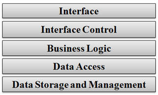
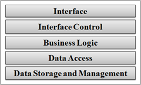
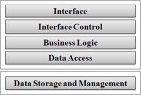
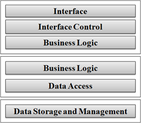
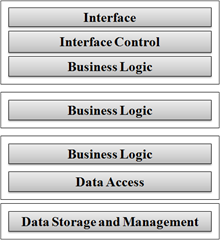

26 September 2008

CSLA .NET version 3.6 is a framework for creating business applications using object-oriented design concepts, in a distributed computing environment. [CSLA .NET for Windows](http://www.lhotka.net/cslanet) and [CSLA .NET for Silverlight](http://www.lhotka.net/cslalight) share many common features and capabilities, though they support different platforms. The commonality between the two framework implementations allows sharing of business object code between .NET and Silverlight, while the differences allow you to exploit the power of the two different platforms.

CSLA .NET version 3.6 is the latest evolution in the CSLA .NET framework, which has been around since 2001. Over the past eight years the framework has grown and changed in many ways, and is now one of the most widely used open source development frameworks for the .NET platform.It is covered under a very [liberal license](http://www.lhotka.net/cslanet/license.aspx) and has a vibrant, helpful and friendly [community](http://forums.lhotka.net/).

The primary goal of CSLA .NET is to enable you to build a rich, powerful and flexible business layer for your application.

This business layer is composed of business domain objects that encapsulate your business logic (calculations, algorithmic processing, validation and authorization). These objects should be designed based on the business use cases for your application domain. With some reasonable care, it is possible to create a single set of business objects that work within both the .NET and Silverlight environments.

In some cases your Silverlight business objects may contain the exact same object code used for CSLA .NET for Windows applications, though in most cases there will be some small variation of code. In most cases more than 90% of your object code will be shared between .NET and Silverlight, with less than 10% of the code being different. The differences are primarily due to the asynchronous nature of Silverlight programming, and the more synchronous nature of traditional .NET programming. If you are willing to apply the same asynchronous designs to your .NET implementation you can achieve 99% or 100% code sharing between the two platforms.

### CSLA .NET Core Features

Regardless of platform, CSLA .NET is designed to do two things. First and foremost, it is designed to support you as you create a powerful business layer based on rich business domain objects. Second, it is designed to enable a distributed application architecture centered on a concept called *mobile objects*.

To support the creation of rich domain objects, CSLA .NET includes subsystems that supply commonly required functionality, including:

- Full support for data binding (WPF, Silverlight, Windows Forms and Web Forms)
- Object status tracking (is object new, changed, marked for deletion, etc.)
- Standardized business and validation rule processing
- Standardized authorization at the object and property levels
- Integration with, and simplification of, standard .NET authentication models
- Undo capabilities to support implementation of Cancel buttons and complex layered UIs
- Standardized interaction with a data access layer or ORM
- Enhanced support for LINQ queries against your business objects
- Numerous general productivity features, useful in many business application scenarios
- Asynchronous data access and asynchronous validation rules

My *Expert 2008 Business Objects* book (published by [Apress](http://www.apress.com)) covers these subsystems in detail.

These subsystems are exposed through a set of base classes from which you inherit to create your business objects. These base classes enable a set of object stereotypes:

- Editable root (single or collection) - an object that has read-write properties, and which can be directly retrieved and stored in a database
- Editable child (single or collection) - an object that has read-write properties, and which is retrieved and stored in a database as part of some editable root
- Dynamic list - a collection that contains editable root objects, integrating with data grid controls to auto-update each object when the user leaves a row in the grid (not applicable to ASP.NET interfaces)
- Read-only root (single or collection) - an object that has read-only properties, and which can be directly retrieved from a database
- Read-only child (single or collection) - an object that has read-only properties, and which is retrieved from a database as part of some read-only root
- Name/value list - a read-only root collection that contains only name/value pairs for use in populating combobox or listbox controls
- Command - an object that executes code on the client and/or the server; often used to execute database code or server-side workflows

The end result of building your business objects using CSLA .NET is that your objects are created in a consistent, standardized manner. So not only do your objects automatically gain substantial benefit from all of these subsystems, but your overall maintainability is radically improved thanks to the consistent architecture, design and coding of your application.

The concept of *mobile objects* is a technique that supports the use of rich business domain objects in distributed application environments. Specifically, the idea is that your business objects are *mobile*, able to move physically from one computer to another to take advantage of the resources available on each computer.

CSLA .NET includes a component called the *data portal* which is responsible for providing the mobile object functionality. Using the data portal, your business objects may come into existence on an application server so they can efficiently interact with your data access layer (and database). The objects may then physically move across the network to the client workstation (web server, Windows client or Silverlight client) where they can efficiently interact with the user by being data bound directly to the UI. Once the user is done interacting with the object, the object may then move back to the application server so it can interact with the data access layer to update the database.

Mobile objects are an incredibly powerful technique for exploiting the power of object-oriented design and programming in distributed environments. The CSLA .NET data portal abstracts the complexity of this concept. The result is that your application can switch between 1-tier, 2-tier, 3-tier and even 4-tier models with no change to code - the change is purely one of configuration.

### CSLA .NET for Windows

CSLA .NET for Windows allows you to easily build WPF, ASP.NET (Web Forms, AJAX and MVC) and Windows Forms user interfaces on top of your business objects. It also supports WCF service, Windows Workflow and asmx web services interfaces. Technically you could create *all* of these interfaces on top of the same set of business objects, though most applications require only one or two types of interface (Web Forms and WCF services for example).

CSLA .NET includes some UI controls in each major UI technology. These controls help minimize UI code and maximize productivity.

In WPF the following controls are provided:

- CslaDataProvider - a WPF data provider that enables the use of commanding to implement Save, Cancel, Add New and Remove Item functionality in the UI
- PropertyStatus - like the Windows Forms ErrorProvider, but manages validation, authorization and busy notification for each control
- ObjectStatus - enables data binding to the business object's status properties (IsValid, IsNew, etc.)
- Authorizer - container-based implementation that enables/disables controls based on the business object's authorization rules

In Web Forms the following controls are provided:

- CslaDataSource - a Web Forms data source control that supports data binding to business objects
- DataMapper - a component that simplifies the copying of form post values into your business objects

In Windows Forms the following controls are provided:

- BindingSourceRefresh - work around for a data binding refresh issue in Windows Forms
- CslaActionExtender - automate object management behind buttons such as Save and Cancel
- ReadWriteAuthorization - automatically enable/disable detail controls based on the object's authorization rules

CSLA .NET also includes functionality to assist in the creation of services and workflow activities.

For WCF and asmx services the following component is provided:

- DataMapper - a component that simplifies the copying of data between your business objects and data contract objects

For WCF services, there is another component:

- PrincipalCache - a component that temporarily caches .NET principal objects for use when implementing custom authentication/authorization in a WCF service

For Windows Workflow the following component is provided:

- WorkflowManager - simplifies launching, suspending and resuming a workflow instance

CSLA .NET for Windows provides a great deal of flexibility in terms of data access. CSLA .NET is not a data access layer or an object-relational mapping (ORM) tool. However, CSLA .NET does provide a level of formalization around how your application interacts with your data access layer or ORM. This formalized flexibility allows you to use a wide range of data access technologies, including raw ADO.NET, DataSets, LINQ to SQL, ADO.NET Entity Framework, NHibernate, Paul Wilson's ORM mapper and many other technologies.

### CSLA .NET for Silverlight

CSLA .NET for Silverlight allows you to easily build Silverlight 2.0 user interfaces on top of your business objects. By fully supporting Silverlight data binding, along with extra controls provided by CSLA .NET, you can create Silverlight forms with nearly no UI code. Just like with CSLA .NET for Windows, most of your code is encapsulated in your business objects, maintaining clean separation between the presentation and business behaviors.

Because Silverlight doesn't provide all the rich data binding features found in WPF or Windows Forms, CSLA .NET for Silverlight provides a set of Silverlight UI controls and features to provide a high level of parity with the functionality in WPF. Not only are you able to build a Silverlight interface on your business objects, but CSLA simplifies the creation of very rich, interactive business interfaces over those objects. For example, Silverlight doesn't include WPF *commanding*, and so CSLA .NET includes replacement functionality so you can hook up common UI functionality to your objects without resorting to code behind each form. The controls provided by CSLA .NET include:

- CslaDataProvider - a Silverlight equivalent to the WPF data provider
- InvokeMethod - a Silverlight equivalent to WPF commanding
- PropertyStatus - a Silverlight equivalent to WPF validation or the Windows Forms ErrorProvider (though far superior to both)
- ObjectStatus - a control that uses the visual state manager to automatically change the UI based on the state of your business object
- BusyAnimation - a control that displays a busy animation; can be bound to your object to automatically show that your object is performing an asynchronous operation
- Data grid columns - custom data grid column types that incorporate the PropertyStatus control to show validation, authorization and busy status for each cell

CSLA .NET for Silverlight enables a data access model where your business objects invoke remote services to retrieve or update data. You can use this model to implement client/server or service-oriented application designs. For example, you might use ADO.NET Data Services to expose data services from a server, and use CSLA .NET for Silverlight to create business objects and a Silverlight UI to interact with those data services.

If you have a CSLA .NET for Windows server, you can take advantage of some advanced CSLA .NET capabilities. Specifically, your CSLA .NET for Silverlight application can interact with the CSLA .NET for Windows server, enabling 2-, 3- and 4-tier physical deployments of your application. In this model, your .NET business objects (perhaps already supporting a Web Forms UI) are effectively extended directly into the Silverlight client. The standard object persistence models supported by CSLA .NET are now automatically used to support the Silverlight client, providing an incredibly high level of code and functionality reuse across the .NET and Silverlight platforms.

### CSLA .NET Deployment Models and Mobile Objects

The CSLA .NET data portal enables the use of mobile object concepts in your application. This is largely transparent to your code, and the code you do write to interact with the data portal is very standardized. The benefit of using the data portal is flexibility; you can switch your application from a physical 1-tier deployment to a 3-tier or even 4-tier deployment purely by changing configuration - no coding changes are required.

CSLA .NET for Windows supports 1-, 2- and 3-tier physical deployments.

  

Again, it is possible to switch between these physical models purely by changing configuration. Your UI code, business object code and data access code remains entirely intact across all three deployment models.

In the 3-tier model, the business logic layer (the assembly(ies) containing your business object code) is deployed to both the client and application server. Your business objects literally move between those two machines through the data portal.

The data portal uses standard .NET technologies such as WCF to manage the network communication. It is implemented using powerful design patterns such as channel adapter, provider and message router.

CSLA .NET for Silverlight supports 1-, 2-, 3- and 4-tier physical deployments. The 1-, 2- and 3-tier models employ the same architecture as CSLA .NET for Windows. The 4-tier model is a little different.

In the case of CSLA .NET for Silverlight's 3- and 4-tier models, the data portal is more advanced because your business objects literally move between the Silverlight client and the .NET server(s). This means your objects are moving between different platforms, as well as different machines. This is usually entirely transparent to your code, so the resulting functionality and your code is the same as in a pure .NET application.

It is important to realize that in the 3- and 4-tier deployment models, for both .NET and Silverlight, your business code and business objects are fully functional on each machine. This means you have the flexibility to run logic on the client, the server or both as required to meet your applications needs.

### Standardized Data Access

CSLA .NET is not a data access technology or an object-relational mapping (ORM) tool. However, the data portal (which implements the mobile object concept) does impose a level of standardization and structure around how your objects interact with your data access layer or ORM. This standardization remains very flexible, and you are free to use nearly any data access technology you choose, including (but not limited to):

- Raw ADO.NET (connections, data readers, etc.)
- DataSet and TableAdapter objects
- LINQ to SQL
- LINQ to XML
- ADO.NET Entity Framework
- NHibernate and other third-party ORM tools
- Simple file I/O
- Remote XML or JSON services

The data portal supports two models: data portal managed, and object factory.

In the data portal managed model, the data portal manages the creation and state of your business objects, and invokes methods on your object to perform persistence. So in this model, your business objects are responsible for interacting with your data access layer or ORM, and the data portal helps ensure your object state (new, dirty, etc.) is properly managed.

In the object factory model, the data portal creates a factory object that is responsible for the creation and state of your business objects. You must supply this factory object. The data portal invokes methods on your factory object to perform persistence. In this model your factory objects are responsible for interacting with (or implementing) your data access layer or ORM, and for managing your business object's state (new, dirty, etc).

The data portal managed model is ideal when using a data access layer built using raw ADO.NET, simple file I/O or other relatively direct techniques. It is the simpler of the models, because the data portal provides a lot of automatic management of your business objects.

The object factory model is ideal when using an ORM or a more sophisticated data access layer. It is more complex, and requires more coding on your part, but is far more flexible. It is also implementing using an open architecture, which enables some test driven development (TDD) scenarios that are (arguably) more difficult to achieve using the data portal managed model.

Summary

CSLA .NET is a powerful, time-tested framework that supports the creation of an object-oriented business layer for distributed application development. It helps you encapsulate your business logic in a set of rich business domain objects, and provides your objects with powerful features around data binding, business logic, validation and authorization.

Starting with version 3.6, CSLA .NET supports all common interface types on the .NET platform, and provides seamless support for the new Silverlight 2.0 platform as well.
