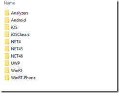
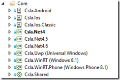
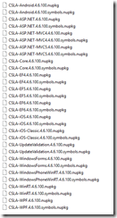

04 September 2015

In a recent blog post [@praeclarum](http://twitter.com/praeclarum) discusses [frustrations with NuGet 3](http://praeclarum.org/post/128347388533/my-complaints-with-nuget-3).

His viewpoint is from someone who uses (used?) PCLs.

What is interesting is that I agree with him about NuGet 3, but my viewpoint is as someone who chose Shared Projects over PCLs.

So I rather suspect NuGet 3 solved some unknown set of problems that *somebody* must have had – but it wasn’t authors of libraries using *and not using* PCLs. Huh.

You might ask why I don’t use PCLs – and in particular in my [CSLA .NET framework](http://www.cslanet.com), which is extremely cross platform. And that’s actually part of the answer.

CSLA .NET came into being before .NET itself was released, and has been evolving ever since. Perhaps the biggest point of evolution occurred when I chose to support Silverlight 2.0 in around 2006 (or 2007?). That was the first point where the (then years old) codebase needed to stop depending on full .NET. Also at that point in time neither PCLs nor Shared Projects existed, but Linked Files existed (the precursor to Shared Projects).

As a result, much of the CSLA Silverlight code existed as links to files in the full CSLA .NET project. So there were two different projects – one for .NET and one for Silverlight. Shortly followed by a third project when .NET Server and .NET Client split.

Of course the .NET and Silverlight platforms weren’t the same, but by using linked files each shared file was compiled for each target platform, and we were able to use compiler directives to accommodate differences in each platform.

Any real-world project tends to end up with some cruft, and CSLA is no exception. By the time we’d followed this model to add Silverlight, Windows Phone, various versions of .NET (3.5, 4, 4.5), Xamarin (iOS and Android aren’t always identical either), WinRT, and mono we’d accidentally duplicated various files and inappropriately reused some compiler directives. I wish I could say the CSLA dev team was perfect at all times, but we take shortcuts, or miscommunicate, from time to time like anyone else.

Earlier this year I undertook a major initiative to shift all the linked files into a set of common Shared Projects using the official support provided in Visual Studio 2015. The end result is really nice, but this change brought me face to face with every compromise or mistake we’d made over the past several years. Fun!

The end result is that all the actual code for CSLA resides in a small set of Shared Projects, and those projects are shared into concrete compilable projects for each target platform supported by CSLA .NET. The release folder (compiler output target) looks like this:

Then a set of NuGet 2 packages are created representing the various scenarios where people would want to use CSLA to reuse their business logic – across different user experiences and/or different platforms. The list of NuGet packages includes:

- Core (basically Csla.dll for your platform)
- Web (Core + Web (basic ASP.NET and Web Forms helpers))
- MVC (Core + Web + helpers for the MVC version you are using)
- WPF (Core + WPF helpers)
- WinForms (Core + Windows Forms helpers)
- WinRT/UWP (Core + WinRT and UWP helpers – which are the same right now thankfully)
- Android (Core + Android helpers)
- iOS (Core + iOS helpers)
- Entity Framework (Core + helpers for the EF version you are using)
- Validation (Core + helpers for enable backward compatibility with an older rules engine from CSLA 3.8)
- Templates (installs VS templates and snippets on the dev workstation)

To accomplish this we have the following solution structure for the core Csla.dll outputs:

Notice that there’s one Csla.Shared project – it contains all the code – and then a set of concrete compilable projects for the various platforms and .NET versions supported. Those projects *contain no code at all*, just settings for the compilers.

Would a PCL simplify this? Sort of, but not really. There are too many differences between some of these target platforms for the actual implementation code to exist in a single PCL. Remember, you can’t use compiler directives or have *any* platform-specific implementation code in a PCL – and that constraint is just too limiting to allow CSLA to do what it does. Perhaps this is in large part because a key feature of CSLA is that it shields *your business code* from underlying platform differences, so we can’t dumb down the code in CSLA and allow platform differences to penetrate our abstractions or we’d lose a primary benefit of CSLA itself.

> *Namely, you write your business logic one time and then reuse that exact code on every platform you want to target, thus radically reducing your maintenance burden over the years you’ll be running that code.*

Now there is the concept of “bait-and-switch” with a PCL, where the PCL itself contains no implementation – only public interface definitions. And then you create a concrete compilable project with the actual implementation for each platform and .NET version you want to support. In other words, you do exactly what we are doing here, with the addition of one more project that only contains all the public class/interface/type information from Csla.Shared.

And I might do this “bait-and-switch” hack someday – but to make such a thing manageable I’d want a tool I can run as part of the build process that generates all that public type information from Csla.Shared, because otherwise I’d have to maintain it all by hand and that’s just asking for trouble. (anyone knowing of such a tool feel free to let me know!!)

We follow the same basic pattern for the various UI technologies – so there are a similar set of concrete projects and one shared project for XAML, Android, iOS, Web, MVC, etc.

The result is, in my view, extremely manageable thanks to the great support for Shared Projects in Visual Studio 2015. Yes, we’ve been following this approach “the hard way” since ~2007, so I feel very confident saying that VS2015 is a *major* step forward in terms of tooling around this model.

I also feel comfortable saying that I have no regrets that we *didn’t* go down the PCL route when PCLs were introduced. They’d have required we use the “bait-and-switch” hack, which is too much magic for my taste, and I think they’d have further increased the complexity of our solution.

Back to NuGet 3 – nothing I’m talking about here requires (or currently uses) NuGet 3. Part of the build process generates a set of NuGet 2 packages that I push into NuGet:

As a result, when you add a reference to ‘CSLA MVC5’ you get the correct ‘CSLA Core’, ‘CSLA Web’, and ‘CSLA MVC’ assemblies in your project for the version of .NET your projects are targeting. Exactly what you expect. Easy for the end developer, and I think easy for us as maintainers of an OSS library.

From what I can see, NuGet 3 just changes a bunch of stuff and adds confusion to fix some problems I’m not encountering. That’s never a good sign…
