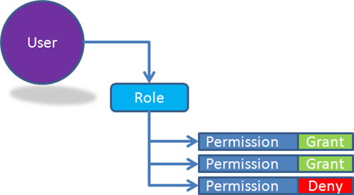

03 December 2008

One of the topic areas I get asked about frequently is authorization. Specifically role-based authorization as supported by .NET, and how to make that work in the "real world".

I get asked about this because CSLA .NET (for Windows and Silverlight) follow the standard role-based .NET model. In fact, CSLA .NET rests directly on the existing .NET infrastructure.

So what's the problem? Why doesn't the role-based model work in the real world?

First off, it is important to realize that it *does work* for some scenarios. It isn't bad for course-grained models where users are authorized at the page or form level. ASP.NET directly uses this model for its authorization, and many people are happy with that.

But it doesn't match the requirements of a lot of organizations in my experience. Many organizations have a slightly more complex structure that provides better administrative control and manageability.

Whether a user can get to a page/form, or can view a property or edit a property is often controlled by a *permission*, not a role. In other words, users are in roles, and a role is essentially a *permission set*: a list of permissions the role has (or doesn't have).

This doesn't map real well into the .NET IPrincipal interface, which only exposes an IsInRole() method. Finding out if the user is in a role isn't particularly useful, because the application really needs to call some sort of HasPermission() method.

In my view the answer is relatively simple.

The first step is understanding that there are two concerns here: the administrative issues, and the runtime issues.

At administration time the concepts of "user", "role" and "permission" are all important. Admins will associate permissions with roles, and roles with users. This gives them the kind of control and manageability they require.

At *runtime*, when the user is actually using the application, the roles are *entirely meaningless*. However, if you consider that IsInRole() can be *thought of as "HasPermission()"*, then there's a solution. When you load the .NET principal with a list of "roles", you really load it with a list of permissions. So when your application asks "IsInRole()", it does it like this:

> bool result = currentPrincipal.IsInRole(requiredPermission);

Notice that I am "misusing" the IsInRole() method by passing in the name of a permission, not the name of a role. But that's ok, assuming that I've loaded my principal object with a list of permissions instead of a list of roles. Remember, the IsInRole() method typically does nothing more than determine whether the string parameter value is in a list of known values. It doesn't really matter if that list of values are "roles" or "permissions".

And since, at runtime, no one cares about roles at all, there's no sense loading them into memory. This means the list of "roles" can instead be a list of "permissions".

The great thing is that many people store their users, roles and permissions in some sort of relational store (like SQL Server). In that case it is a simple JOIN statement to retrieve all permissions for a user, merging all the user's roles together to get that list, and not returning the actual role values at all (because they are only useful at admin time).
