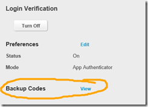

13 January 2016

Some time ago I switched my EA Origin account to use two factor authentication (TFA) using an authenticator app. The authenticator app concept is a great one, much nicer than relying on SMS messages.

The thing is, if you then lose/reset/replace your phone you’ll find that you need to reconfigure the authenticator app for each of your online accounts, such as EA Origin. To do that you need the QR code to rescan (or some code you type in) to pair your phone with EA.

This is a bit of a trap, because to get the QR code you need to turn off TFA and then turn it back on. And you can’t turn off TFA without a pre-existing authenticator app to give you a login code. If you are like me, you don’t have a functioning authenticator app – that’s why you are trying to pair a new one.

What I learned today is that when you first pair your device so the authenticator app works, you also get a set of recovery codes. I’d seen these, but didn’t understand the purpose (it isn’t documented).

It turns out that these are a set of one-time authenticator codes. Basically they are like codes that you get from the authenticator app, but they don’t expire until used – and each one can be used exactly one time.

If you keep these codes somewhere safe and accessible, you can use one to log into your account, then use another to turn off TFA. Then you can turn TFA back on, which will give you the QR code needed to pair your new phone’s authenticator app with EA Origin.

Now that I understand how these recovery codes work, I also know how to recover my other accounts (such as GitHub, Facebook, etc.) if the need were to arise.
