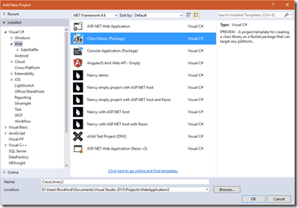
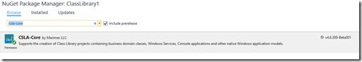
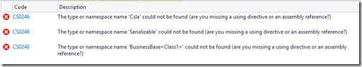

10 December 2015

Starting with version 4.6.300 CSLA .NET supports ASP.NET 5 (.NET Core) and the CSLA-Core NuGet package includes a portable class library that targets .NET 4.6 and dnxcore50.

There does appear to be an issue with adding the NuGet package to an ASP.NET Class Library project. I assume this is due to the pre-release nature of the ASP.NET 5 tooling.

What happens is easy to replicate. Create an ASP.NET 5 web site project, then add a portable class library using the ASP.NET 5 template:

Then add a NuGet reference to CSLA .NET 4.6.300 (currently also in pre-release):

Then try to use features of CSLA – for example, altering the Class1 code like this:

`using System;      using Csla;`

`namespace ClassLibrary1      {          [Serializable]           public class Class1 : BusinessBase<Class1>          {                public Class1()                { }          }       } `

The project will not compile at this point even though one would expect that CSLA really has been referenced:

After some experimenting I found what appears to be a solution. The project.json file must be manually edited so CSLA is listed as a dependency not only in the “net451” framework, but also in the “dotnet5.4” framework:

`{      ``   "version": "1.0.0-*",         "description": "ClassLibrary1 Class Library",          "authors": [ "Rockford" ],          "tags": [ "" ],          "projectUrl": "",          "licenseUrl": "",          "frameworks": {            "net451": {              "dependencies": {                "CSLA-Core": "4.6.300-Beta001"                 }            },            "dotnet5.4": {              "dependencies": {           "Microsoft.CSharp": "4.0.1-beta-23516",                "System.Collections": "4.0.11-beta-23516",                "System.Linq": "4.0.1-beta-23516",                "System.Runtime": "4.0.21-beta-23516",                "System.Threading": "4.0.11-beta-23516"              }            },            “dependencies” : {                 “CSLA-Core”: “4.6.300-Beta001”        ``     }     }       }`

The solution/workaround is to move the “CSLA-Core”: “4.6.300-Beta001” dependency from the “net451” framework to a global dependencies section.

With this change the project will now build.
