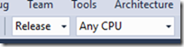
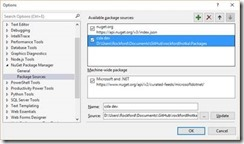

16 September 2015

Steps to repro the issue described in this github issue:

https://github.com/MarimerLLC/csla/issues/428

1. Pull the csla repo from
https://github.com/rockfordlhotka/csla.git

a. Switch to the NuGet-uwp branch

2. Open &lt;root&gt;\csla\Source\csla.build.sln

a. Build Release | All CPU

b. Don’t worry about the Xamarin projects – they don’t matter for this issue

c. Build results will be in &lt;root&gt;\csla\bin

i. including the problematic rd.xml files for the UWP projects

3. Open PowerShell, cd to &lt;root&gt;\csla\NuGet

a. Run ‘Build All.ps1’ /prerelease:Beta3

b. Run consolidatepackages.bat

4. Open &lt;root&gt;\csla\Samples\ProjectTracker\ProjectTracker.sln

a. Add a NuGet package source to &lt;root&gt;\Packages, for example:

b. Build Debug | All CPU

i. Ignore the *async method lacks await* warning – this is a testing artifact

ii. Ignore the warnings about our analyzers (unless you know how to fix them – this analyzer via NuGet stuff is challenging at best!!!!)

iii. You should end up with a build error:

| Severity | Code | Description | Project | File | Line |
| --- | --- | --- | --- | --- | --- |
| Error |   | Payload contains two or more files with the same destination path 'Csla\Properties\Csla.Uwp.rd.xml'. Source files: C:\Users\Rockford\.nuget\packages\CSLA-Core\4.6.172-Beta3\lib\uap10.0\Csla\Properties\Csla.Uwp.rd.xmlC:\Users\Rockford\.nuget\packages\CSLA-UWP\4.6.172-Beta3\lib\uap10.0\Csla\Properties\Csla.Uwp.rd.xml | ProjectTracker.Ui.UWP |   |   |

