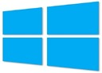

24 April 2014

Ho hum. Microsoft is going to [bring back the start menu in Windows 8](http://techcrunch.com/2014/04/23/the-start-menu-may-return-to-windows-in-august/?ncid=rss) – presumably in August.

That might be ok, though I’ve long since adapted to the start screen so I’m not sure I care at all.

What I *do* care about are much more real challenges when working in the ‘modern’ or WinRT (Windows Runtime or Windows Store) side of the operating system.

My top list:

1. The file save/open dialogs don’t sort or filter items and so are almost useless if you have a lot of files
2. The file save/open dialogs (and OneNote app) often don’t show the full filename or properties of files, making similar files hard to distinguish – again making these core aspects of the OS extremely challenging if not useless
3. The OneDrive app doesn’t let me access folders shared to me by other people – a feature I use constantly, and so spend more time in the web UI than the app
4. Unpredictability and lack of control about how WinRT apps display side-by-side is a continual thorn in my side – I launch an app in one monitor and it messes up the display in another monitor? Seriously?!?!
5. The Calendar app is lame at best. It has some good features, but wastes amazing amounts of space and lacks simple bits of functionality like copying an item or moving an item from one calendar to another. Hopefully it turns into something more like the Windows Phone 8.1 calendar
6. There’s no way to schedule Lync meetings using the Lync app – how lame is that???
7. I’ve tried nearly all the file manager apps out there, and some are not bad, but what I \_don’t\_ understand is why the OneDrive app (which already does OneDrive and local PC stuff) doesn’t just handle things like removable and network drives so it would literally be the “one drive” app
8. I want a notification summary screen like we now have in Windows Phone 8.1 - \_that\_ is a useful feature!

I guess what I’m getting at is that I understand that Microsoft feels like they need to add back the Start menu to lure stubborn people into using Win8. BUT what I’m afraid will happen is that they’ll lure people into the WinRT world only to have those people suffer the same day-to-day frustrations I already suffer because these core fit-and-finish capabilities aren’t implemented or complete.

Personally I think it would be better to make the WinRT platform so nice and compelling and fun to use that people will \_choose\_ to use it over the legacy Desktop with or without cosmetic stuff like a Start menu.
