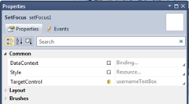

26 February 2010

Continuing on my quest to use the Visual Studio 2010 XAML designer, MVVM and absolutely no code behind, I ran into the common problem of setting focus to a control as a form loads.

This is easily accomplished using code-behind:

> firstControl.Focus();

But of course that requires *code-behind*, which I believe should be unnecessary.

It can also be accomplished by creating an attached property or (with the Blend 3 SDK) trigger action or behavior. Neither of these are great with the VS10 designer though, because the designer has no way to apply attached properties and doesn’t know about the Blend 3 SDK concepts.

So while those solutions are fine, they require manual typing of XAML, which I believe should be unnecessary (as unrealistic as that view might be…).

My solution is to create a FrameworkElement called SetFocus. This shows up in the Toolbox and so can be dragged directly onto the form using the designer. The SetFocus control has no visual aspect, so it doesn’t interfere with the layout or look of the form. Once SetFocus is on the form, the Properties window can be used to set its TargetProperty property, indicating the property that should get focus when the form is loaded.

This requires no code-behind and no manual typing of XAML. It keeps the concept of startup focus completely in the view, which (I think) is a good place for it. So my viewmodel doesn’t know or care about this issue. And the same control works in Silverlight and WPF, which should be the goal for any good XAML control.

Here’s the code:

using System;
using System.Windows;
using System.Windows.Controls;
using System.ComponentModel;

namespace Collective.Controls
{
  /// &lt;summary&gt;
  /// Sets the focus to the TargetControl property as the
  /// form is loaded.
  /// &lt;/summary&gt;
  public class SetFocus : FrameworkElement
  {
    /// &lt;summary&gt;
    /// Gets or sets the target UI control.
    /// &lt;/summary&gt;
    public static readonly DependencyProperty TargetControlProperty =
      DependencyProperty.Register("TargetControl", typeof(Control),
      typeof(SetFocus), new PropertyMetadata((o, e) =&gt;
      {
        var sf = o as SetFocus;
        if (sf != null && sf.TargetControl != null)
          sf.TargetControl.Focus();
      }));
    /// &lt;summary&gt;
    /// Gets or sets the target UI control.
    /// &lt;/summary&gt;
    [Category("Common")]
    public Control TargetControl
    {
      get { return (Control)GetValue(TargetControlProperty); }
      set { SetValue(TargetControlProperty, value); }
    }
  }
}
