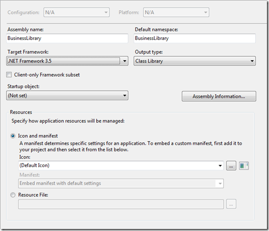
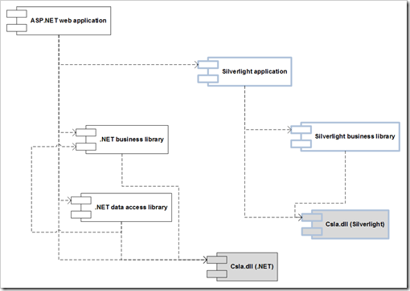

19 February 2009

Setting up any type of n-tier solution requires the creation of numerous projects in the solution, along with appropriate references, configuration and so forth. Doing this with a Silverlight application is complicated slightly because Silverlight and .NET projects are slightly different (since they use different compilers, runtimes, etc). And sharing code between Silverlight and .NET projects complicates things a bit more, because the same physical code files are typically shared between two different projects in the solution.

[CSLA .NET for Silverlight](http://www.lhotka.net/cslalight) makes it relatively easy to create powerful n-tier applications that do share some code between the Silverlight client and the .NET server(s). Even though CSLA .NET does solve a whole host of issues for you, the reality is that the solution still needs to be set up correctly.

Here are the basic steps required to set up an n-tier CSLA .NET for Silverlight solution:

1. Create a new Silverlight application project
    1. Have Visual Studio create a web application for the Silverlight project
2. Add a new Silverlight Class Library project (this is your business library)
3. Add a new .NET Class Library project (this is your business library)
4. Use the Project Properties windows to set the Silverlight and .NET Class Library projects to use the same namespace and assembly name

5. Remove the Class1 files from the Silverlight and .NET Class Library projects
6. (optional) Add a .NET Class Library project to contain the data access code
7. Set up references
    1. The Silverlight application should reference Csla.dll (for Silverlight) and the Silverlight Class Library
    2. The Silverlight Class Library (business) should reference Csla.dll (for Silverlight)
    3. The ASP.NET Web application should reference Csla.dll (for .NET), the .NET Class Library (business) and the .NET Class Library (data)
    4. The .NET Class Library (data) should reference Csla.dll (for .NET) and the .NET Class Library (business)
    5. The .NET Class Library (business) should reference Csla.dll (for .NET)

8. Add your business classes to the .NET Class Library (business)
    1. Link them to the Silverlight Class Library (business)
    2. Use compiler directives (#if SILVERLIGHT) or partial classes to create Silverlight-only or .NET-only code in each Class Library
9. Configure the data portal
    1. Add a WcfPortal.svc file to the ASP.NET web application to define an endpoint for the Silverlight data portal
    2. Add a &lt;system.serviceModel&gt; element to web.config in the ASP.NET web application to configure the endpoint for the Silverlight data portal
    3. Add any connection string or other configuration values needed on the server to the web.config file
    4. Add a ServiceReferences.ClientConfig file to the Silverlight application and make sure it has an endpoint named BasicHttpBinding\_IWcfPortal pointing to the server

This isn’t the simplest or most complex option for creating a CSLA .NET for Silverlight solution. You could use CSLA .NET for Silverlight to create a client-only application (that’s the simplest), or a 4-tier application where there is not only a web server in the DMZ, but also a separate application server behind a second firewall. I do think that the model I’ve shown in this blog post is probably the most common scenario however, which is why this is the one I chose to outline.
