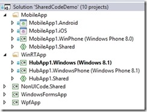

01 July 2014

There’s been a lot of exciting change in cross-platform development for C# developers over the past few months. Microsoft introduced the [Universal Apps](http://msdn.microsoft.com/en-us/library/windows/apps/dn609832.aspx) concept for WinRT (Windows 8 and Windows Phone 8.1), and Xamarin introduced [Xamarin.Forms](http://xamarin.com/forms) (Windows Phone 8, Android, and iOS).

Beneath the Universal App support in Visual Studio 2013 is a broader concept called a Shared Project. With the [Shared Project Reference Manager](http://visualstudiogallery.msdn.microsoft.com/315c13a7-2787-4f57-bdf7-adae6ed54450) add-in for VS13 you can reference these shared projects from any project, not just Universal App projects.

As a result, you can build a solution like this one:

[](binary/WindowsLiveWriter/SharingCodefromWinFormstoiOS_E8B4/SharedCodeSolution_2.jpg)

This solution includes a Xamarin.Forms MobileApp, a Microsoft Universal App (based on the Hub control), a Windows Forms app, and a WPF app. All of these apps use non-UI code from the NonUICode.Shared project.

In fact, the Android, iOS, WinPhone, Windows, and WindowsPhone UI projects have basically no code at all. In the MobileApp all the UI code is in the MobileApp1.Shared project. In the WinRTApp all the UI code is in the HubApp1.Shared project.

The Windows Forms and WPF apps each have their own UI code. Windows Forms is its own thing, and although WPF uses XAML, it is an older dialect that doesn’t share enough in common with WinRT or Xamarin.Forms for sharing.

*None* of the UI projects contain any business logic or logic to call services. All that code is in the NonUICode.Shared project so it can be maintained just one time. The service calls use HttpClient, which is reasonably common across all the UI platforms, and for the few differences I’m using #if statements to accommodate the per-platform code. For example, here’s a bit of code from a shared viewmodel class:


```
    public async Task SaveData()    {      if (this.IsDataLoaded)      {        var webClient = new HttpClient();        var data = JsonConvert.SerializeObject(this.Speaker);#if ANDROID || __ANDROID__ || __IOS__        var content = new StringContent(data, System.Text.Encoding.UTF8, "application/json");#else        var content = new HttpStringContent(data);#endif        var urlString = apiSpeakerUrl + @"/" + this.Speaker.Id.ToString();        var response = await webClient.PutAsync(new Uri(urlString), content);        if (!response.IsSuccessStatusCode)          throw new Exception("SaveData failed");      }    }
```

The overall result is that with reasonable effort you can create an app that spans every type of smart client technology available today; from Windows Forms up to iOS. These apps can share all your business and service client code, and can often share a lot of UI code.

(fwiw, if you build your business logic with [CSLA .NET](http://cslanet.com) it is a *lot* easier to create and maintain the shared business and service client code than if you try to build that code by hand)
