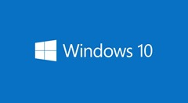
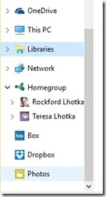

20 August 2015

In a recent article ‘[10 reasons you shouldn’t upgrade to Windows 10](http://www.cio.com/article/2973974/windows/10-reasons-you-shouldnt-upgrade-to-windows-10.html)’ the author ends by saying that he did upgrade even over his own objections. I can’t argue with that conclusion, as my only remaining Win7 ‘machine’ is a virtual machine I use for legacy work, and I have no Win8 devices left at all (except for my phone, and hopefully I’ll be on [Win10 there soon too](http://www.theverge.com/2015/8/20/9181253/microsoft-surface-pro-4-hardware-event-launch-october-rumors)).

> **Note:** to be fair, [@woodyleonhard](https://twitter.com/woodyleonhard) wrote another article earlier on why [you should upgrade to Windows 10](http://www.infoworld.com/article/2954263/microsoft-windows/10-reasons-you-should-upgrade-to-windows-10.html).

I’ve upgraded or installed Windows 10 on quite a few devices at this point, and have been using it continually for a long time as part of the [Windows Insiders Program](https://insider.windows.com/). So I thought I’d provide at least some quick thoughts on the 10 reasons “not to upgrade” based on my experience.

#### 10. Ongoing privacy concerns

I think there’ve been a lot of good rebuttals of this issue – not least of which is that anyone using an Apple or Android (or Windows) smart phone already gave away all their privacy anyway 

Perhaps more useful is this good article about [what Windows 10’s privacy settings actually do](http://lifehacker.com/what-windows-10s-privacy-nightmare-settings-actually-1722267229).

#### 9. OneDrive regression

There’s some truth to this – I liked the way Win8.1 did OneDrive. Apparently the Win8.1 approach confused a lot of people though – including several of my co-workers. OneDrive in Win10 now it works more like DropBox. I’m personally unconvinced that this is a big deal one way or the other.

For me the big thing was access to my massive library of photos in OneDrive, and when I discovered that the Win10 file open dialog (from Universal apps) can tap into the Photos app (and other file sharing apps like DropBox) to get at cloud-based files my life was greatly improved.

#### 8. Missing Media Center and DVD player

VLC ([from the store](https://www.microsoft.com/en-us/store/apps/vlc-for-windows-8/9wzdncrfj3t0), and [for desktop](http://www.videolan.org/vlc/)), [k-lite](http://www.codecguide.com/download_mega.htm), and [CCCP](http://cccp-project.net/) solve this problem just fine, in terms of playing DVDs anyway. I suspect that’s the biggest issue for most people.

If you are an actual Media Center user then I agree, don’t upgrade until you’ve found a replacement solution. You might consider one of the [numerous other options](http://www.techdrivein.com/2011/03/top-5-media-center-applications-for.html) that run on Linux and/or Windows.

#### 7. Not much in the way of Universal apps

This isn’t new – there were relatively few good apps in the store for Win8.1 – and it continues to be frustrating into Win10. I really hope that the new UWP and UWP bridge technologies help bring a lot more apps to Win10. That, and the reality that there are nearly 100 million Win10 installs already (in the first few weeks the OS has been out) so you’d think that app authors would start to care about reaching this audience.

On the other hand, if you are a Win7 user then why would this be a roadblock to moving to Win10? You have *zero* apps in Win7, so what little is in the store is infinitely more than what you have today.

And if you are a Win8.1 user there aren’t *less* apps than what you have, there just aren’t really any more apps either.

#### 6. Key apps, including Mail and Edge, aren’t ready yet

I’ll argue here about Edge, because I like it a lot. I know it doesn’t yet have some features of more mature browsers, but then again it is lighter and faster than they are and I like that trade-off.

On the other hand, the points about the Mail (and Calendar and People) apps are totally on point. I’m extremely disappointed that these apps weren’t (imo) completed before Win10 shipped, and every day when Mail crashes or messes up in other ways I wish for a higher quality app. They are getting better fairly rapidly, but today they are frustrating.

If you are coming from Win7 you don’t have these apps and so perhaps won’t care. If you have Outlook you won’t care, because you’ll probably keep using Outlook.

But I really, really liked the Win8.1 mail/calendar/people apps and can’t wait for the Win10 versions to catch up to their 8.1 predecessors.

#### 5. Win10’s Tablet Mode may not appeal to you

If you are *upgrading* from Win7 you almost certainly don’t have a tablet, so moving to Win10 with tablet mode is immaterial because you’ll never use tablet mode. Not a roadblock.

If you are one of the few people that does have a Win7 tablet then how do you live with it??? And if you do, then Win10’s tablet mode with be nothing but an improvement. Again, not a roadblock.

If you are on Win8.1 with a tablet then Win10’s tablet mode is basically the same thing you have today. Nothing to lose in this case, but if you sometimes use a keyboard/mouse with your tablet then there is a *lot* to be gained by upgrading to Win10.

#### 4. The installer may not be ready for you yet

Having upgraded quite a number of machines (including my father-in-law’s old laptop) without any issues I must say that Win10 is the first time in Windows history that I would recommend doing an upgrade rather than a fresh install. I’m amazed at the upgrade process and how well it works.

That said, if the installer isn’t ready for you it is probably because some hardware vendor for some component in your computer hasn’t released a Windows 10 driver yet. That’s increasingly rare, but if you are in that situation then you really *don’t* want to upgrade yet – not until the drivers are available.

#### 3. Forced updates

I don’t really know what to say about this one. Not forcing updates is bad because people fall behind and end up vulnerable to viruses and malware, but forcing updates is causing some issues. It seems to me that the solution is to roll forward on the current course and for Microsoft to figure out how to make forced updates work reliably.

As (I hope) more apps end up in the Windows Store they’ll tend to only run on the current version of Windows, so not applying updates almost certainly means your apps will stop working. I personally use a lot of apps from the store, and I sure don’t want them to stop running because I missed an update!

#### 2. Ain’t broke, don’t fix

This is somewhat short-sighted. I get the idea here, just like most people stick with old versions of OSX, iOS, or Android (note my sarcasm: most people *don’t* stick with old versions of those operating systems).

Enterprises being slow I understand, but most users of personal devices should just keep current in my view. Take advantage of the new shiny stuff, and stay with the most supported version of any OS to help avoid viruses and malware.

#### 1. Questions, questions, questions

This isn’t a real point at all – just FUD because the author is (presumably) being paid by the word. Then on the next page he goes on to say that he upgraded anyway, because really, who wants to be stuck in the past when you have a *free* avenue into the future?

#### My conclusion

In summary, I haven’t hesitated to upgrade numerous computers to Windows 10, including computers for non-experts such as relatives and some friends. The transition from Windows 7 to Windows 10 is pretty easy for most people, it is much the same but a little prettier. The transition from Windows 8 to Windows 10 is nearly always an improvement – in desktop and tablet modes.

So yes, I am in favor of most people upgrading.
