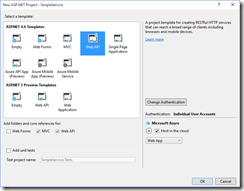
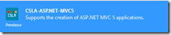
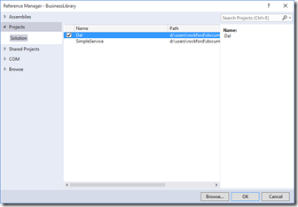
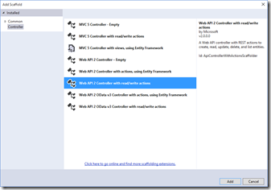

26 October 2015

Many people look at CSLA .NET and see a big, complex framework. And to be honest, this *is* an enterprise-grade framework that supports a lot of features, so it can be complex.

But it doesn't have to be, not for the simple scenarios.

So here's a basic walkthrough of creating a Web API service that sits on top of a CSLA business layer.

> **Remember:** This *exact same business layer* can be reused (unchanged) to support everything from an iOS/Android mobile interface to a web interface to an old-fashioned Windows Forms interface. *That* is the power of CSLA .NET!

I should point out that even *this code* isn’t as simple as it could be – but I want to show a proper basic architecture that abstracts the interface, business, and data layers of the application. As a result you’ll end up seeing a number of projects created:

1. Web API interface
2. Business library
3. Abstract data access layer
4. Concrete data access layer

At the end of this process you’ll have a simple Web API service running. But even better, the projects/assemblies in number 2-4 are 100% reusable across other platforms.

You can get the finished code from [GitHub](https://github.com/rockfordlhotka/SimpleService).

## 1

To start, open Visual Studio 2015 and create an ASP.NET Web Application. I named mine SimpleService.

In the next dialog, indicate that you want to create a Web API style project.

Using NuGet, add a reference to the CSLA-ASPNET-MVC5 package.

## 2

Next, add a .NET 4.6 Class Library project to the solution. I named mine BusinessLibrary.

Using NuGet, add a reference to the CSLA-Core package.

Also add a reference to the standard System.ComponentModel.DataAnnotations assembly. Thanks to CSLA .NET, the basic validation rules in this assembly not only work with ASP.NET, but also with every other UI technology, even on platforms where this assembly wouldn’t normally be available (like Windows Forms).

## 3

Now add a simple business class to the business library project. Add a class named PersonEdit.

CSLA supports editable and read-only objects, so I tend to name my classes XyzEdit and XyzInfo to differentiate easily between the type that supports changing data, and the type that typically shows a small subset of data when the user needs to see a list of data.

Edit the class to look like this:
 `   using System;
using System.ComponentModel.DataAnnotations;
using Csla;

namespace BusinessLibrary
{   [Serializable]   public class PersonEdit : BusinessBase<PersonEdit>   {   }
}

`
In the class add a read-only property and a read-write property as follows:
`  public static readonly PropertyInfo<int> IdProperty = RegisterProperty<int>(c => c.Id);
public int Id
{   get { return GetProperty(IdProperty); }   private set { SetProperty(IdProperty, value); }
}

public static readonly PropertyInfo<string> NameProperty = RegisterProperty<string>(c => c.Name);
public string Name
{   get { return GetProperty(NameProperty); }   set { SetProperty(NameProperty, value); }
}

`
CSLA does include code snippets you can add to your project via the CSLA-Templates NuGet package. Here I’ve used the cslapropg and cslaprop snippets.

Finally, make the Name property required:
`  [Required]
public string Name
{   get { return GetProperty(NameProperty); }   set { SetProperty(NameProperty, value); }
}

`

> **Note:** CSLA .NET has a very powerful rule engine in addition to support of DataAnnotations attributes. The rules engine supports multi-property and multi-object validation, as well as authorization, and data manipulation/calculation. Basically, everything you need to implement virtually any business rule or process can be accommodated by the rule engine.

At this point the business domain class exists. But the only way to create an instance of an object is via the new keyword, and that’s problematic. You should generally use factory methods or dependency injection to create object instances. CSLA supports either, but the easiest approach is to use a factory method. Add the following method to the PersonEdit class.

At this point return to the Web API project and add a reference to the BusinessLibrary project.
`      public static async Task<PersonEdit> GetPersonEditAsync(int id)    {       return await DataPortal.FetchAsync<PersonEdit>(id);    }#if !NETFX_CORE    public static PersonEdit GetPersonEdit(int id)    {       return DataPortal.Fetch<PersonEdit>(id);    }
#endif
`
You will also need to add a using statement.
`    using System.Threading.Tasks;

  `
The DataPortal is a CSLA concept that abstracts away creating, retrieving, updating, and deleting business domain objects so you can easily switch between different platforms (Xamarin, .NET, UWP, etc.) and also easily switch between 1-, 2-, 3-, and n-tier physical deployments of your application.

## 4

Now that the business domain class exists, let’s hook it up to a data access layer.

Add a .NET 4.6 class library to the solution. I named mine Dal.

This project will *not* contain the data access code, but will contain the definitions for all data operations, basically using a repository pattern. Inside this project I am not creating or using business domain types, I am creating and using data entity types. So where the business domain type created in the previous step is shaped to meet the needs of the interface (in this case the REST API), the types created in this Dal project will be primarily shaped to meet the needs of the database.

Add a data transfer type for person data to the project – a class named PersonDto.
`    namespace Dal
{   public class PersonDto   {     public int Id { get; set; }     public string Name { get; set; }   }
}

  `
Add an interface named IPersonDal to the project.
`    namespace Dal
{   public interface IPersonDal   {     PersonDto GetPerson(int id);   }
}

  `
In a real application your interface would contain other methods as well that might allow other retrieval options, as well as the ability to insert, update, and delete a person data entity.

Next add a .NET 4.6 class library project to the solution named DalMock. This project will contain a concrete implementation of the data access layer we just defined.

Add a project reference from the DalMock project to the Dal project.

In this project add a class named PersonDal.
`    using Dal;

namespace DalMock
{   public class PersonDal : Dal.IPersonDal   {     public PersonDto GetPerson(int id)     {       return new PersonDto { Id = id, Name = "Maria Kowalski" };     }   }
}

  `
Because this is a mock data access layer, it will just return hard-coded test values. You can also create another concrete data access layer project that uses EF or any other data access technology that you prefer.

Finally, the Dal project needs to provide an abstract/dynamic way to load the concrete data access layer assembly. Go back to the Dal project and add a class named DalFactory.
`    using System;

namespace Dal
{   public static class DalFactory   {     public static T GetDal<T>()     {       Type dalType = null;       if (typeof(T) == typeof(IPersonDal))         dalType = Type.GetType("DalMock.PersonDal, DalMock");       if (dalType != null)         return (T)Activator.CreateInstance(dalType);       else         throw new Exception("DAL type not found");     }   }
}

  `
In a real application you would not hard-code the PersonDal type; instead you would load that type from a configuration file or through some other means. Or perhaps you’d use a full-blown DI container instead of this simple dynamic factory scheme. For this simple demo however, this code illustrates the concept behind dynamically loading a concrete DAL type.

At this point the data access layer itself is complete, so all that remains is to wire up the business domain class to the abstract DAL.

Go to the business library project and add a project reference to the Dal project.

This provides the business domain classes access to the *abstract concepts* around the data access layer, without providing any access to a concrete DAL implementation.

In the PersonEdit class add the following method.
`    private void DataPortal_Fetch(int id)
{   var dal = Dal.DalFactory.GetDal<Dal.IPersonDal>();   var dto = dal.GetPerson(id);   using (BypassPropertyChecks)   {     Id = dto.Id;     Name = dto.Name;   }
}

  `
This code interacts with the abstract DAL types in the Dal project, but ultimately invokes the concrete DAL implementation to get back data that is used to load the domain object with the values it needs to do its job.

Now all that remains is to create the REST interface.

## 5

Return to the SimpleService project and add project references to the Dal and DalMock projects. While the Web API project doesn’t technically need those references, it is critical that those DLLs end up deployed to the bin folder on the web server, and adding these references will cause Visual Studio to handle that detail on our behalf.

With that done, add a Contracts folder to the project. In that folder add a PersonContract class to the project.
`    namespace SimpleService.Contracts
{   public class PersonContract   {     public int Id { get; set; }     public string Name { get; set; }   }
}
  `
This class defines the public contract for our API. You should never directly expose your *internal* business types to the outside world through a service; it is important to keep clean separation between the public interface and your internal implementation.

Next add a Person Web API controller to the project.

`    using System.Web.Http;

namespace SimpleService.Controllers
{   public class PersonController : ApiController   {     // GET: api/Person/5     public Contracts.PersonContract Get(int id)     {       var person = BusinessLibrary.PersonEdit.GetPersonEdit(id);       return new Contracts.PersonContract       {         Id = person.Id,         Name = person.Name       };     }   }
}

  `
This controller uses the factory method of the business domain object to retrieve the requested instance of the domain type. The data from that domain object is loaded into the public API contract type, which is then returned to the caller of the service.

Using this approach you have complete separation and maintainability over what the consumer of the service sees, how the internal business domain model works, and how the data access layer interacts with the database.

If the business layer implements business rules, such as authorization, at a per-property or per-type level, this service implementation would succeed or fail to return those values as it attempted to pull them from the business object. No rules are implemented in the Web API project, because it is part of the interface layer. All rules are implemented in the business layer.

You should now be able to run the Web API project and navigate to the service URL (the port number may vary).
`    http://localhost:59560/api/Person/5
  `
The result should be JSON that looks like this.
`    {"Id":5,"Name":"Maria Kowalski"}
  `
For more information about CSLA to go http://www.cslanet.com.
