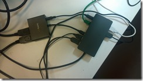

02 December 2015

I have had my new Surface Pro 4 for a few days now (I waited to get the i7 model) and I’m liking it quite a lot. I really liked my SP3, and the SP4 is better yet.

My one primary disappointment is with the dock. I got the new Surface dock and tried to connect it to my two external monitors using brand new mini-DisplayPort-to-DVI cables but the displays were just all messed up – one or the other would come on but not both, and everything was very unstable.

Searching around the Internet I found this: [https://www.reddit.com/r/Surface/comments/3s655j/surface\_pro\_4\_dock\_cannot\_drive\_a\_dvi\_monitor/](https://www.reddit.com/r/Surface/comments/3s655j/surface_pro_4_dock_cannot_drive_a_dvi_monitor/ "https://www.reddit.com/r/Surface/comments/3s655j/surface_pro_4_dock_cannot_drive_a_dvi_monitor/")

In summary, the Surface dock can’t power DVI or HDMI outputs directly. I *assume* it can power VGA directly, but I don’t know – maybe not?

This makes the dock pretty useless for many (most?) of us who don’t have monitors that have DisplayPort ports. I’ve never owned such a monitor and I don’t think I’ve ever actually seen one in a store or anything. So I assume that most of us don’t have such a thing.

In my case I was “fortunate” in that I’d already bought a powered DisplayPort hub to get the dual monitor scenario working from my Surface 3 dock, so that’s what I’m using to get my monitors to work. The [DP hub](https://smile.amazon.com/gp/product/B00JLRBC7S/ref=oh_aui_detailpage_o03_s00?ie=UTF8&amp;psc=1) I’m using is from StarTech and seems to work quite nicely.

The fact that it works remains quite disappointing though. The Surface dock *looks* like it would be useful, but in practice I think for most of us it doesn’t do what any reasonable person would expect – which is to say that the two DP ports are not what they seem.

So if you are considering buying the Surface dock I’d suggest that you also budget an extra US$100 or so to buy a DP hub and appropriate DP-to-DVI (or HDMI) cables.
