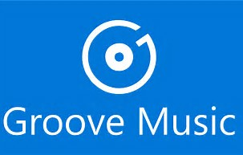

30 August 2017

Long ago I switched from a Windows 10 phone to an iPhone. But I remained a Groove Music user, because I really like the service and its features.

1. Offline sync of playlists so I can listen on the airplane
2. Available on iPhone, Android, Windows, Xbox
3. Plays music videos when available
4. "Radio" (used to be Smart DJ or something) to help find new music

The only big issue I've struggled with on the iPhone is that the app doesn't have an easy way to sync all my music from OneDrive onto the phone for offline play. This was a simple option on Windows, but there's no support in the iPhone app.

I've got a few thousand songs in my library, all on OneDrive. They auto-sync to my Windows 10 devices for offline play, but the most *important* device for offline play is my phone, which I use when on airplanes and driving through northern Minnesota.

I tried syncing the music to the phone using iTunes, but that only makes the music available via the Apple Music app, not Groove, and I want my music in a single app across all my devices.

After trading some emails with a gentleman named Bob Spiker (I think the original email exchange was in response to a twitter rant of mine), it turns out there's a hack that sort of works.

These are the steps:

1. Open the Groove app on Windows and create a set of playlists that contain only your OneDrive music
    1. Playlists can only have 1000 songs, so you may need to create several playlists
    2. It is probably easiest to add artists to the playlists, as you'll have fewer of them then albums or songs
    3. You can do this on your phone too, but the UI is tedious, so it is far easier on Win10
2. Open the Groove app on your iPhone and you'll see the playlists; open each playlist and mark it available for offline use
3. Make sure your phone has enough storage to handle your music; the sync will stall if the phone runs out of storage
4. Groove will only download songs when the app is open and the phone's screen isn't locked
    1. Go to the iPhone settings, search for "Lock" and set the phone to never lock
    2. Plug in the phone so it is on AC power
    3. Leave the Groove app open as the active app
    4. Make sure your phone is on high speed wifi
    5. Wait patiently until the music has all synced onto the phone (which might take a long time)
5. Go back into your phone's settings and set the auto-lock back to its original setting

This isn't a perfect solution. It does get all the music onto the phone, but I'm finding that artist/album indexing isn't always working as expected against the music synced from OneDrive. In other words, the music is there and you can see it in the playlists, but you can't always find it from the artist or album views (though it is *usually* there).

Maybe the "right" answer is to switch to another music service. But I'll only do that if I get the same cross-device support (including xbox), offline sync for my phone, and music videos.
