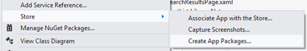
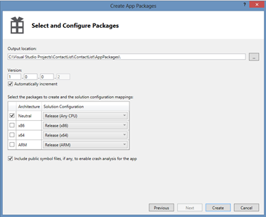
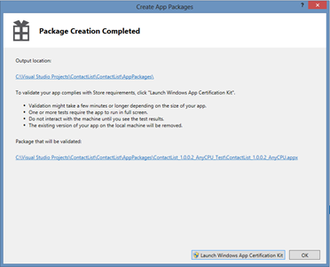
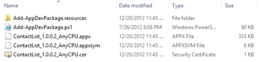
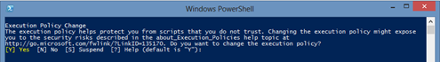
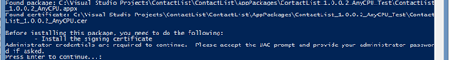
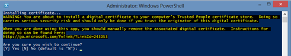

20 December 2012

A colleague of mine at Magenic recently posted on how to [deploy and debug a WinRT app on a Surface RT](http://elybob.wordpress.com/2012/12/19/step-by-step-to-deploying-app-to-surface/).

Another alternative is to install the app onto the Surface device via PowerShell. This won’t attach the debugger, but is often an appropriate solution for people who are just testing the app (QA testers, colleagues willing to provide feedback, etc.).

This is a multi-step process. At a high level it goes like this:

1. Developer packages the WinRT app to a folder on their hard drive, then puts the package on a network share or USB key, etc.
2. Tester unlocks PowerShell on their device (this is a one-time thing)
3. Tester gets the WinRT app package and runs a PowerShell script to install the app on their device

### Creating the Package

The developer needs to create a distributable package for the app. This is done by right-clicking on the WinRT project in the Visual Studio solution explorer, and choosing Store –&gt; Create App Packages.

This brings up the Create App Package wizard. The first question is whether you want to deploy the the store, and the answer in this case is No.

Next, you’ll be asked where to create the package, how to create the package version number (different from the app version number) and what platforms to target.

The Neutral architecture in Release (Any CPU) allows testing on Intel and ARM devices.

When the Create button is clicked, the project is built and packaged, with the results placed in the specified folder.

The top level folder contains an appxupload file that you can safely ignore (it is used for uploads to the store). It also contains a sub-folder with the actual app package.

These are the files you must make available to the tester. You can put these files on a network share, a USB key, a SkyDrive folder, or any other location where the tester can gain access. The Add-AppDevPackage.ps1 file is the PowerShell script the tester will run to install the app.

### Unlocking PowerShell

The tester’s device must be able to execute PowerShell scripts before they can install the app. By default PowerShell has security settings that prevent scripts from executing. This [TechNet article](http://technet.microsoft.com/en-us/library/cc764242.aspx) discusses running PowerShell scripts. In summary, you need to open PowerShell as Admin and run this command:

> Set-ExecutionPolicy unrestricted

Be aware that this allows execution of any script, so you do assume some risk by enabling this policy.

Once this has been done your test device is now able to install WinRT apps by executing the PowerShell script generated by Visual Studio.

### Installing the App

On the test device you must have access to the contents of the package folder created by the developer in Visual Studio. You might get those files from a network share, a USB key, or other location.

Simply execute the Add-AppDevPackage.ps1 file in PowerShell to install the app.

The script will ask permission to run.

If this device does not have a side-loading unlock key (MAK or developer key), you will be asked if you want to get a developer key. You should answer yes and walk through the wizard to get a developer key for this device. This step will require you to enter your Microsoft Account email address and password. The resulting key will expire after a short period of time (currently three months).

The PowerShell script will then ask for permission to install the certificate for the app. If you’ve already installed the certificate (perhaps you are installing a newer version of the same app) the script will skip this step.

Once the certificate is installed, the script will install the WinRT app itself.

At this point the WinRT app is installed and its tile should appear on the start screen along with all other apps installed on this device.

The user may now run the app like any other app.

Once the developer key for this device expires the app will stop working. Obviously the intent of this installation approach isn’t for the user to run the app forever, but rather so they can test it and provide feedback during the development process.
