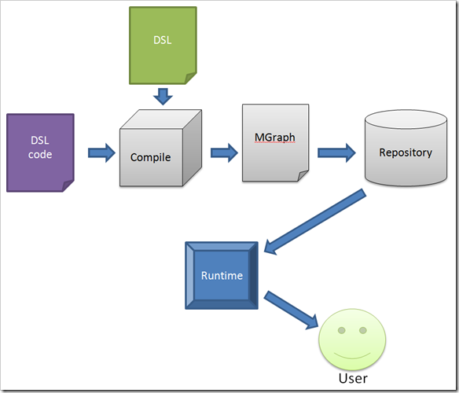
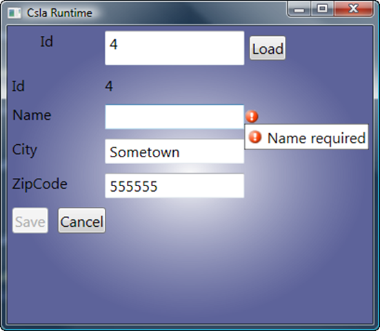

10 April 2009

I’m working on a number of things at the moment. Most notably the [CSLA .NET for Silverlight video series](http://download.lhotka.net/Default.aspx?t=SLVid01) that will be available in the very near future (it turns out that creating a video series is a lot of work!). And of course I’m prepping for numerous [upcoming speaking engagements](http://www.lhotka.net/Presentations.aspx), and I’d love to see you at them – please come up and say hi if you get a chance.

But I’m also working on some content around [Microsoft Oslo](http://msdn.com/oslo), MGrammar and related concepts. To do this, I’m creating a prototype “MCsla” language (DSL) that allows the creation of CSLA .NET business objects (and more) with very concise syntax. I’ll probably be blogging about this a bit over the next couple weeks, but the goal is to end up with some in-depth content that really walks through everything in detail.

My goal is for the prototype to handle CSLA *editable root* objects, but covers business rules, validation rules and per-type and per-property authorization rules. Here’s a conceptual example:

> Object foo  {  &nbsp;&nbsp;&nbsp; // per-type authz  &nbsp;&nbsp;&nbsp; Allow Create ("Admin");  &nbsp;&nbsp;&nbsp; Allow Edit ("Admin", "Clerk" );   &nbsp;&nbsp;&nbsp; // property definitions   &nbsp;&nbsp;&nbsp; Public ReadOnly int Id;   &nbsp;&nbsp;&nbsp; Public Integer Value {  &nbsp;&nbsp;&nbsp;&nbsp;&nbsp;&nbsp; // per-property authz  &nbsp;&nbsp;&nbsp;&nbsp;&nbsp;&nbsp; Allow Write ("Clerk" );  &nbsp;&nbsp;&nbsp;&nbsp;&nbsp;&nbsp; // business/validation rules  &nbsp;&nbsp;&nbsp;&nbsp;&nbsp;&nbsp; Rule MinValue (1 );  &nbsp;&nbsp;&nbsp;&nbsp;&nbsp;&nbsp; Rule MaxValue (50 );  &nbsp;&nbsp;&nbsp; }  }

But what I’ve realized as I’ve gotten further into this, is that I made a tactical error.

A lot of people, including myself, have been viewing MGrammar as a way to create a DSL that is really a front-end to a code generator. My friend [Justin Chase](http://www.justnbusiness.com/) has done a lot of very cool work in this space, and he’s not alone.

But it turns out that if you want to really leverage *Microsoft Oslo* and not just MGrammar, then this is not about creating a code generator. And what I’m finding is that starting with the DSL is a terrible mistake!

In fact, the idea behind MOslo is that the DSL is just a way to get metadata into the Oslo repository. And you can use other techniques to get metadata into the repository as well, including the graphical “Quadrant” tool.

But my next question, and I’m guessing yours too, is that if all we do is put metadata into the repository, what good is that???

This is where a *runtime* comes into play. A runtime is a program that reads the metadata from the repository and basically executes the metadata.

I always had a mental picture of MOslo “projecting” the metadata into the runtime. But that’s not accurate. It is the runtime that “pulls” metadata from the repository and then uses it.

And that’s OK. The point is that the runtime is this application that interprets/compiles/uses/consumes the metadata to end up with something that actually does some work.

What I’m learning through this process, is that the DSL exists to service the metadata in the repository. But it is the *runtime that defines the metadata*. The runtime consumes the metadata, so the metadata exists to serve the needs of the runtime.

In other words, I should have started with the runtime *first* so I knew what metadata was required, so I could design a DSL that was capable of expressing and capturing that metadata.

The example MCsla code you see above is OK, but it turns out that it is missing some important bits of information that my runtime needs to function. So while the DSL expresses the important CSLA .NET concepts, it doesn’t express everything necessary to generate a useful runtime result…

So at the moment I’ve stopped working on the DSL, and am focusing on creating a working runtime. One that can execute the metadata in a way that the user gets a dynamically created UI (in WPF) that is bound to a dynamically created CSLA .NET business object, that leverages a dynamically created data access layer (using the CSLA .NET 3.6 ObjectFactory concept). I’m not dynamically creating the database, because I think that’s unrealistic in any real-world scenario. We all have pre-existing databases after all.

Once I get the runtime working (and it is close – here’s a screenshot of a simple object, showing how the dynamic WPF UI is running against an object with business rules, buttons bound to the CslaDataProvider through commanding and all the other nice CSLA features.

Not that my UI is a work of art, but still :)

I have a lot more to do, but it is now clear that starting with the runtime makes a lot more sense than starting with the DSL.
