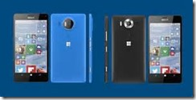

26 April 2016

There’s a lot of speculation at the moment, mostly I think from the tech press, that there’s no future for Windows 10 Mobile (aka Windows Phone). To the point that Terry Myerson apparently released a statement to clarify that [Microsoft is committed to mobile for many years](http://www.windowscentral.com/microsofts-committed-windows-10-mobile).

Over the past couple years I’ve been increasingly critical of Microsoft’s mobile strategy as well – it is hard not to be when the platform has such low market share, there’s been a lack of flagship devices released, and there’s still a major issue with apps (that don’t exist or that are quite poor compared to iPhone/Android versions).

So at the beginning of this year I “threw in the towel” and switched to the iPhone. This was after talking to a lot of people in person and via twitter about whether to go iPhone or Android. The overwhelming advice was that if you live in the US you should go iPhone, so I did exactly that.

After a couple weeks with the iPhone I wrote a [comparison between Windows 10 Mobile and the iPhone](http://www.lhotka.net/weblog/MyWindowsPhoneVsIPhoneComparison.aspx) – from my perspective. I’m selfish – I’m looking for a good answer *for me*, so my blog post was about me and my personal experience. After a couple more months I realized that this is a real tradeoff, because Windows 10 Mobile *the operating system* is more consistent and polished than iOS, but the apps on the iPhone are almost universally superior.

At that point I thought I’d try Android. This was right after Microsoft Build 2016, where it seemed like there was a lot of love for Android, and where I encountered a whole lot of my peers who were incredulous that I had an iPhone instead of an Android (where they were last fall when I was soliciting input I have no idea – I begin to suspect that people only advocate for their platform when you have “the other platform” in your pocket). Basically, some of the [iOS frustrations and inconsistencies](http://www.lhotka.net/weblog/iPhoneFrustration.aspx) were bugging me enough I wanted to look elsewhere.

I didn’t even [last a couple weeks on Android though](http://www.lhotka.net/weblog/WindowsToIPhoneToAndroid.aspx). I bought a OnePlus 2 – a high-end device with very generic Android. It turns out that generic Android pretty much sucks – much like generic Linux. You need to spend (in my experience) hours and hours and hours researching and trying different launchers, lock screen apps, email apps, calendar apps, contact apps, etc. Just to get *basic functionality* that works out of the box in the iPhone and Windows 10. O.M.G. I don’t understand how people can waste that much time just getting the basics to work on their phones!?!

Now I’m back to Windows 10 with a Lumia 950xl. And I’m happy.

I keep hearing how Windows “lacks polish”. Clearly this statement is being made by people who have not actually used Windows 10, iOS, and Android back to back like I just did. In some ways iOS might have more polish, but it is far, far less consistent than Windows, so I give the OS polish nod to Windows 10. Android isn’t even in the running – it has no polish *or* consistency – though maybe with another many hours of research and testing I could have found a launcher that I liked? That’s not how I want to spend my life.

I also keep hearing about the Windows “app gap”. That is obviously a real problem. It is absolutely the case that the iPhone has a lot more apps, and almost all the apps are superior. It is also the case that the Android apps are plentiful, but they generally look like crap compared to their iOS counterparts. But I’ll give it to Android that, though its apps are inconsistent and often cartoonish, they are full featured, unlike Windows apps.

One other note on apps: Android is clearly designed to work well if you are a Google user (mail/calendar/contacts) and it is pretty half-baked for people not on Google. I can’t say I support the [EU going after Google](http://www.newser.com/story/205457/europe-is-going-after-google.html) any more than I did when they went after Microsoft so long ago – I think that’s just dumb – but at the same time, I understand their consistent view here, because Google *is* using Android to drive usage and lock-in around their cloud service offerings, not unlike what Microsoft did 20 years ago with Windows.

Finally, I keep hearing how Windows phone hardware is inferior. I even heard that from someone at Microsoft. I’m skeptical. It is true that the iPhone 6s is a really nice device, and I *love* the fingerprint unlock feature. Android device quality varies a lot, but the OnePlus 2 is pretty nice (if a bit heavy) and has a fingerprint reader (if you can find a lock screen app that supports it). The Lumia 950 is nicer and lighter than the Android devices I’ve seen and used (including the Samsung ones). But I’ll grant that it isn’t as nice as the iPhone. At the end of the day though, I think all three platforms have hardware that are basically in the same ballpark: reasonably stylish, light, fast, with decent battery life, and great cameras. If it was just down to hardware my ranking would be iPhone 6s, Lumia 950, Samsung Android, other Android – in that order.

At this point though I’ll remind you that I’m selfish here – I’m after a solution *for me*.

That means it comes down to iPhone vs Windows 10 Mobile – the Android OS is too unpolished, clumsy, and inefficient; and its apps are too ugly, inconsistent, and cartoonish. It is clearly the cheapest platform, and you get what you pay for. I’m willing to pay to get a more productive experience.

And at the end of the day there are only 3 apps that don’t exist or don’t work on Windows that I actually need: Swarm, Waze, and the Parrott Bebop app for my drone.

> My bank does have an app on iPhone/Android, but it sucks and so not having it isn’t really a loss. To solve my bank app issue I need to switch to a better bank, not a different phone.

I weighed the value of those 3 apps against Windows 10’s more polished and consistent OS experience; and I considered that Siri is like Cortana’s dullard older sister (yes, Siri is really an idiot compared to Cortana, and Cortana on the iPhone is crippled compared to Windows or Android).

Ultimately I’ve decided that I’d rather go with the best OS on a regular basis. In my case I’m fortunate enough that I can carry a second phone (sans SIM) so I can still fly my drone – it just needs the app and wifi after all. That also gets me Waze and Swarm, because they also work over wifi, and my Lumia works great as a wifi hotspot when I’m out and about.

At the end of the day, until Foursquare, Google, and Parrot (and my bank) get their heads out of their @$$’s I am working around them via a two phone solution.

But *most importantly*, I’m happy using Windows 10 and Cortana for my 99% use case of email/calendar/phone/text/messaging/Office/etc.

And fwiw, I think the continued rapid adoption of Windows 10 itself (on my Surface and Desktop for example) will drive more and more companies to create UWP apps – perhaps not initially for the phone, but at least for the 300 million (and climbing) people running Windows 10. The thing is, once your app runs in UWP, getting to the phone is a pretty small step – and one companies would be foolish *not to do* for such little effort.
