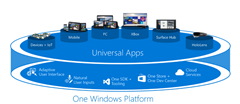

21 September 2015

I recently made an interesting discovery about Universal Windows Platform apps.

When you build and run them in Release mode they are compiled using the .NET Native compiler, *and they stop using `mscorlib`*.

Most of your common .NET types come out of mscorlib. For example:

> `System.Object, mscorlib, Version=4.0.0.0, Culture=neutral,PublicKeyToken=7ce85d7bea7798e`

When you are running UWP code in Debug mode that remains true. But in Release mode the use of `mscorlib` is replaced by `System.Private.CoreLib`. For example:

> `System.Object, System.Private.CoreLib, Version=4.0.0.0, Culture=neutral, PublicKeyToken=b03f5f7f11d50a3a`

In the vast majority of cases nobody cares about the assembly qualified name of a type – unless you are using reflection, in which case you may easily make this same discovery.

In my case, working on CSLA .NET, this difference posed a real challenge. One of the key features of CSLA is the concept of mobile objects, where object graphs transparently flow (move) across the tiers of your application (between AppDomains, processes, or computers over the network). For this to work, the type names of the objects must be the same in the source and destination environments, whether that be an Android client talking to a full .NET server, or a UWP client talking to that same server.

Fortunately ever since ~2007 and Silverlight’s restrictions on reflection (and the fact that it didn’t support `BinaryFormatter` or `NetDataContractSerializer`) CSLA has had its own serializer: `MobileFormatter`.

`MobileFormatter` has some serious advantages over `BinaryFormatter` and the NDCS, most notably it works across *all platforms* in a consistent manner, as well as minimizing the use of reflection and providing substantial control over the format of the byte stream transferred over the network.

In this scenario that last point is important, because I was easily able to enhance `MobileFormatter` to translate any assembly qualified type name that uses `mscorlib` or `System.Private.CoreLib` so the assembly name is an arbitrary text code. I chose `/n`. The full assembly name becomes `/n` during serialization, and that code becomes the full assembly name during deserialization.

The result is that types flow between UWP and all other platforms (.NET, Xamarin, etc.) transparently - as always. As a bonus this change reduces the number of bytes transferred over the wire because the full assembly name isn't in the byte stream, just this short code.

I found that benefit to be compelling enough that while I was changing `MobileFormatter` to solve the `mscorlib` issue I also added code to translate the CSLA assembly name to `/c` in the same manner.

In the future I may look at ways to translate user-created assembly names (your business assemblies) into short codes as well, as that would save a lot of bytes on the wire.
