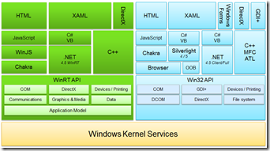

25 October 2011

Based on comments from my previous [Windows 8 Development Platform](http://www.lhotka.net/weblog/Windows8DevelopmentPlatformClarified.aspx) blog post (thank you to Shawn and Slavo in particular), here’s an updated Magenic diagram.

This one adds the Chakra js engine to the WinRT and desktop sides of the diagram, and it expands the detail of WinRT and Win32 to include things like COM, GDI+, and DirectX.

The result is that DirectX and GDI+ are duplicated – they are shown as a presentation technology at the top (which is valid), and as a core part of the OS APIs too (which is also valid). I’m not entirely sure that this adds clarity (or causes confusion?), but it seems like a reasonable addition to me based on Shawn’s comments.

The DirectX/GDI+ addition is directly valuable (I think), because it clearly illustrates that GDI+ is a Win32 thing, and doesn’t exist in the WinRT world.
