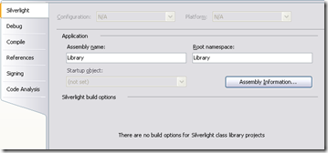
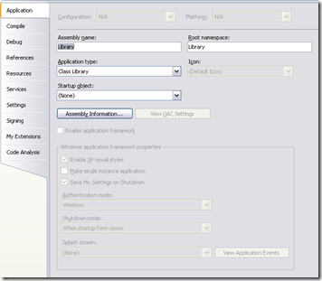

28 July 2008

In [Part 1](http://www.lhotka.net/weblog/UsingCSLALightPart1.aspx) I discussed the high level architectural options offered by CSLA Light. In Part 2 I'll start walking through the implementation of the 3-tier mobile object model (which pretty much also covers the 4-tier mobile object model as well).

I'll start with the center of the application: the business layer. As I discussed in [Part 1](http://www.lhotka.net/weblog/UsingCSLALightPart1.aspx), the business layer spans Silverlight and .NET and defines mobile objects that are capable of moving between the Silverlight client and the .NET web/app server.

(CSLA Light supports both C# and VB - and probably most other languages too - so the fact that this particular demo is in VB shouldn't be taken as an indication that anything only works with VB. Rather, I consciously switch between VB and C# for each demo I write, and it is VB's turn.)

This is intended to be as simple a demo as I can create, and still show something useful. To that end, the demo has exactly one object, with three properties.

#### Library.Client Setup

The Library.Client project is a Silverlight Class Library. This means it compiles for the Silverlight runtime and can only contain code that will run on the Silverlight client.

It is important to realize that when objects serialize and deserialize, they must have the *exact same type name*. This includes the assembly name, namespace and type name. The standard .NET way to represent an assembly qualified type name is something like:

> "MyNamespace.MyType, MyAssembly"

Since the business objects in Library.Client must be compatible with those in Library.Server, both assemblies must compile to the same assembly name, and must use the same namespaces.

To accomplish this, the project's properties must be changed so the Assembly name and Root namespace do not include the ".Client" part of the name:

I've changed them both to "Library", so this will compile to Library.dll and the root namespace is Library.

#### Library.Server Setup

The same changes to the Assembly name and Root namespace are made to the .NET Class Library project, Library.Server:

This project also builds a Library.dll with a root namespace of Library.

If you sign either project, you *must sign both projects*, and you must use the same key. That way they end up with the same effective assembly name, even though they are on different runtimes.

The end result is that a class in one project is serializable into and out of a class in the other project.

#### CustomerEdit Class Declaration

The CustomerEdit class exists in both the Library.Client and Library.Server projects, so the code is compiled into both runtimes. This means CustomerEdit can serialize and move between the Silverlight and .NET runtimes.

The class declaration should be pretty familiar to any CSLA .NET developer:

> Imports Csla
> Imports Csla.Serialization
>
> &lt;Serializable()&gt; \_
> Public Class CustomerEdit
>   Inherits BusinessBase(Of CustomerEdit)

The only odd or new thing here might be the inclusion of the Csla.Serialization namespace. Silverlight has no concept of a Serializable attribute, so CSLA Light supplies one (along with NonSerialized). So in CSLA .NET this namespace exists, but is essentially empty, while in CSLA Light the namespace includes definitions for the attributes "missing" from Silverlight. The end result is that a Serializable class in .NET can compile in Silverlight.

#### Property Declarations

The property declarations are standard CSLA .NET 3.5 fare:

> Private Shared IdProperty As PropertyInfo(Of Integer) = \_
>   RegisterProperty(New PropertyInfo(Of Integer)("Id"))
> ''' &lt;Summary&gt;
> ''' Gets and sets the Id value.
> ''' &lt;/Summary&gt;
> Public Property Id() As Integer
>   Get
>     Return GetProperty(IdProperty)
>   End Get
>   Set(ByVal value As Integer)
>     SetProperty(IdProperty, value)
>   End Set
> End Property
>
> Private Shared NameProperty As PropertyInfo(Of String) = \_
>   RegisterProperty(New PropertyInfo(Of String)("Name"))
> ''' &lt;Summary&gt;
> ''' Gets and sets the Name value.
> ''' &lt;/Summary&gt;
> Public Property Name() As String
>   Get
>     Return GetProperty(NameProperty)
>   End Get
>   Set(ByVal value As String)
>     SetProperty(NameProperty, value)
>   End Set
> End Property
>
> Private Shared StatusProperty As PropertyInfo(Of String) = \_
>   RegisterProperty(New PropertyInfo(Of String)("Status"))
> ''' &lt;Summary&gt;
> ''' Gets and sets the Status value.
> ''' &lt;/Summary&gt;
> Public Property Status() As String
>   Get
>     Return GetProperty(StatusProperty)
>   End Get
>   Set(ByVal value As String)
>     SetProperty(StatusProperty, value)
>   End Set
> End Property

This code compiles in both CSLA Light and CSLA .NET. Notice that I'm using *managed backing fields*. This allows the CSLA Light serialization to automatically serialize the field values to/from the .NET server.

You can use private backing fields if you choose. If you do use private backing fields, then you'll need to override OnGetState() and OnSetState() and get/set each private field value into the serialization stream. This process is much like the old PropertyBag concept from VB6, and is necessary because Silverlight's support for reflection is insufficient to automate the process.

By using managed backing fields, I avoid having to do that manual work, but I want to be clear that you ultimately get to choose between the two approaches.

#### Silverlight vs .NET Code

The rest of this post will cover code that is either Silverlight-only or .NET-only. In this sample I've chosen to use compiler directives to separate the code, even though it is all in one file. You can certainly use partial classes instead, and based on [this forum thread](http://forums.lhotka.net/forums/thread/24921.aspx) that might be the preferred approach.

But in this sample, you'll find the following basic structure:

> #If Silverlight Then
>   ' Silverlight-only code
> #Else
>   ' .NET-only code
> #End If

Compiler directives or partial classes work fine and achieve the same end result.

#### Silverlight Factory Methods

Now we're at a point where the Silverlight and .NET code may diverge. In Silverlight, any server communication must be asynchronous. This means that the CSLA Light data portal is asynchronous, and thus your factory methods must also be asynchronous.

We've added asynchronous capabilities to the CSLA .NET data portal as well, so you can use this same async factory approach there as well, but typically I don't think that makes a lot of sense.

In any case, the factory methods are designed to be called by the Silverlight UI, and they look like this:

> Public Shared Sub BeginNewCustomer( \_
>     ByVal proxyMode As DataPortal.ProxyModes, \_
>     ByVal callback As EventHandler(Of DataPortalResult(Of CustomerEdit)))
>   Dim dp As New DataPortal(Of CustomerEdit)(proxyMode)
>   AddHandler dp.CreateCompleted, callback
>   dp.BeginCreate()
> End Sub
>
> Public Shared Sub BeginGetCustomer( \_
>     ByVal id As Integer, \_
>     ByVal callback As EventHandler(Of DataPortalResult(Of CustomerEdit)))
>   Dim dp As New DataPortal(Of CustomerEdit)
>   AddHandler dp.FetchCompleted, callback
>   dp.BeginFetch(New SingleCriteria(Of CustomerEdit, Integer)(id))
> End Sub

In both the create and fetch scenarios the steps are:

1. Create an instance of the data portal (optionally forcing it to run in local mode)
2. Add a handler for the async completed event
3. Call the data portal method to begin the async operation

For this example, I'm requiring that the UI developer pass in the event handler method. In VB this is done with the AddressOf command, and in C# it is a delegate, an anonymous delegate or a multi-line lambda. I'll get to the UI code in a future blog post.

When the data portal is in remote mode, it communicates with a web server running a special CSLA .NET data portal host that is compatible with CSLA Light. I'll get into the server configuration in a later blog post.

The result is that a BeginCreate() or BeginFetch() call results in the data portal using WCF to call the server. When the call gets to the .NET server, it follows much of my discussion in [this blog post](http://www.lhotka.net/weblog/CSLALightDataPortalOptions.aspx). A few things have changed in terms of how a factory object is created, but that's a topic for a different sample app.

In this sample app, the client-side data portal calls are routed directly to server-side DataPortal\_XYZ methods. These are normal CSLA .NET DataPortal\_XYZ methods, and are entirely unaffected by the fact that the client is Silverlight.

#### Silverlight Constructor

The one other bit of important code in the Silverlight-only area is a Public constructor:

> Public Sub New()
>   ' required by MobileFormatter
> End Sub

The serializer used by CSLA Light is the MobileFormatter, and in Silverlight this serializer requires a Public default constructor on any object it deserializes. This is because Silverlight doesn't allow the use of reflection to create an object with a non-Public constructor like you can in .NET.

This is unfortunate, because a UI developer might accidentally try to use the New keyword to create an instance of the object, like:

> Dim cust As New CustomerEdit

While this would compile, it won't really work - not as expected anyway. The UI developer really needs to call one of the factory methods shown earlier to create or retrieve the object successfully. This is why CSLA .NET constructors are typically non-Public, to act as a reminder to the UI developer to use the factory methods. In Silverlight you'll just have to use code reviews to ensure that the UI code is correct.

#### .NET Constructor

Now let's shift to the .NET-only code. In the .NET-only code there's also a definition of a default constructor, but this one is Private:

> Private Sub New()
>   ' require use of factory methods
> End Sub

This is standard CSLA .NET coding style, using a non-Public constructor to force the UI developer to use the factory methods. In .NET the MobileFormatter does the same thing as the BinaryFormatter or NetDataContractSerializer, and it creates an instance of the object even though it has a non-Public constructor.

#### .NET DataPortal\_XYZ Methods

To keep this sample as easy as possible, the DataPortal\_XYZ methods don't actually call a data access layer or talk to a database. They merely set a property on the object to indicate which of the methods was invoked, and where it ran (on Silverlight or on .NET):

> Protected Overrides Sub DataPortal\_Create()
>   LoadProperty(StatusProperty, \_
>        "Created " & ApplicationContext.ExecutionLocation.ToString)
>   MyBase.DataPortal\_Create()
> End Sub
>
> Private Overloads Sub DataPortal\_Fetch( \_
>         ByVal criteria As SingleCriteria(Of CustomerEdit, Integer))
>   LoadProperty(StatusProperty, \_
>         "Retrieved " & ApplicationContext.ExecutionLocation.ToString)
>   LoadProperty(IdProperty, criteria.Value)
>   LoadProperty(NameProperty, "Test " & criteria.Value)
> End Sub
>
> Protected Overrides Sub DataPortal\_Insert()
>   LoadProperty(StatusProperty, \_
>       "Inserted " & ApplicationContext.ExecutionLocation.ToString)
> End Sub
>
> Protected Overrides Sub DataPortal\_Update()
>   LoadProperty(StatusProperty, \_
>         "Updated " & ApplicationContext.ExecutionLocation.ToString)
> End Sub
>
> Protected Overrides Sub DataPortal\_DeleteSelf()
>   LoadProperty(StatusProperty, \_
>        "Deleted " & ApplicationContext.ExecutionLocation.ToString)
> End Sub

There's nothing special about these methods. You could write this code in CSLA .NET 3.5 for a pure .NET application and it would work just fine. Sure, it is simplistic, in that I'm just loading some hard-coded values into the object's properties, but you should be able to imagine these methods calling your data access layer and getting back a DataReader, DTO, entity object or whatever you are using; and then loading the object's property values from that data source.

#### Summary

What I hope you take away from this post is that you can take an existing CSLA .NET 3.5 class (that uses managed backing fields), and get it running in CSLA Light too with very little effort. In fact, all you need to do is:

1. Add an #If Silverlight compiler directive
2. Put the Silverlight-only factory methods and Public constructor in the Silverlight area
3. Put your existing .NET-only factory methods and non-Public constructor in the .NET area
4. Put your existing DataPortal\_XYZ methods in the .NET area
5. Link the file into a Silverlight Class Library

In future posts I'll cover the Silverlight UI and the CSLA Light data portal configuration, including the CSLA .NET data portal server.
