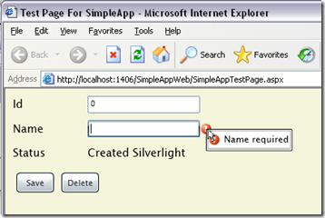

11 August 2008

In [Part 1](http://www.lhotka.net/weblog/UsingCSLALightPart1.aspx) of this series I discussed the overall architecture and structure of a CSLA Light application. In [Part 2](http://www.lhotka.net/weblog/UsingCSLALightPart2.aspx) I walked through the creation of a simple [editable root](http://www.lhotka.net/Article.aspx?area=4&amp;id=4484d01a-faa9-4220-a5c9-065e7b43b0af) business object that supports both the 3-tier and 4-tier mobile object models.

In this post I want to cover the Silverlight UI. Following the theme of this walkthrough, the UI will be very simple so I can illustrate the basic requirements and concepts.

At this point in time we're working on UI support for authorization, and I'll discuss it when we have something to show.

#### UI XAML

The XAML for the UI is not complex, but does have some interesting differences from typical WPF XAML:

> &lt;UserControl x:Class="SimpleApp.Page"
>     xmlns="[http://schemas.microsoft.com/winfx/2006/xaml/presentation"](http://schemas.microsoft.com/winfx/2006/xaml/presentation")
>     xmlns:x=http://schemas.microsoft.com/winfx/2006/xaml
>     xmlns:csla="clr-namespace:Csla.Wpf;assembly=Csla"
>     Width="800" Height="600" Loaded="UserControl\_Loaded"&gt;
>   &lt;Grid x:Name="LayoutRoot" Background="Beige"&gt;
>     &lt;StackPanel Margin="5,5,5,5"&gt;
>       &lt;StackPanel Orientation="Horizontal" Margin="5,5,5,5"&gt;
>         &lt;TextBlock Width="100" Text="Id" /&gt;
>         &lt;TextBox Width="150" Text="{Binding Id, Mode=TwoWay}" /&gt;
>         &lt;csla:PropertyStatus Property="Name" Source="{Binding}" /&gt;
>       &lt;/StackPanel&gt;
>       &lt;StackPanel Orientation="Horizontal" Margin="5,5,5,5"&gt;
>         &lt;TextBlock Width="100" Text="Name" /&gt;
>         &lt;TextBox Width="150" Text="{Binding Name, Mode=TwoWay}" /&gt;
>       &lt;/StackPanel&gt;
>       &lt;StackPanel Orientation="Horizontal" Margin="5,5,5,5"&gt;
>         &lt;TextBlock Width="100" Text="Status" /&gt;
>         &lt;TextBlock Width="150" Text="{Binding Status}" /&gt;
>       &lt;/StackPanel&gt;
>       &lt;StackPanel Orientation="Horizontal" Margin="5,5,5,5"&gt;
>         &lt;Button Width="50" HorizontalAlignment="Left" Margin="5,5,5,5"
>               Click="Button\_Click" Content="Save" /&gt;
>         &lt;Button Width="50" HorizontalAlignment="Left" Margin="5,5,5,5"
>               Click="Delete\_Click" Content="Delete" /&gt;
>       &lt;/StackPanel&gt;
>     &lt;/StackPanel&gt;
>   &lt;/Grid&gt;
> &lt;/UserControl&gt;

The primary difference is that the Mode=TwoWay expression is *required* to get two-way data binding. In WPF the default is two-way, and in Silverlight it appears to be one-way.

Also, in WPF I would have created a Style for the StackPanel controls to pull the Margin property into a Resources block. While I was able to get a Style working for a TextBlock or TextBox, it would not work for StackPanel. Could be something I did, or a bug or missing feature in Silverlight... Certainly the XAML to do that from WPF doesn't work in Silverlight.

In WPF I probably would have used a CslaDataProvider control as my binding source. The WPF data provider control model is really nice, and I use it all the time. Unfortunately Silverlight doesn't have a data provider concept, and so obviously that's not here.

Notice the PropertyStatus control from CSLA .NET. It is in the Csla.Wpf namespace, but will be moving to Csla.Silverlight. PropertyStatus handles both validation and authorization on a per-control basis, and is responsible for the error icon and tooltip in the UI. It also shows warning and information severity broken rules, and so is more comprehensive than the ErrorProvider in Windows Forms or the error support in WPF.

#### Creating or Retrieving the Object

When this form is loaded, the business object is either created or retrieved:

> Private Sub UserControl\_Loaded( \_
>     ByVal sender As System.Object, ByVal e As System.Windows.RoutedEventArgs)
>
>   'Library.CustomerEdit.BeginGetCustomer(123, AddressOf BindCustomer)
>   Library.CustomerEdit.BeginNewCustomer( \_
>      Csla.DataPortal.ProxyModes.Auto, AddressOf BindCustomer)
>
> End Sub

Remember from [Part 2](http://www.lhotka.net/weblog/UsingCSLALightPart2.aspx) that the BeginNewCustomer() factory creates a new object, while the BeginGetCustomer() retrieves an existing object (or at least mocks that behavior). I've commented out the BeginGetCustomer() call, so the code shown here is creating a new object.

Don't mind the ProxyModes.Auto parameter to BeginNewCustomer(). This is something I'm working on to allow a factory method to force the data portal to run in local mode, and will probably be the topic of a future blog post. The Auto setting indicates that the data portal should use its default behavior.

In either case, the factory methods accept a delegate reference that points to a callback handler. These factories are asynchronous, so the code you see here merely *starts the process*. You need to implement a callback handler that is invoked when the asynchronous operation is complete. That looks like this:

> Private Sub BindCustomer( \_
>   ByVal sender As Object, ByVal e As Csla.DataPortalResult(Of Library.CustomerEdit))
>
> Me.LayoutRoot.DataContext = e.Object
>
> End Sub

In C# you could shorten this code by using an anonymous delegate or multi-line lambda instead of creating a totally separate method to handle the callback. Having tried all three approaches, I must say that I still prefer the approach you see here, even in C#, because I find it easier to read the code. Obviously you may find one of the other approaches easier to read - personal preference at work.

The important thing to remember is that BindCustomer() is called by the data portal when the asynchronous operation is complete. In other words, while the object was being created/retrieved on the server, the user was still able to interact with the UI and the browser. Then, when the server is done with its work, this BindCustomer() method is invoked (much like an event being raised) so you can process the result.

The DataPortalResult parameter has a couple important properties: Object and Error. The Object property contains a reference to the business object that was created/retrieved. The Error property contains a reference to any exception that may have occurred during the asynchronous operation.

Please note that the BindCustomer() callback occurs *on the UI thread*. Behind the scenes the data portal is using WCF, and WCF callbacks in Silverlight always occur on the UI thread. This is really nice, because it means that the developer doesn't have to worry about marshalling the call to the UI thread like they would in WPF.

In the end, all this method does is to take the business object that was just returned from the data portal, and uses it to set the DataContext for the top-level Grid control in the UI. That causes all the detail controls contained in that Grid control to bind to the object according to the binding expressions in the XAML.

#### Saving the Object

When the Save button is clicked, the object is either inserted or updated into the database. As with CSLA .NET objects, CSLA Light objects keep track of whether they are new or old, and so the UI developer doesn't need to worry about whether the save is an insert or update - that's automatically handled by the data portal.

Also, like in CSLA .NET, the object keeps track of whether it has been changed. So clicking the Save button when the object has not been changed will result in nothing happening - the object automatically detects that it hasn't been changed and doesn't really invoke the server to do a meaningless update operation.

In WPF, with CSLA .NET, the Save button probably would have no code, but would work using the concept of *commanding* and the CslaDataProvider. Unfortunately commanding doesn't exist in Silverlight, nor do data providers. So in Silverlight the Save button behavior is implemented in old-fashioned code-behind event handlers.

The following code handles the Save button's Click event:

> Private Sub Button\_Click( \_
>   ByVal sender As System.Object, ByVal e As System.Windows.RoutedEventArgs)
>
> Dim cust = CType(Me.LayoutRoot.DataContext, Library.CustomerEdit)
>   cust.BeginSave(AddressOf BindSaveResult)
>
> End Sub

First, the business object is retrieved from the form's DataContext, and the object is cast into the right type.

Then the BeginSave() method is called to start the save process. Again, all server communication must be asynchronous in Silverlight and so the data portal is asynchronous. This means the save operation is asynchronous as well, and so a callback delegate is passed as a parameter.

Remember that the Click event handler *exits immediately* and the user can interact with the UI and browser while the save operation is occurring on the server. The UI will probably need to take steps to disable important buttons and controls to prevent the user from interacting with the object (or flooding the server with repeated save requests or something) while the asynchronous operation is executing.

That BindSaveResult() method will be invoked when the asynchronous operation is complete:

> Private Sub BindSaveResult( \_
>   ByVal sender As Object, ByVal e As Csla.Core.SavedEventArgs)
>
>   Me.LayoutRoot.DataContext = e.NewObject
>
> End Sub

Just like in CSLA .NET, the data portal in CSLA Light returns *a new object* as a result of the save operation. This means that the UI *must be rebound to use the new object* when the operation is complete.

#### Deleting the Object

When the Delete button is clicked, the object is deleted from the database. CSLA Light supports both immediate and deferred deletion. In this sample app I'm illustrating deferred deletion, where the object has been retrieved, it is marked for deletion and then saved. Here's the Click handler behind the button:

> Private Sub Delete\_Click( \_
>   ByVal sender As System.Object, ByVal e As System.Windows.RoutedEventArgs)
>
>   Dim cust = CType(Me.LayoutRoot.DataContext, Library.CustomerEdit)
>   cust.Delete()
>   cust.BeginSave(AddressOf BindSaveResult)
>
> End Sub

The code is much like that for the Save button, but in this case the Delete() method is called on the object before it is saved. This marks the object to be deleted, so the data portal automatically routes the call to DataPortal\_DeleteSelf() so that occurs.

The resulting object (which is now considered a "new" object) is bound to the UI in the same BindSaveResult() method I discussed earlier.

#### Summary

In this post I have walked through the basic creation of a Silverlight UI that binds to a business object. The object is created or retrieved through the data portal, and then is inserted, updated or deleted through the data portal.

It is probably worth noting that CSLA .NET 3.6 will also include the same asynchronous data portal concepts shown here, and so the same basic code can be written behind a WPF, Windows Forms or even Web Forms UI.
