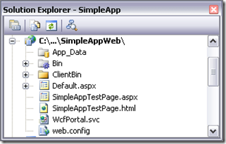

12 August 2008

In [Part 1](http://www.lhotka.net/weblog/ct.ashx?id=74fc453c-5522-4a7f-bc0f-19258cdd932e&amp;url=http%3a%2f%2fwww.lhotka.net%2fweblog%2fUsingCSLALightPart1.aspx) of this series I discussed the overall architecture and structure of a CSLA Light application. In [Part 2](http://www.lhotka.net/weblog/ct.ashx?id=74fc453c-5522-4a7f-bc0f-19258cdd932e&amp;url=http%3a%2f%2fwww.lhotka.net%2fweblog%2fUsingCSLALightPart2.aspx) I walked through the creation of a simple [editable root](http://www.lhotka.net/weblog/ct.ashx?id=74fc453c-5522-4a7f-bc0f-19258cdd932e&amp;url=http%3a%2f%2fwww.lhotka.net%2fArticle.aspx%3farea%3d4%26id%3d4484d01a-faa9-4220-a5c9-065e7b43b0af) business object that supports both the 3-tier and 4-tier mobile object models. In [Part 3](http://www.lhotka.net/weblog/UsingCSLALightPart3.aspx) I discussed the creation of the Silverlight UI.

In this post I will discuss the configuration of the web/app server and the data portal.

All Silverlight applications require a web server, because the Silverlight runtime is hosted in a web page, and the user has to get the web page from a web server (I'm sure there are exceptions to this rule - but in practicality, nearly all Silverlight apps will be downloaded from a web server).

When using CSLA Light in a 3- or 4-tier client/server model, the CSLA Light client application will communicate with a .NET application server. That application server might be the same server from which the Silverlight app was downloaded, or a different server. It might be hosted in ASP.NET or WAS or a custom Windows Service.

The CSLA Light data portal uses WCF as its network transport, and so the only requirement is that the server be reachable from the client using the Silverlight WCF implementation.

CSLA .NET 3.6 includes a special data portal host designed to work with a CSLA Light client. Remember that the CSLA Light data portal is not only going across the network, but it is communicating between the .NET and Silverlight platforms. So while this data portal is functionally similar to the .NET data portal, it has to do some extra work thanks to the cross-platform nature of the scenario.

#### Configuring the Server

The simplest server configuration is to put the data portal host in the same virtual root as the Silverlight application itself, and that's what I've done in this example.

When the Silverlight application was created, Visual Studio automatically created a host web application project. What I've done is added a WcfPortal.svc file, some web.config entries and a reference to Csla.dll to this project:

The WcfPortal.svc file is a typical WCF service file:

> &lt;% @ServiceHost Service="Csla.Server.Hosts.Silverlight.WcfPortal" %&gt;

It references the WcfPortal class that contains the data portal host designed to work with CSLA Light. Notice that it comes from the Csla.Server.Hosts.Silverlight namespace.

The web project references Csla.dll, and of course also references Library.dll *from the Library.Server project*. Remember that Library.Server is a .NET Class Library project containing all the business classes, while Library.Client is a Silverlight Class Library project. Since the web server is running .NET, it needs to reference the .NET assembly.

Finally, the web.config file contains the WCF configuration necessary for the WcfPortal to be available to clients:

> &lt;system.serviceModel&gt;
>     &lt;behaviors&gt;
>         &lt;serviceBehaviors&gt;
>             &lt;behavior name="WcfPortalBehavior"&gt;
>                 &lt;serviceMetadata httpGetEnabled="true"/&gt;
>                 &lt;serviceDebug includeExceptionDetailInFaults="true"/&gt;
>             &lt;/behavior&gt;
>         &lt;/serviceBehaviors&gt;
>     &lt;/behaviors&gt;
>     &lt;services&gt;
>         &lt;service behaviorConfiguration="WcfPortalBehavior"
>                      name="Csla.Server.Hosts.Silverlight.WcfPortal"&gt;
>             &lt;endpoint address=""
>                             binding="basicHttpBinding"
>                             contract="Csla.Server.Hosts.Silverlight.IWcfPortal"&gt;
>                 &lt;identity&gt;
>                     &lt;dns value="localhost"/&gt;
>                 &lt;/identity&gt;
>             &lt;/endpoint&gt;
>         &lt;/service&gt;
>     &lt;/services&gt;
> &lt;/system.serviceModel&gt;

This is pretty standard WCF configuration, defining an endpoint for the IWcfPortal interface from Csla.Server.Hosts.Silverlight. Notice that the name of the service (Csla.Server.Hosts.Silverlight.WcfPortal) matches the name of the service specified in the svc file.

At this point the app server is configured and ready to go.

#### Configuring the Client

In Silverlight, WCF gets its configuration from a file called ServiceReferences.ClientConfig. In Beta 2 I've found that WCF doesn't consistently read this file, but it does work in the sample app I'm discussing here, and I assume Microsoft will fix whatever is causing the file to sometimes be ignored.

The config file looks like this:

> &lt;configuration&gt;
>     &lt;system.serviceModel&gt;
>         &lt;bindings&gt;
>             &lt;basicHttpBinding&gt;
>                 &lt;binding name="BasicHttpBinding\_IWcfPortal"
>                               maxBufferSize="65536"
>                               maxReceivedMessageSize="65536"
>                               receiveTimeout="10" sendTimeout="10"&gt;
>                 &lt;/binding&gt;
>             &lt;/basicHttpBinding&gt;
>         &lt;/bindings&gt;
>         &lt;client&gt;
>             &lt;endpoint
>                 address="http://localhost:1406/SimpleAppWeb/WcfPortal.svc
>                 binding="basicHttpBinding"
>                 bindingConfiguration="BasicHttpBinding\_IWcfPortal"
>                 contract="Csla.WcfPortal.IWcfPortal"
>                 name="BasicHttpBinding\_IWcfPortal" /&gt;
>         &lt;/client&gt;
>     &lt;/system.serviceModel&gt;
> &lt;/configuration&gt;

Again, pretty standard-looking WCF configuration like you'd probably find in an app.config file. It sets up a client endpoint for IWcfPortal, and provides the URL address to the server.

You can optionally override the configuration in your code by setting two static properties:

> Csla.DataPortalClient.WcfProxy.DefaultUrl = "http://localhost/root/WcfPortal.svc"
> Csla.DataPortalClient.WcfProxy.DefaultBinding = myBinding

I've been using the config file approach for the most part, but there are certainly scenarios where you might need to switch to different app server addresses in a more dynamic manner.

Finally, your application can specify whether the data portal should run in local or remote mode by setting a property:

> Csla.DataPortal.ProxyTypeName = "Csla.DataPortalClient.WcfProxy, Csla"

By default the data portal is configured for remote mode, using WCF, and so the sample app doesn't do any configuration of the ProxyTypeName. But if you did want to run the data portal in local mode, you'd set the ProxyTypeName to "Local":

> Csla.DataPortal.ProxyTypeName = "Local"

Then the DataPortal\_XYZ methods would run on the Silverlight client and the data portal won't interact with an app server at all. That is particularly useful if you want to directly call remote services from your Silverlight client, and the primary scenario in our design is to support the use of .NET Data Services (code name Astoria) - but that is a topic for another sample app.

In *this* sample app the only configuration required is in ServiceReferences.ClientConfig. The data portal defaults to the correct settings to use the values in this file to communicate with a CSLA .NET application server.

As you can see, configuring the application server and client to use the CSLA Light data portal is not difficult. The data portal relies on standard WCF configuration on both ends of the network connection, allowing you to exploit the power and flexibility of WCF to access the mobile object capabilities provided by the data portal.
